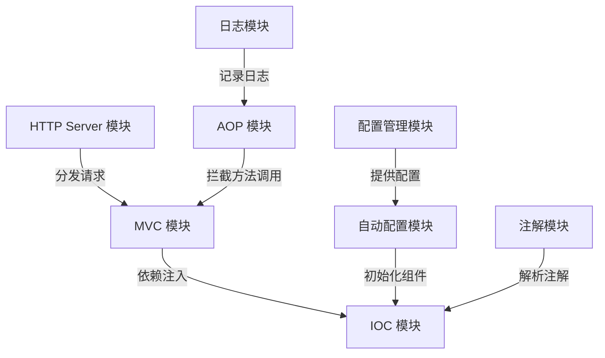

# 概要设计说明书

## 1. 引言

### 1.1 编写目的

本概要设计说明书旨在描述 Summer 框架的总体设计方案，包括系统架构、模块划分、主要功能和接口设计等内容，为后续的详细设计和实现提供指导。

### 1.2 项目概述

Summer 是一个模仿 Spring Boot 的 Rust 框架，旨在为熟悉 Java 后端开发的开发者提供一个高效、易用的开发工具。框架核心模块包括 MVC、IOC、HTTP Server、AOP、配置管理、自动配置、注解模块和日志模块。

## 2. 系统架构设计

### 2.1 总体架构

Summer 框架采用模块化设计，核心模块包括：

- **MVC 模块**: 提供路由管理、请求处理和控制器功能。
- **IOC 模块**: 提供依赖注入和组件生命周期管理。
- **HTTP Server 模块**: 提供高性能 HTTP 服务器，支持高并发和低延迟。
- **AOP 模块**: 提供面向切面编程功能，支持日志、权限等横切关注点。
- **配置管理模块**: 提供 YAML 配置文件解析和管理功能。
- **自动配置模块**: 提供开箱即用的自动配置功能。
- **注解模块**: 提供注解解析和处理功能，支持类似 Spring 的注解驱动开发。
- **日志模块**: 提供日志管理功能，支持日志格式化和订阅。

### 2.2 模块关系

各模块之间通过依赖注入和接口进行解耦，具体关系如下：

## 3. 模块依赖关系与开发顺序

### 3.1 模块依赖关系

- **HTTP Server 模块**: 作为框架的基础模块，负责处理 HTTP 请求，依赖于异步运行时（如 Tokio）。
- **IOC 模块**: 提供依赖注入功能，作为核心模块，其他模块（如 MVC、AOP、注解模块）均依赖于 IOC 模块。
- **配置管理模块**: 提供配置文件解析功能，供自动配置模块和其他模块使用。
- **自动配置模块**: 依赖于配置管理模块，用于初始化其他模块。
- **MVC 模块**: 依赖于 HTTP Server 模块和 IOC 模块，负责路由和请求处理。
- **AOP 模块**: 依赖于 IOC 模块，提供切面功能。
- **注解模块**: 依赖于 IOC 模块和自动配置模块，解析注解并生成元信息。
- **日志模块**: 独立模块，供 AOP 模块和其他模块使用。

### 3.2 开发顺序

1. **HTTP Server 模块**
   - 实现基础的 HTTP 请求处理功能。
   - 使用 `hyper` 或 `actix-web` 提供高性能 HTTP 服务。
2. **IOC 模块**
   - 实现依赖注入容器，支持组件的注册和解析。
   - 确保其他模块可以通过 IOC 容器进行依赖管理。
3. **配置管理模块**
   - 实现 YAML 配置文件的解析功能。
   - 使用 `config` 库支持多种配置格式。
4. **自动配置模块**
   - 基于配置管理模块，自动加载和初始化其他模块。
5. **日志模块**
   - 实现日志记录和订阅功能。
   - 使用 `tracing` 库支持结构化日志。
6. **MVC 模块**
   - 实现路由管理和控制器功能。
   - 集成 HTTP Server 模块和 IOC 模块。
7. **AOP 模块**
   - 实现切面功能，支持方法拦截和动态代理。
   - 集成日志模块。
8. **注解模块**
   - 实现注解解析功能。
   - 使用 `proc-macro` 提供自定义注解支持。

## 4. 开发计划

### 4.1 时间安排

- **第 1 阶段**: 完成 HTTP Server 模块和 IOC 模块（预计 2 周）。
- **第 2 阶段**: 完成配置管理模块和自动配置模块（预计 1 周）。
- **第 3 阶段**: 完成日志模块和 MVC 模块（预计 2 周）。
- **第 4 阶段**: 完成 AOP 模块和注解模块（预计 2 周）。
- **第 5 阶段**: 集成测试和文档编写（预计 1 周）。

### 4.2 任务分配

- **开发人员 A**: 负责 HTTP Server 模块和 MVC 模块。
- **开发人员 B**: 负责 IOC 模块和 AOP 模块。
- **开发人员 C**: 负责配置管理模块和自动配置模块。
- **开发人员 D**: 负责日志模块和注解模块。

## 5. 性能设计

- **高并发**: 使用异步编程模型（如 Tokio）实现高并发处理。
- **低延迟**: 优化 HTTP 请求的解析和路由性能。
- **高内聚低耦合**: 通过模块化设计和依赖注入实现高内聚低耦合。

## 6. 扩展性设计

- **插件机制**: 提供统一的插件注册和管理接口。
- **模块化设计**: 支持按需加载模块，减少资源占用。

## 7. 开发环境

- **编程语言**: Rust
- **构建工具**: Cargo
- **操作系统**: 跨平台支持（Windows、Linux、macOS）

## 8. 可用 Rust 开源库分析

- **HTTP Server**: 使用 `hyper` 或 `actix-web` 提供高性能 HTTP 服务。
- **异步编程**: 使用 `tokio` 实现异步任务调度。
- **依赖注入**: 使用 `shaku` 或自定义实现。
- **日志管理**: 使用 `tracing` 提供日志记录和订阅功能。
- **配置管理**: 使用 `config` 库解析 YAML 配置文件。
- **注解处理**: 使用 `proc-macro` 实现自定义注解。

### 8.1 详细分析

#### Tokio

- **功能**: 提供异步运行时，支持任务调度、IO、多线程等。
- **适用场景**: 高并发 HTTP 请求处理。
- **优势**: 社区支持广泛，性能优异。

#### Hyper

- **功能**: 高性能 HTTP 客户端和服务器库。
- **适用场景**: 构建 HTTP Server 模块。
- **优势**: 与 Tokio 深度集成，支持异步编程。

#### Tracing

- **功能**: 提供结构化日志记录和事件订阅功能。
- **适用场景**: 日志模块的核心实现。
- **优势**: 支持分布式追踪，灵活性高。

#### Config

- **功能**: 提供配置文件解析和管理功能。
- **适用场景**: 配置管理模块。
- **优势**: 支持多种格式（YAML、JSON 等），易于集成。

#### Proc-macro

- **功能**: 提供自定义注解的实现能力。
- **适用场景**: 注解模块。
- **优势**: 强大的元编程能力，支持编译时代码生成。

## 9. 参考文献

- [Spring Boot 官方文档](https://spring.io/projects/spring-boot)
- [Rust 官方文档](https://www.rust-lang.org/)
- [Actix Web](https://actix.rs/)
- [Tokio](https://tokio.rs/)
- [Tracing](https://docs.rs/tracing/)
- [Hyper](https://hyper.rs/)
- [Config](https://docs.rs/config/)
