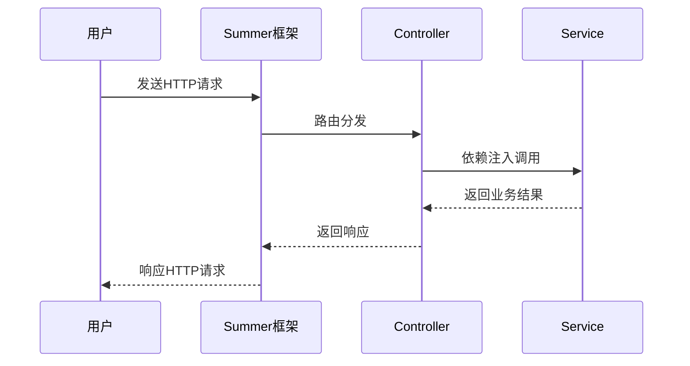
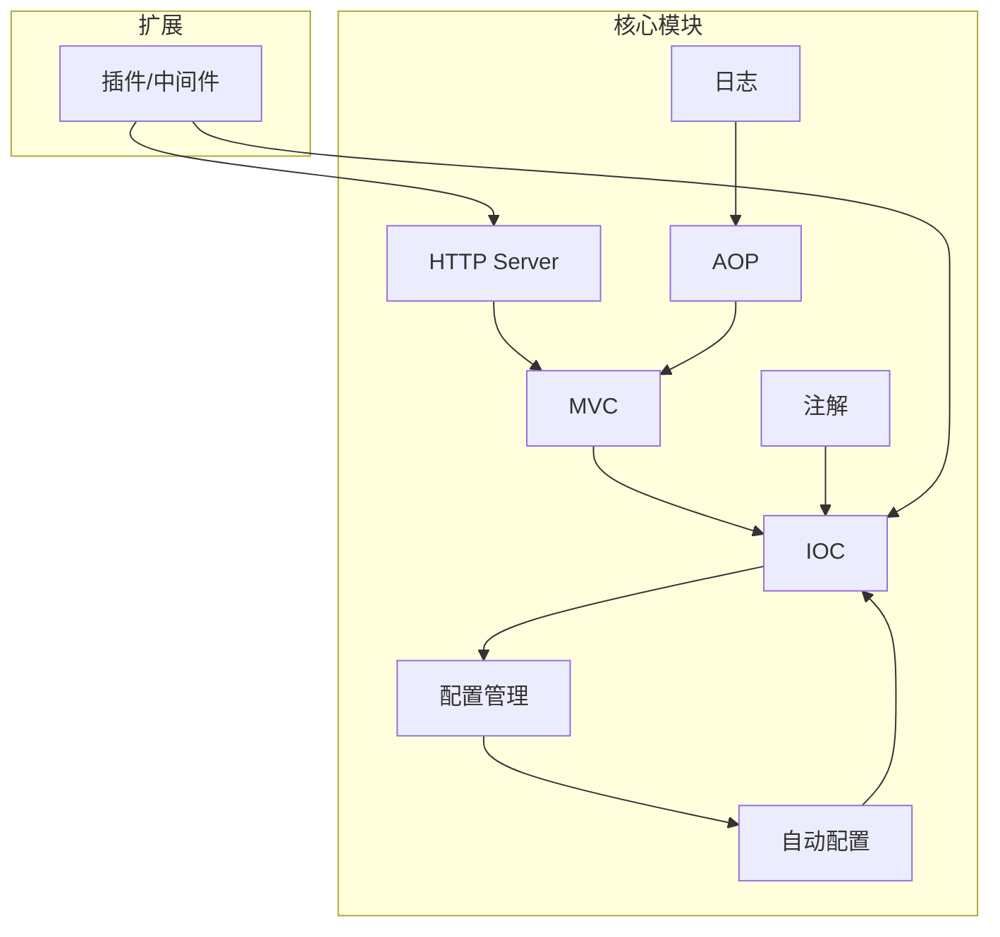

# 需求规格说明书

## 1. 项目背景

Rust 以高性能和内存安全著称，但缺乏类似 Spring Boot 的一站式后端开发框架。Summer 项目旨在为熟悉 Java/Spring Boot 的开发者提供一个易用、高效、现代化的 Rust 后端开发框架，降低 Rust 后端开发门槛。

## 2. 项目目标

| 模块        | 目标描述                                           |
| ----------- | -------------------------------------------------- |
| MVC         | 提供路由、控制器、请求处理等功能，支持注解驱动开发 |
| IOC         | 提供依赖注入、组件生命周期管理                     |
| HTTP Server | 内置高性能 HTTP 服务器，支持异步高并发             |
| AOP         | 支持切面编程，便于日志、权限等横切关注点实现       |
| 配置管理    | 支持 YAML/JSON 配置文件，统一配置访问接口          |
| 自动配置    | 自动装配常用组件，减少手动配置                     |
| 注解        | 支持类似 Spring 注解，简化开发                     |
| 日志        | 集成结构化日志，支持多种日志格式和订阅             |
| 插件/中间件 | 友好集成 Redis、RocketMQ、MySQL ORM 等第三方中间件 |

## 3. 主要功能需求

### 3.1 功能列表

| 编号 | 功能模块    | 主要功能描述                                |
| ---- | ----------- | ------------------------------------------- |
| F1   | HTTP Server | 启动/关闭服务、监听端口、处理请求、异步支持 |
| F2   | MVC         | 路由映射、控制器、请求参数绑定、响应处理    |
| F3   | IOC         | 依赖注入、组件注册、作用域管理              |
| F4   | 配置管理    | 读取/热加载配置、类型安全、配置注入         |
| F5   | 自动配置    | 自动扫描/装配组件、条件装配                 |
| F6   | AOP         | 方法拦截、切面定义、注解切面                |
| F7   | 注解        | 控制器/服务/路由/切面等注解定义与解析       |
| F8   | 日志        | 日志输出、格式化、订阅、日志级别控制        |
| F9   | 插件/中间件 | 插件注册、生命周期管理、第三方中间件集成    |

### 3.2 典型用例

## 4. 非功能性需求

| 类别   | 需求描述                                 |
| ------ | ---------------------------------------- |
| 性能   | 支持高并发、低延迟，单机 QPS 达万级      |
| 扩展性 | 插件化、模块化，便于功能扩展和第三方集成 |
| 易用性 | 注解驱动、自动配置、文档完善             |
| 跨平台 | 支持 Windows、Linux、macOS               |
| 安全性 | 组件隔离、配置加密、日志脱敏             |
| 兼容性 | 兼容主流 Rust 生态库                     |

## 5. 约束与假设

- 仅使用 Rust 语言实现，遵循 Rust 最佳实践。
- 遵循 MIT/Apache2.0 开源协议。
- 依赖 tokio、hyper、tracing、config、serde、proc-macro 等主流库。
- 不支持国际化。

## 6. 关键技术选型

| 技术/库    | 用途             | 说明                     |
| ---------- | ---------------- | ------------------------ |
| tokio      | 异步运行时       | 高性能异步任务调度       |
| hyper      | HTTP 服务器      | 低层高性能 HTTP 协议支持 |
| actix-web  | 可选 Web 框架    | 备选高性能 Web 框架      |
| tracing    | 日志/追踪        | 结构化日志与分布式追踪   |
| config     | 配置管理         | 多格式配置文件解析       |
| serde      | 序列化/反序列化  | 配置、数据结构序列化     |
| proc-macro | 注解/元编程      | 编译时代码生成           |
| shaku      | 依赖注入（可选） | IOC 容器实现             |

## 7. 系统高层架构

## 8. 风险与挑战

| 风险点          | 说明                       | 应对措施             |
| --------------- | -------------------------- | -------------------- |
| Rust 生态不成熟 | 部分功能需自研             | 选型主流库，文档完善 |
| 学习曲线        | Java 转 Rust 有一定门槛    | 注解驱动、示例丰富   |
| 性能调优        | 高并发场景下的性能瓶颈     | 基准测试、异步优化   |
| 兼容性          | 依赖库版本变化、平台兼容性 | 持续集成、自动化测试 |

## 9. 术语表

| 术语 | 说明                 |
| ---- | -------------------- |
| MVC  | 模型-视图-控制器架构 |
| IOC  | 控制反转（依赖注入） |
| AOP  | 面向切面编程         |
| YAML | 配置文件格式         |
| QPS  | 每秒查询数           |
| ORM  | 对象关系映射         |

## 10. 参考文献

- [Spring Boot 官方文档](https://spring.io/projects/spring-boot)
- [Rust 官方文档](https://www.rust-lang.org/)
- [Actix Web](https://actix.rs/)
- [Tokio](https://tokio.rs/)
- [Tracing](https://docs.rs/tracing/)
- [Config](https://docs.rs/config/)
