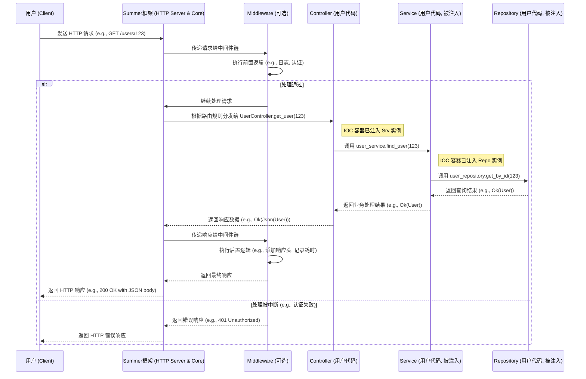
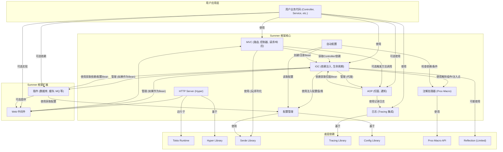

# **Summer Framework - 需求规格说明书 (SRS)**

**版本历史**

| 版本 | 日期       | 作者      | 变更说明               |
| ---- | ---------- | --------- | ---------------------- |
| 1.0  | 2025-05-03 | FaustoFan | 初稿创建               |
| 1.1  | YYYY-MM-DD | (待定)    | (根据后续开发迭代更新) |

**(建议使用 Git 进行版本控制)**

---

**目录**

1. [引言](#1-引言)
   1.1 [目的](#11-目的)
   1.2 [范围](#12-范围)
   1.3 [定义、首字母缩写词和缩略语](#13-定义首字母缩写词和缩略语)
   1.4 [参考文献](#14-参考文献)
   1.5 [概述](#15-概述)
2. [总体描述](#2-总体描述)
   2.1 [产品前景](#21-产品前景)
   2.2 [产品功能摘要](#22-产品功能摘要)
   2.3 [用户特征](#23-用户特征)
   2.4 [运行环境](#24-运行环境)
   2.5 [设计和实现约束](#25-设计和实现约束)
   2.6 [假设和依赖](#26-假设和依赖)
3. [特定需求](#3-特定需求)
   3.1 [功能需求](#31-功能需求)
   3.1.1 [F1: HTTP Server](#311-f1-http-server)
   3.1.2 [F2: MVC (模型-视图-控制器)](#312-f2-mvc-模型-视图-控制器)
   3.1.3 [F3: IOC (控制反转)](#313-f3-ioc-控制反转)
   3.1.4 [F4: 配置管理](#314-f4-配置管理)
   3.1.5 [F5: 自动配置](#315-f5-自动配置)
   3.1.6 [F6: AOP (面向切面编程)](#316-f6-aop-面向切面编程)
   3.1.7 [F7: 注解 (Annotations)](#317-f7-注解-annotations)
   3.1.8 [F8: 日志 (Logging)](#318-f8-日志-logging)
   3.1.9 [F9: 插件/中间件 (Plugins/Middleware)](#319-f9-插件中间件-pluginsmiddleware)
   3.2 [非功能性需求](#32-非功能性需求)
   3.2.1 [性能](#321-性能)
   3.2.2 [可扩展性](#322-可扩展性)
   3.2.3 [易用性](#323-易用性)
   3.2.4 [可靠性](#324-可靠性)
   3.2.5 [可维护性](#325-可维护性)
   3.2.6 [安全性](#326-安全性)
   3.2.7 [兼容性/跨平台](#327-兼容性跨平台)
   3.2.8 [可观测性](#328-可观测性)
   3.3 [外部接口需求](#33-外部接口需求)
   3.4 [典型用例](#34-典型用例)
4. [系统高层架构](#4-系统高层架构)
5. [关键技术选型](#5-关键技术选型)
6. [风险与挑战](#6-风险与挑战)
   [附录 A: 术语表](#附录-a-术语表)

---

## 1. 引言

### 1.1 目的

本文档旨在详细定义 **Summer** Rust 后端框架的需求。它将作为项目后续设计、开发、测试和验收的基础，确保所有相关方对框架的目标、功能和约束有一致的理解。

### 1.2 范围

**Summer** 项目的目标是创建一个受 Spring Boot 启发、基于 Rust 语言的一站式、高性能、内存安全的现代化后端 Web 框架。

**项目范围包括：**

- 实现核心的 Web 服务功能，包括基于 `hyper` 的异步 HTTP 服务器。
- 提供类似 Spring 的 MVC 架构，支持注解驱动的路由、控制器和请求处理。
- 内置 IOC 容器，实现依赖注入和组件生命周期管理。
- 提供 AOP 支持，用于日志、权限等横切关注点的统一处理。
- 集成灵活的配置管理，支持多种格式和环境配置。
- 实现自动配置机制，简化常见场景的设置。
- 定义和解析一套易于理解和使用的注解。
- 集成基于 `tracing` 的结构化日志系统。
- 设计插件和中间件机制，方便集成第三方库（如数据库 ORM、消息队列、缓存等）。

**项目范围不包括：**

- 前端 UI 框架或组件。
- 特定业务逻辑的实现。
- 对 HTTP/1.1 以外协议（如 HTTP/2, gRPC, WebSocket）的初期支持（未来可能扩展）。
- 完整的国际化（i18n）支持。

### 1.3 定义、首字母缩写词和缩略语

见 [附录 A: 术语表](#附录-a-术语表)。

### 1.4 参考文献

- [Spring Boot 官方文档](https://spring.io/projects/spring-boot)
- [Rust 官方文档](https://www.rust-lang.org/)
- [Tokio - Rust 异步运行时](https://tokio.rs/)
- [Hyper - Rust 低层 HTTP 库](https://hyper.rs/)
- [Tracing - Rust 应用检测框架](https://docs.rs/tracing/)
- [Config - Rust 分层配置系统](https://docs.rs/config/)
- [Serde - Rust 序列化/反序列化框架](https://serde.rs/)
- [Rust API Guidelines](https://rust-lang.github.io/api-guidelines/)
- (其他参考的开源项目或库，如 Actix Web, Axum, Shaku 等)

### 1.5 概述

本文档后续内容安排如下：

- **第 2 节** 描述产品的总体前景、功能摘要、用户特征、运行环境及主要约束。
- **第 3 节** 详细说明具体的功能需求和非功能性需求，包括性能、易用性等方面，并给出典型用例。
- **第 4 节** 描绘系统的高层架构，展示主要模块及其关系。
- **第 5 节** 列出项目选用的关键技术和库。
- **第 6 节** 分析项目可能面临的风险与挑战，并提出应对措施。
- **附录** 提供术语解释。

---

## 2. 总体描述

### 2.1 产品前景

**Summer** 旨在填补 Rust 生态中缺少类似 Java Spring Boot 的、易于上手且功能全面的后端开发框架的空白。它并非要完全复制 Spring Boot，而是借鉴其优秀的设计思想（如约定优于配置、注解驱动、自动配置、IOC/AOP），并结合 Rust 的语言特性（高性能、内存安全、强大的宏系统），为熟悉 Java/Spring Boot 的开发者或寻求高效 Rust 后端方案的开发者提供一个现代化的选择。Summer 是一个独立的框架，构建在 `tokio` 和 `hyper` 等基础库之上，与其他 Rust Web 框架（如 Actix Web, Axum）是竞争或互补关系，其核心优势在于提供更接近 Spring Boot 的开发体验和更全面的“开箱即用”功能集。

### 2.2 产品功能摘要

Summer 框架将提供以下核心功能模块：

- **HTTP Server:** 内置基于 `hyper` 的高性能异步 HTTP/1.1 服务器。
- **MVC:** 支持注解驱动的 Web 层开发，包含路由、控制器、请求/响应处理。
- **IOC:** 实现依赖注入和组件生命周期管理。
- **配置管理:** 支持 YAML/JSON 等格式，实现类型安全和配置注入。
- **自动配置:** 根据依赖和条件自动装配组件。
- **AOP:** 提供切面编程能力，支持方法拦截。
- **注解:** 利用 Rust 宏实现类似 Spring 的注解，简化开发。
- **日志:** 集成 `tracing` 提供结构化、可配置的日志系统。
- **插件/中间件:** 提供扩展机制，方便集成数据库、缓存、消息队列等。

详细功能见 [第 3.1 节](#31-功能需求)。

### 2.3 用户特征

主要目标用户群体包括：

- **有 Java/Spring Boot 背景的开发者:** 希望将技能迁移到 Rust，寻求相似开发体验的工程师。
- **Rust 开发者:** 寻求一个功能全面、开发效率高的后端框架，减少底层细节的关注。
- **需要高性能、低资源消耗后端服务的团队:** 利用 Rust 的优势构建服务。

假设用户具备一定的 Rust 基础知识（所有权、生命周期、异步编程基础）和 Web 后端开发的基本概念。

### 2.4 运行环境

- **操作系统:** Windows, Linux, macOS (需要跨平台编译和测试)。
- **Rust 版本:** 需要指定支持的最低 **stable** Rust 版本 (例如：1.65+)。
- **构建工具:** 标准 `cargo` 工具链。
- **运行时:** 依赖 `tokio` 作为核心异步运行时。

### 2.5 设计和实现约束

- **语言:** 必须完全使用 Rust (stable) 语言实现。
- **核心依赖:** 必须使用 `tokio` 作为异步运行时，`hyper` 作为底层 HTTP Server 实现基础。
- **编码规范:** 遵循 Rust 官方 API Guidelines 和社区最佳实践。
- **错误处理:** 广泛使用 `Result<T, E>` 进行错误传递，定义清晰的错误类型。
- **异步:** 核心 I/O 操作和请求处理必须是异步的 (`async/await`)。
- **宏:** 大量使用过程宏 (`proc-macro`) 实现注解和代码生成，需注意可维护性和编译时间。
- **模块化:** 框架设计必须是模块化的，核心模块之间低耦合。
- **开源协议:** 采用 MIT / Apache 2.0 双协议。
- **安全性:** 不应引入已知的安全漏洞，依赖库需定期审查。
- **测试:** 需要有高覆盖率的单元测试和集成测试。

### 2.6 假设和依赖

- **用户能力:** 假设用户具备必要的 Rust 编程知识和 Web 开发背景。
- **生态系统:** 依赖 Rust 社区提供的高质量基础库（如 `tokio`, `hyper`, `serde`, `tracing`, `config` 等）。
- **网络环境:** 假设应用部署在标准的 TCP/IP 网络环境中。
- **编译环境:** 假设用户拥有正确配置的 Rust 开发环境。

---

## 3. 特定需求

### 3.1 功能需求

下表总结了主要的功能模块及其核心需求描述。

| 编号 | 功能模块    | 主要功能描述                                          |
| :--- | :---------- | :---------------------------------------------------- |
| F1   | HTTP Server | 启动/关闭服务、监听端口、处理 HTTP/1.1 请求、异步支持 |
| F2   | MVC         | 路由映射、控制器、请求参数绑定、响应处理              |
| F3   | IOC         | 依赖注入、组件注册、生命周期管理、作用域管理          |
| F4   | 配置管理    | 读取/热加载配置、类型安全、配置注入                   |
| F5   | 自动配置    | 自动扫描/装配组件、条件装配                           |
| F6   | AOP         | 方法拦截、切面定义、注解驱动切面                      |
| F7   | 注解        | 控制器/服务/路由/切面/配置等注解定义与解析            |
| F8   | 日志        | 结构化日志输出、格式化、日志级别控制、异步写入        |
| F9   | 插件/中间件 | Web 中间件、插件注册、生命周期、第三方中间件集成      |

以下是对每个功能模块需求的详细说明：

#### 3.1.1 F1: HTTP Server

- **启动与关闭:** 提供简单的 API 来启动和停止 HTTP 服务器。
- **监听:** 支持配置监听的 IP 地址和端口号。
- **协议:** 支持 HTTP/1.1 协议。
- **HTTPS/TLS:** 支持通过集成 `rustls` 或 `native-tls` (可选，通过 feature gate) 实现 HTTPS。
- **异步处理:** 基于 `tokio` 运行时和 `hyper` 库，实现完全异步的请求处理，支持高并发连接。
- **优雅停机:** 支持 Graceful Shutdown，允许服务器在关闭前完成正在处理的请求。
- **基础管理:** 管理请求到响应的完整生命周期。

#### 3.1.2 F2: MVC (模型-视图-控制器)

- **路由 (Routing):**

  - 使用过程宏注解 (如 `@GetMapping("/users")`, `@PostMapping("/users")`) 将 HTTP 请求路径和方法映射到控制器函数。
  - 支持路径变量 (e.g., `@GetMapping("/users/{id}")`) 并能提取其值。
  - 支持查询参数 (e.g., `/search?q=keyword`) 并能提取其值。
  - 支持按请求头 (e.g., `Content-Type`, `Accept`) 进行路由匹配（可选）。
  - (可选) 支持路由分组和统一前缀。
  - **示例注解:**

    ```rust
    // Conceptual example
    #[controller("/api/users")]
    struct UserController;

    impl UserController {
        #[get("/{id}")]
        async fn get_user(&self, #[path] id: u64) -> Result<Json<User>, AppError> { /* ... */ }

        #[post("")]
        async fn create_user(&self, #[body] user_data: CreateUserDto) -> Result<StatusCode, AppError> { /* ... */ }
    }
    ```
- **控制器 (Controller):**

  - 使用 `@Controller` 或 `@RestController` 注解标记包含请求处理方法的结构体。
  - `@RestController` 组合了 `@Controller` 和默认 JSON 响应的行为。
- **请求处理 (Request Handling):**

  - 自动将请求体（如 JSON, Form）反序列化为 Rust 结构体 (依赖 `serde`)，通过 `@RequestBody` 或类似注解标记。
  - 自动将路径变量、查询参数、请求头等绑定到处理函数的参数上，通过 `@PathVariable`, `@RequestParam`, `@RequestHeader` 等注解标记。
  - 提供访问原始 `hyper::Request` 对象的能力。
- **响应处理 (Response Handling):**

  - 自动将处理函数的返回值（如结构体、`Result`）序列化为 HTTP 响应（默认为 JSON，依赖 `serde`)。
  - 支持返回 `Result<T, E>`，框架能自动处理成功和错误情况，映射到不同的 HTTP 状态码。
  - 支持手动设置响应状态码、响应头、内容类型。
  - 提供统一的、可定制的全局异常处理机制。

#### 3.1.3 F3: IOC (控制反转)

- **组件定义 (Component Definition):**
  - 使用 `@Component`, `@Service`, `@Repository` (可选区分) 等注解标记需要被 IOC 容器管理的结构体。
  - **示例注解:**
    ```rust
    // Conceptual example
    #[service]
    struct UserServiceImpl {
        // Dependency will be injected
        user_repository: Arc<dyn UserRepository>,
    }
    ```
- **依赖注入 (Dependency Injection):**
  - 支持构造函数注入（推荐方式，通过分析构造函数参数类型自动注入）。
  - 支持字段注入，使用 `@Autowired` 或类似注解标记需要注入的字段 (通常注入 `Arc<T>` 或 `Arc<dyn Trait>`)。
  - **示例注解:**
    ```rust
    // Conceptual example (Field Injection)
    #[controller]
    struct UserController {
        #[autowired]
        user_service: Arc<dyn UserService>,
    }
    ```
- **容器管理 (Container Management):**
  - 应用启动时，自动扫描指定路径或模块下的组件注解，注册 Bean Definition。
  - 根据依赖关系实例化组件，解决循环依赖问题（或报错）。
  - 管理组件的生命周期。
- **生命周期回调 (Lifecycle Callbacks):**
  - 支持 `@PostConstruct` 注解，在依赖注入完成后执行初始化方法。
  - 支持 `@PreDestroy` 注解，在容器关闭、组件销毁前执行清理方法。
- **作用域 (Scopes):**
  - 默认提供单例 (Singleton) 作用域：一个 Bean Definition 在容器中只有一个实例。
  - (可选) 未来可能支持请求 (Request) 作用域。

#### 3.1.4 F4: 配置管理

- **多格式支持:** 支持读取 YAML (`.yaml`/`.yml`) 和 JSON (`.json`) 格式的配置文件。
- **分层加载:** 支持 `application.ext` 作为默认配置，`application-{profile}.ext` (如 `application-dev.yaml`) 作为特定环境配置，后者会覆盖前者。Profile 可通过环境变量或启动参数指定。
- **环境变量覆盖:** 支持通过环境变量覆盖配置文件中的值 (e.g., `SERVER_PORT=8081` 覆盖 `server.port`)。
- **统一访问 API:** 提供 API 如 `config.get::<T>("key.subkey")` 来获取配置值。
- **类型安全:** 支持将配置项反序列化为强类型的 Rust 结构体。
- **配置注入:**

  - 支持使用 `@Value("${key.subkey}")` 注解将单个配置值注入到组件字段。
  - 支持使用 `@ConfigurationProperties(prefix = "prefix.subkey")` 注解将一组配置项绑定到一个结构体 Bean 上。
  - **示例注解:**

    ```rust
    // Conceptual example
    #[component]
    struct AppConfig {
        #[value("${server.port}")]
        port: u16,
        #[value("${app.name:default_app}")] // 支持默认值
        app_name: String,
    }

    #[configuration_properties(prefix = "database")]
    #[derive(Deserialize)] // Needs serde::Deserialize
    struct DatabaseConfig {
        url: String,
        pool_size: usize,
    }
    ```
- **热加载:** (可选) 支持在运行时监测配置文件变化并重新加载配置，通知相关组件更新。

#### 3.1.5 F5: 自动配置

- **自动化装配:** 根据项目中存在的依赖 (检查 `Cargo.toml` 或特定标记文件/类型) 和用户配置，自动配置基础设施 Bean (如数据库连接池、Redis 客户端、Web 服务器设置等)。
- **"Starter" 模式:** 提供 `summer-starter-*` crates (e.g., `summer-starter-web`, `summer-starter-sqlx`, `summer-starter-redis`)。开发者只需添加对应 starter 依赖，即可获得相关功能的自动配置。
- **条件装配:** 提供条件注解，允许自动配置类根据特定条件启用或禁用：
  - `@ConditionalOnProperty(name = "feature.enabled", havingValue = "true")`: 属性条件。
  - `@ConditionalOnBean(type = "SomeBean")`: 存在某个 Bean 的条件。
  - `@ConditionalOnMissingBean(type = "SomeBean")`: 缺少某个 Bean 的条件。
  - `@ConditionalOnClass(name = "some::crate::Type")`: 类路径存在某个类型的条件。
- **用户覆盖:** 用户总是可以通过显式配置 Bean 来覆盖自动配置的行为。

#### 3.1.6 F6: AOP (面向切面编程)

- **切面定义 (Aspect Definition):** 使用 `@Aspect` 注解标记包含通知逻辑的结构体。
- **切点表达式 (Pointcut Expression):** 定义匹配连接点（需要被拦截的方法）的规则。可以基于：

  - 注解 (e.g., 拦截所有带 `@Transactional` 注解的方法)。
  - 类型/模块路径 (e.g., 拦截 `com::myapp::service::*` 下的所有方法)。
  - 方法签名 (e.g., 拦截所有返回 `Result` 的公共方法)。
  - 组合表达式 (AND, OR, NOT)。
  - **示例注解:**

    ```rust
    // Conceptual example
    #[aspect]
    struct LoggingAspect;

    impl LoggingAspect {
        // Matches all public methods in types annotated with #[service]
        #[pointcut("execution(pub * (@service *).*(..))")]
        fn service_methods() {}

        #[before("service_methods()")]
        fn log_entry(&self, join_point: JoinPoint) { // JoinPoint provides context
            println!("Entering method: {:?}", join_point.signature());
        }

        #[after_returning(pointcut = "service_methods()", returning = "result")]
        fn log_exit(&self, join_point: JoinPoint, result: &dyn Any) { /* ... */ }
    }
    ```
- **通知类型 (Advice Types):** 支持标准的通知类型：

  - `@Before`: 在方法执行前运行。
  - `@AfterReturning`: 在方法成功执行后运行。
  - `@AfterThrowing`: 在方法抛出错误（返回 `Err`）后运行。
  - `@After`: 在方法执行后运行（无论成功还是失败）。
  - `@Around`: 完全包围方法执行，可以控制是否执行原方法，修改参数或返回值。
- **实现机制:** 主要通过过程宏在编译时修改目标代码（静态织入），或者在运行时结合 IOC 创建代理对象（动态代理，可能对 Rust 的类型系统有挑战）。优先考虑编译时织入。
- **集成:** AOP 需与 IOC 容器紧密集成，自动为被管理的 Bean 创建代理（如果需要）。

#### 3.1.7 F7: 注解 (Annotations)

- **核心目的:** 使用声明式的方式配置框架行为，减少样板代码，提高开发效率。
- **实现:** 通过 Rust 的过程宏 (`proc-macro`) 实现。宏在编译时解析注解，并生成相应的代码或修改被注解项。
- **注解列表:** 提供一套设计良好、易于理解的注解，涵盖上述 MVC, IOC, AOP, 配置管理等模块。主要注解包括但不限于：
  - **组件类:** `@Component`, `@Service`, `@Repository`, `@Controller`, `@RestController`, `@Configuration`
  - **注入类:** `@Autowired`, `@Value`
  - **Web 类:** `@RequestMapping`, `@GetMapping`, `@PostMapping`, `@PutMapping`, `@DeleteMapping`, `@PathVariable`, `@RequestParam`, `@RequestBody`, `@RequestHeader`, `@ExceptionHandler`
  - **AOP 类:** `@Aspect`, `@Pointcut`, `@Before`, `@After`, `@AfterReturning`, `@AfterThrowing`, `@Around`
  - **配置类:** `@ConfigurationProperties`
  - **生命周期:** `@PostConstruct`, `@PreDestroy`
  - **条件类:** `@ConditionalOnProperty`, `@ConditionalOnBean`, `@ConditionalOnMissingBean`, `@ConditionalOnClass`
- **解析:** 框架需要在启动时或编译时有效地解析这些注解并据此配置内部行为。

#### 3.1.8 F8: 日志 (Logging)

- **集成:** 基于 `tracing` 生态系统构建，利用其提供的结构化日志、span（跨度）追踪能力。
- **结构化日志:** 支持将日志事件以结构化格式（如 JSON）输出，方便机器解析和日志聚合系统（如 ELK, Splunk）处理。
- **配置:**
  - 允许通过配置文件 (`application.yaml` 等) 控制日志级别（全局、按模块/target）。支持的级别如 TRACE, DEBUG, INFO, WARN, ERROR。
  - 允许配置日志输出目标：控制台 (stdout/stderr)、文件（支持轮转）。
- **格式化:** 提供默认的日志格式，并允许用户自定义格式。
- **异步:** 日志写入操作应是异步的，避免阻塞应用主线程。可以使用 `tracing-appender` 等库实现。
- **上下文关联:**
  - 自动在日志中包含当前请求的上下文信息，如 Trace ID, Span ID (如果开启了追踪)。
  - 可通过 MDC (Mapped Diagnostic Context) 类似机制添加自定义上下文信息。
- **API:** 提供简单易用的宏或函数 (`trace!`, `debug!`, `info!`, `warn!`, `error!`) 供开发者在代码中使用。

#### 3.1.9 F9: 插件/中间件 (Plugins/Middleware)

- **Web 中间件 (Middleware/Filter/Interceptor):**
  - 提供一种机制允许开发者在 HTTP 请求处理流程的不同阶段插入自定义逻辑。
  - 典型的中间件应用：请求日志记录、身份认证、权限校验、CORS 处理、请求/响应修改、限流、性能监控。
  - 中间件应能访问请求/响应对象，并能控制请求是否继续向下传递。
  - 应支持全局中间件和路由级别的中间件。
- **插件机制:**
  - 定义清晰的插件接口 (trait) 和注册机制。
  - 插件应能够参与应用的生命周期（如初始化、关闭）。
  - 插件可以访问 IOC 容器以获取依赖，也可以访问配置信息。
- **第三方集成 (Starters):** 通过自动配置和插件机制，简化常用第三方服务的集成：
  - **数据库:** 提供 `summer-starter-sqlx` 或 `summer-starter-diesel`，自动配置数据源 (DataSource)、连接池 (Pool)。
  - **缓存:** 提供 `summer-starter-redis`，自动配置 Redis 客户端实例。
  - **消息队列:** 提供 `summer-starter-rocketmq` (或 Kafka/RabbitMQ)，自动配置生产者/消费者。
  - 这些 Starter 应提供必要的配置项，并将其集成到统一的配置管理中。

### 3.2 非功能性需求

下表总结了主要的非功能性需求：

| 类别          | 需求描述                                                                                                                           |
| :------------ | :--------------------------------------------------------------------------------------------------------------------------------- |
| 性能          | 高并发处理能力，低请求延迟，低内存占用。目标单机 QPS > 10,000 (简单 JSON 返回场景)，P99 延迟 < 10ms (简单场景)。                   |
| 可扩展性      | 模块化设计，提供清晰的插件和中间件接口，易于添加新功能或集成第三方库。                                                             |
| 易用性        | 注解驱动开发，约定优于配置，提供完善的文档、教程和丰富的示例代码，错误信息友好。                                                   |
| 可靠性        | 框架稳定，核心组件经过充分测试，提供优雅停机和合理的错误处理机制。                                                                 |
| 可维护性      | 代码结构清晰，遵循 Rust 最佳实践，高测试覆盖率 (单元、集成)，易于理解和修改。                                                      |
| 安全性        | 核心框架无已知漏洞，依赖库保持更新并进行安全审计 (`cargo-audit`)，提供安全相关的配置选项（如禁用敏感信息日志），组件间适当隔离。 |
| 兼容性/跨平台 | 支持主流操作系统 (Windows, Linux, macOS)，兼容指定范围的 stable Rust 版本，兼容 `tracing`, `serde` 等核心生态库。              |
| 可观测性      | 集成结构化日志，支持分布式追踪 (通过 `tracing`)，暴露基础性能指标 (Metrics) 以便集成 Prometheus 等监控系统。                     |

### 3.3 外部接口需求

- **插件 API:** 需要定义一套稳定、清晰的插件接口 (Rust traits)，允许第三方开发者创建与 Summer 框架集成的插件。接口应涵盖插件的初始化、配置读取、生命周期管理等方面。
- **中间件 API:** 需要定义中间件接口 (trait 或函数签名)，明确其如何访问请求/响应、如何控制流程以及如何注册。

### 3.4 典型用例

以下序列图展示了一个典型的 HTTP 请求处理流程：



这个流程展示了请求如何通过框架核心、中间件、控制器、服务层和数据访问层，以及 IOC 如何在其中发挥作用。

---

## 4. 系统高层架构

Summer 框架采用分层和模块化的设计思想。核心模块提供基础功能，并通过良好定义的接口进行交互。扩展模块（插件/中间件）可以方便地集成到核心流程中。

**核心模块关系描述:**

- **HTTP Server (基于 Hyper):** 接收网络请求，将其转换为内部表示，并将响应写回网络。它是框架的入口点。
- **MVC:** 处理来自 HTTP Server 的请求，根据路由规则调用相应的 Controller 方法。它依赖 IOC 获取 Controller 实例和处理请求/响应。
- **IOC (控制反转容器):** 负责管理应用中组件 (Bean) 的生命周期和依赖关系。它是 MVC、AOP 和许多插件的基础。
- **AOP (切面编程):** 通过拦截方法调用（通常是 IOC 管理的 Bean 的方法）来织入横切逻辑（如日志、事务）。它通常作用于 MVC 层或 Service 层。
- **配置管理 (Config):** 提供统一的配置加载和访问机制。IOC 容器使用它来注入配置值 (`@Value`) 和配置类 (`@ConfigurationProperties`)。自动配置也依赖它读取配置。
- **自动配置 (AutoConf):** 根据条件和配置，自动创建和注册 IOC Bean，简化用户配置。
- **注解 (Ann):** 主要通过过程宏实现，在编译时处理，其结果影响 IOC 容器的构建、MVC 的路由建立、AOP 的切面定义等。
- **日志 (Log):** 提供日志记录功能。AOP 常用于自动记录方法进入/退出日志，其他模块也使用它来记录内部状态和错误。

**扩展模块:**

- **插件/中间件 (Plugin):** 通过定义的接口与核心模块交互，提供额外的功能（如数据库访问、缓存、消息队列集成、Web 中间件逻辑）。它们通常依赖 IOC 获取服务，依赖 Config 获取配置。

以下图表可视化了这些模块及其主要依赖关系：



---

## 5. 关键技术选型

为了实现上述目标，并确保高性能和良好的开发体验，我们选择以下关键技术和库：

| 技术/库                               | 用途                  | 说明                                                                       |
| :------------------------------------ | :-------------------- | :------------------------------------------------------------------------- |
| **Rust**                        | 主要开发语言          | 提供高性能、内存安全和强大的元编程能力。                                   |
| **Tokio**                       | 异步运行时            | 业界标准的 Rust 异步运行时，提供高性能的 I/O 和任务调度。                  |
| **Hyper**                       | HTTP 服务器底层库     | 提供快速、低级别的 HTTP/1.1 (和未来 HTTP/2) 协议实现，给予框架最大控制权。 |
| **Serde**                       | 序列化/反序列化       | Rust 生态中最流行的序列化框架，用于处理 JSON, YAML, Form data 等。         |
| **`config` crate**            | 配置管理              | 支持多种来源（文件、环境变量）和格式（YAML, JSON, TOML）的分层配置。       |
| **`tracing` crate**           | 日志/追踪             | 提供结构化日志和分布式追踪的基础设施，生态完善。                           |
| **Rust Proc-Macro**             | 注解/元编程           | 利用 Rust 编译时代码生成能力实现注解驱动开发，减少样板代码。               |
| **(待定)**                      | IOC 容器实现          | 可能选用现有库（如 `shaku`, `inject`）或基于宏自研一个轻量级容器。     |
| **SQLx**                        | 异步数据库交互 (推荐) | 提供编译时检查 SQL 查询的类型安全异步数据库客户端。                        |
| **Diesel**                      | 同步数据库 ORM (可选) | 功能强大的同步 ORM，如果需要复杂查询构建或传统 ORM 功能。                  |
| **`rustls` / `native-tls`** | TLS/SSL 支持          | 用于实现 HTTPS。`rustls` 是纯 Rust 实现，`native-tls` 依赖系统库。     |
| **`clap` (或类似)**           | 命令行参数解析 (可选) | 用于解析应用的启动参数，如指定端口、配置文件、profile 等。                 |

**选型理由:**

- **Tokio + Hyper:** 是 Rust 构建高性能网络服务的黄金组合，社区支持广泛，性能优异。选择基于 Hyper 而非直接使用 Actix/Axum 是为了对底层有更多控制，并构建更贴合 Summer 设计理念的上层抽象。
- **Serde:** 在 Rust 生态中无处不在，是处理数据格式转换的事实标准。
- **Tracing:** 比传统的 `log` crate 提供了更丰富的上下文信息和对分布式追踪的更好支持，适合现代后端服务。
- **Config:** 提供了灵活强大的配置加载机制，满足多环境部署需求。
- **Proc-Macro:** 是实现注解驱动开发的关键，能极大提升开发体验，向 Spring Boot 看齐。

---

## 6. 风险与挑战

| 风险点                               | 说明                                                                                            | 应对措施                                                                                                                                      | 严重程度 (高/中/低) |
| :----------------------------------- | :---------------------------------------------------------------------------------------------- | :-------------------------------------------------------------------------------------------------------------------------------------------- | :------------------ |
| **Rust 生态相对不成熟**        | 某些特定功能（如复杂的 AOP、某些中间件集成）可能缺乏成熟的库，需要自研。                        | 优先选用社区活跃、文档齐全的主流库；对缺失部分，评估自研成本或贡献社区；保持核心框架轻量，将复杂集成放在插件中。                              | 中                  |
| **学习曲线**                   | 对于习惯 Java/Spring Boot 的开发者，Rust 的所有权、生命周期、异步模型、宏编程有陡峭的学习曲线。 | 提供清晰的、面向 Java 开发者的入门文档和示例；强调注解驱动，隐藏底层复杂性；录制教学视频或系列博客；建立 Q&A 社区。                           | 高                  |
| **过程宏 (Proc-Macro) 复杂性** | 过程宏功能强大但难以编写、调试和维护，可能增加编译时间。                                        | 严格的代码审查；编写充分的宏单元测试；限制宏的逻辑复杂度，保持接口清晰；提供良好的错误报告。                                                  | 中                  |
| **异步编程挑战**               | `async/await`, `Pin/Unpin`, Send/Sync 等概念对开发者是挑战，容易写出低效或错误的代码。      | 提供框架层面的异步最佳实践指南；封装常见的异步模式；确保框架 API 设计符合人体工程学。                                                         | 中                  |
| **性能调优**                   | 在高并发场景下，可能遇到异步调度、内存管理、锁竞争等性能瓶颈。                                  | 建立性能基准测试套件 (Benchmark)；使用 `pprof`, `tracing` 等工具进行性能分析；提供性能调优指南；持续关注底层库 (Tokio/Hyper) 的性能优化。 | 中                  |
| **依赖库兼容性**               | Rust 生态迭代快，依赖库版本更新可能引入破坏性变更；跨平台编译可能遇到问题。                     | 使用 `cargo update -w` 小心升级依赖；建立全面的持续集成 (CI) 流程，覆盖多平台和多 Rust 版本；明确支持的 Rust 版本范围。                     | 中                  |
| **社区接受度和推广**           | 作为一个新框架，需要吸引早期用户和贡献者，建立社区。                                            | 积极参与 Rust 社区活动；发布高质量的文档和教程；创建标杆应用 (Reference Application)；快速响应 Github Issues 和 PRs。                         | 高                  |
| **AOP 实现难度**               | 在 Rust 中实现功能完备且性能良好的 AOP (尤其是 Around 通知) 比 Java 更具挑战性。                | 初期可能只支持部分通知类型 (如 Before/After)；优先考虑编译时织入；深入研究宏和潜在的运行时代理技术。                                          | 高                  |

---

## 附录 A: 术语表

| 术语                           | 说明                                                                                   | 英文全称/对应概念                               |
| :----------------------------- | :------------------------------------------------------------------------------------- | :---------------------------------------------- |
| **AOP**                  | 面向切面编程，一种编程范式，用于将横切关注点（如日志、事务）与业务逻辑分离。           | Aspect-Oriented Programming                     |
| **Annotation (注解)**    | 附加在代码元素（结构体、方法、字段）上的元数据，用于指导框架行为，通常通过过程宏实现。 | Annotation                                      |
| **Aspect (切面)**        | AOP 中的一个模块，封装了特定的横切关注点（如日志切面）。包含切点和通知。               | Aspect                                          |
| **Advice (通知)**        | 切面在特定连接点（方法执行前/后等）执行的动作。                                        | Advice                                          |
| **Autowired (自动装配)** | IOC 容器自动将依赖项注入到组件的过程。                                                 | Autowired / Autowiring                          |
| **Bean**                 | 由 IOC 容器管理的对象实例。                                                            | Bean / Component                                |
| **Component (组件)**     | 通用的被 IOC 管理的构件，通常通过 `@Component` 或其派生注解标记。                    | Component                                       |
| **Configuration**        | 应用的配置信息，如服务器端口、数据库连接信息等。                                       | Configuration                                   |
| **Controller (控制器)**  | MVC 模式中处理 HTTP 请求，调用业务逻辑，并返回响应的组件。                             | Controller                                      |
| **DI (依赖注入)**        | 依赖注入，IOC 的一种实现方式，对象的依赖关系由外部容器（而非对象自身）创建和提供。     | Dependency Injection                            |
| **DTO**                  | 数据传输对象，用于在不同层或系统之间传递数据的简单对象。                               | Data Transfer Object                            |
| **Graceful Shutdown**    | 优雅停机，服务器在关闭前等待当前正在处理的请求完成的过程。                             | Graceful Shutdown                               |
| **HTTP**                 | 超文本传输协议，Web 通信的基础协议。                                                   | HyperText Transfer Protocol                     |
| **HTTPS**                | 通过 TLS/SSL 加密的 HTTP。                                                             | HTTP Secure                                     |
| **IOC (控制反转)**       | 一种设计原则，将对象创建和管理的控制权从对象本身转移到外部容器或框架。                 | Inversion of Control                            |
| **JSON**                 | 一种轻量级的数据交换格式。                                                             | JavaScript Object Notation                      |
| **Join Point (连接点)**  | 程序执行过程中可以插入切面的点，如方法调用或异常抛出。                                 | Join Point                                      |
| **Middleware (中间件)**  | 在请求处理管道中执行特定任务（如日志、认证）的组件。                                   | Middleware / Filter                             |
| **MVC**                  | 模型-视图-控制器，一种常见的 Web 应用架构模式。                                        | Model-View-Controller                           |
| **ORM**                  | 对象关系映射，将程序中的对象模型与关系数据库中的表进行映射的技术。                     | Object-Relational Mapping                       |
| **Plugin (插件)**        | 可插拔的模块，用于扩展框架的核心功能。                                                 | Plugin / Extension                              |
| **Pointcut (切点)**      | AOP 中用于定义匹配哪些连接点（应用通知）的表达式。                                     | Pointcut                                        |
| **Proc-Macro**           | 过程宏，Rust 的一种元编程能力，允许在编译时检查和生成代码。                            | Procedural Macro                                |
| **Profile (配置环境)**   | 用于区分不同部署环境（如开发、测试、生产）的配置集。                                   | Profile                                         |
| **QPS**                  | 每秒查询数（或请求数），衡量系统处理能力的指标。                                       | Queries Per Second                              |
| **Repository (仓库)**    | 数据访问层组件，负责与数据存储（如数据库）交互。                                       | Repository                                      |
| **REST**                 | 表述性状态转移，一种 Web 服务架构风格。                                                | Representational State Transfer                 |
| **Routing (路由)**       | 将收到的 HTTP 请求根据 URL 路径、方法等信息分发到相应处理程序的过程。                  | Routing                                         |
| **Scope (作用域)**       | IOC 容器中 Bean 实例的生命周期范围（如 Singleton, Request）。                          | Scope                                           |
| **Serde**                | Rust 流行的序列化/反序列化框架 (SERialize/DEserialize)。                               | Serde Framework                                 |
| **Service (服务)**       | 业务逻辑层组件，通常被 Controller 调用，并可能调用 Repository。                        | Service                                         |
| **Singleton (单例)**     | 一种对象作用域，表示在整个应用生命周期中，一个类只有一个实例。                         | Singleton                                       |
| **Starter**              | Summer 中用于简化特定功能集成（如 Web、数据库）的依赖包，通常包含自动配置逻辑。        | Starter                                         |
| **TLS/SSL**              | 传输层安全/安全套接字层，用于在网络上提供加密通信的协议。                              | Transport Layer Security / Secure Sockets Layer |
| **Tokio**                | Rust 的一个异步运行时库。                                                              | Tokio Runtime                                   |
| **Tracing**              | Rust 的一个应用检测（日志、追踪）框架。                                                | Tracing Framework                               |
| **YAML**                 | 一种人类可读的数据序列化标准，常用于配置文件。                                         | YAML Ain't Markup Language                      |

---
