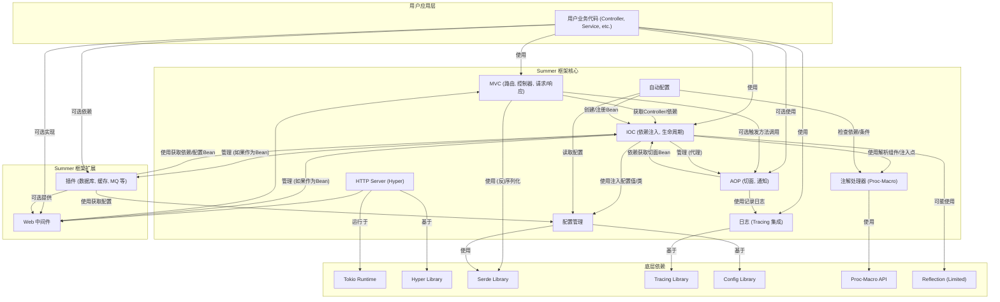

# **Summer Framework - 概要设计说明书 (ODD)**

**版本历史**

| 版本 | 日期       | 作者      | 变更说明                     |
| ---- | ---------- | --------- | ---------------------------- |
| 1.0  | 2025-05-03 | FaustoFan | 基于 SRS v1.0 创建初稿       |
| 1.1  | YYYY-MM-DD | (待定)    | (根据后续设计评审和迭代更新) |

---

## 1. 引言

### 1.1 目的

本文档旨在提供 Summer Rust 后端框架的高层（概要）设计方案。它描述了系统的主要组件、它们的职责、相互关系以及关键的技术实现策略。本文档将作为后续详细设计和开发工作的基础。

### 1.2 范围

本文档的设计范围覆盖了 SRS 中定义的所有核心功能模块和非功能性需求。它侧重于框架的内部结构和机制，而非具体的用户应用程序实现。

### 1.3 与需求规格说明书 (SRS) 的关系

本文档是基于 [Summer Framework - 需求规格说明书 (SRS) v1.0](#) (应链接到实际的 SRS 文档) 进行设计的。SRS 中定义的需求是本设计的输入和约束。

### 1.4 参考文献

- Summer Framework - 需求规格说明书 (SRS) v1.0
- [Tokio 文档](https://tokio.rs/)
- [Hyper 文档](https://hyper.rs/)
- [Serde 文档](https://serde.rs/)
- [Config-rs 文档](https://docs.rs/config/)
- [Tracing 文档](https://docs.rs/tracing/)
- Rust 过程宏 (Proc-Macro) 相关文档

### 1.5 术语

本文档使用的术语遵循 SRS [附录 A: 术语表](#附录-a-术语表)。

---

## 2. 系统概述

Summer 框架旨在提供一个高效、易用、内存安全的 Rust 后端开发体验，借鉴 Spring Boot 的核心理念。它将包含一个基于 Tokio 和 Hyper 的异步 HTTP 服务器、注解驱动的 MVC 层、编译时依赖注入的 IOC 容器、通过宏实现的 AOP 功能、灵活的配置管理、自动配置机制以及可扩展的插件和中间件系统。整个框架强调利用 Rust 的强类型系统和宏能力，在保证性能和安全的同时提升开发效率。

---

## 3. 架构设计

### 3.1 架构风格

Summer 框架将采用 **模块化、分层** 的架构风格。

- **模块化:** 核心功能（HTTP, MVC, IOC, AOP, Config 等）被划分为独立的 Crate 或模块，通过明确定义的接口交互，实现高内聚、低耦合，便于维护和扩展。
- **分层:** 存在逻辑上的分层：
  - **接入层:** HTTP Server 负责接收和响应网络请求。
  - **Web 核心层:** 中间件链和 MVC 框架处理请求路由、参数绑定、响应生成。
  - **核心容器层:** IOC 容器管理组件生命周期和依赖，AOP 提供横切关注点织入。
  - **基础服务层:** 配置管理、日志记录提供底层支持。
  - **扩展层:** 插件和用户代码构建于核心框架之上。
- **异步驱动:** 底层 I/O 和核心处理流程基于 Tokio 的异步模型，确保高并发性能。

### 3.2 高层架构图

（复用 SRS 中提供的已修正的 Mermaid 图表）



**数据流:** HTTP 请求进入 `HTTP Server`，传递给 `Middleware` 链进行预处理，然后由 `MVC` 模块根据 `Ann` 解析生成的路由表找到对应的 `Controller`（由 `IOC` 提供实例）。Controller 方法执行，可能触发 `AOP` 逻辑（如日志记录由 `Log` 实现），并调用 `Service` 等业务组件（同样由 `IOC` 注入）。业务逻辑完成后，结果返回给 `MVC` 进行响应处理（可能使用 `SerdeLib`），再经过 `Middleware` 链后处理，最终由 `HTTP Server` 返回给客户端。整个过程中的组件创建、依赖注入、配置读取由 `IOC`, `Config`, `AutoConf` 协同完成，日志由 `Log` 记录。

### 3.3 关键设计模式

- **依赖注入 (Dependency Injection):** IOC 容器的核心机制，解耦组件依赖。主要通过构造函数注入和基于宏的字段注入实现。
- **注解/属性 (Annotations/Attributes via Proc-Macros):** 大量使用过程宏实现声明式配置（路由、组件、注入、AOP、配置绑定），提升易用性。
- **策略模式 (Strategy Pattern):** 通过插件机制，允许用户选择和集成不同的数据库、缓存等实现。
- **中间件/管道模式 (Middleware/Pipeline Pattern):** 用于构建可扩展的请求处理链。
- **单例模式 (Singleton Pattern):** IOC 容器默认的 Bean 作用域。
- **外观模式 (Facade Pattern):** 框架核心 API 尝试简化底层库（如 Hyper）的复杂性。
- **模板方法模式 (Template Method Pattern):** 可能用于 AOP 通知或插件生命周期的标准流程。

---

## 4. 核心组件设计

### 4.1 HTTP Server (F1)

- **职责:** 监听端口，接收 TCP 连接，解析 HTTP/1.1 请求，将框架内部响应写回 Socket，管理连接生命周期，集成 TLS (可选)。
- **核心技术:** `tokio`, `hyper::Server`, `hyper::service::service_fn`, `rustls` / `native-tls`.
- **设计要点:**
  - 使用 `hyper::Server` 和 `service_fn` 构建主服务循环。
  - `service_fn` 的闭包将捕获框架的核心分发逻辑入口（可能是中间件链的起点或 MVC 路由分发器）。
  - 所有 I/O 操作必须是异步的。
  - 实现优雅停机信号处理 (e.g., `tokio::signal`).
  - 提供配置接口（通过 `Config` 组件）设置监听地址、端口、TLS 证书等。
  - 封装 `hyper::Request` 和 `hyper::Response` 为框架内部更易用的 Request/Response 类型，提供便捷的 Body 读取/写入、Header 操作等方法。

### 4.2 MVC (F2)

- **职责:** 处理 HTTP 请求，执行路由分发，处理请求参数绑定、请求体验证 (可选)、调用控制器方法，处理控制器返回值并生成响应。
- **核心技术:** 过程宏 (`proc-macro`), `serde`.
- **设计要点:**
  - **路由:**
    - `@Controller`, `@GetMapping` 等宏在编译时扫描用户代码，生成静态路由表（可能使用 `matchit` 或类似的高性能路由库）。
    - 路由表包含路径、方法、处理函数指针（或标识）等信息。
    - 运行时，根据请求路径和方法快速查找匹配的路由项。
  - **参数绑定:**
    - `@PathVariable`, `@RequestParam`, `@RequestBody`, `@RequestHeader` 等宏生成代码，从框架 Request 对象中提取数据，进行类型转换（使用 `serde` 或 `FromStr`），并注入到处理函数的参数中。
    - `@RequestBody` 宏处理请求体反序列化 (JSON, Form)。
  - **响应处理:**
    - 处理函数的返回值（如 `Result<T, E>`, `String`, 自定义结构体）被序列化（通常是 JSON，使用 `serde`）。
    - 支持 `impl IntoResponse` trait 允许用户自定义响应类型。
    - 统一的错误处理机制：将处理函数返回的 `Err(E)` 映射为特定的 HTTP 错误响应（可能通过 `@ExceptionHandler` 或全局错误处理器）。
  - **集成:** 深度依赖 IOC 获取 Controller 实例，依赖 Config 获取 Web 相关配置。

### 4.3 IOC 容器 (F3)

- **职责:** 管理应用组件 (Bean) 的实例化、依赖注入和生命周期。
- **核心技术:** 过程宏 (`proc-macro`), `std::any::Any`, `Arc` (用于共享所有权), `Mutex`/`RwLock` (用于可变内部性，如需)。
- **设计要点:**
  - **编译时处理:**
    - `@Component`, `@Service` 等宏在编译时识别 Bean 定义。
    - `@Autowired` 宏或构造函数分析，记录依赖关系。
    - 生成一个静态的“容器上下文”初始化函数或数据结构。
  - **运行时容器:**
    - 应用启动时调用生成的初始化代码，按依赖顺序实例化 Bean。
    - 使用 `TypeId` 和 `HashMap` 或类似结构存储 Bean 实例 (通常是 `Arc<dyn Trait>` 或 `Arc<Struct>`)。
    - 提供 API (`get_bean<T>()`) 供框架内部或用户代码获取 Bean 实例。
    - 处理循环依赖（编译时检测或运行时报错）。
  - **生命周期:**
    - `@PostConstruct` 和 `@PreDestroy` 宏生成代码，在 Bean 实例化后和容器销毁前调用指定方法。
  - **作用域:** 初期仅实现 `Singleton`。Bean 实例在容器初始化时创建，全局共享 (`Arc`)。

### 4.4 配置管理 (F4)

- **职责:** 加载、解析和提供对应用程序配置的访问。
- **核心技术:** `config` crate, `serde`.
- **设计要点:**
  - 封装 `config::Config` builder，实现分层加载逻辑（默认文件、profile 文件、环境变量）。
  - 提供一个 IOC 管理的 `ConfigService` Bean，提供 `get<T>("key")` 等访问方法。
  - `@Value` 宏：在编译时记录需要注入的配置键，运行时通过 `ConfigService` 获取值并注入字段。支持默认值。
  - `@ConfigurationProperties` 宏：结合 `serde::Deserialize`，将配置的一个子树绑定到结构体 Bean。
  - 类型安全：利用 `serde` 和 Rust 类型系统确保配置读取的类型正确性。
  - (可选) 热加载：通过文件监听器 (如 `notify` crate) 检测变化，重新加载配置，并可能提供事件通知机制。

### 4.5 自动配置 (F5)

- **职责:** 根据项目依赖和条件，自动配置和注册基础设施 Bean。
- **核心技术:** 过程宏 (`proc-macro`), 条件逻辑。
- **设计要点:**
  - **Starter 模块:** 每个 `summer-starter-*` 包包含一个或多个 `@Configuration` 类（或等效宏标记的模块）。
  - **条件注解:** `@ConditionalOnProperty`, `@ConditionalOnBean`, `@ConditionalOnMissingBean`, `@ConditionalOnClass` 等宏在编译时或运行时（如果需要动态检查）评估条件。
  - **配置逻辑:** 条件满足的 `@Configuration` 中的 `@Bean` 方法（或等效逻辑）会被执行，创建并注册相应的 Bean 到 IOC 容器。这些配置通常会读取 `Config` 中的相关配置项。
  - **用户覆盖:** IOC 容器优先使用用户显式定义的 Bean，覆盖自动配置的 Bean（通过 `@ConditionalOnMissingBean` 实现）。

### 4.6 AOP (F6)

- **职责:** 实现横切关注点的模块化，允许在不修改业务代码的情况下添加日志、事务、权限等逻辑。
- **核心技术:** 过程宏 (`proc-macro`).
- **设计要点:**
  - **编译时织入:**
    - `@Aspect` 宏识别切面类。
    - `@Pointcut` 宏定义匹配规则（基于注解、路径等）。
    - `@Before`, `@AfterReturning` 等通知宏，根据 Pointcut 匹配，在编译时修改目标 Bean（由 IOC 管理）的方法代码，插入调用切面通知方法的逻辑。
    - `@Around` 通知实现最为复杂，可能需要完全重写原方法，并在生成的代码中调用原始逻辑（可能通过闭包传递）。
  - **`JoinPoint`:** 提供一个上下文对象（或参数）给通知方法，包含被拦截方法的信息（签名、参数、目标对象引用等）。
  - **集成:** AOP 代理（或代码修改）只对 IOC 容器管理的 Bean 生效。IOC 容器在实例化 Bean 时应用 AOP 逻辑。

### 4.7 注解处理 (F7)

- **职责:** 解析用户代码中的 Summer 特定注解，并生成或修改代码以实现框架功能。
- **核心技术:** Rust 过程宏 (`proc-macro`) - 属性宏 (`#[attribute]`) 和派生宏 (`#[derive(Trait)]`)。
- **设计要点:**
  - 为每个注解（如 `@Controller`, `@Autowired`, `@GetMapping`, `@Aspect`）实现一个对应的过程宏函数。
  - 宏函数接收 `TokenStream` 输入（被注解的代码），解析它（使用 `syn` crate），根据注解逻辑生成新的 `TokenStream` 输出（使用 `quote` crate）。
  - 生成的代码可能包括：注册路由、添加依赖注入逻辑、修改方法体（AOP）、实现 trait、生成初始化函数等。
  - 宏需要处理各种 Rust 语法结构，并提供清晰的编译期错误信息。

### 4.8 日志 (F8)

- **职责:** 提供统一、结构化、可配置的日志记录功能。
- **核心技术:** `tracing`, `tracing-subscriber`, `tracing-appender`.
- **设计要点:**
  - 使用 `tracing` 作为核心日志 API (`trace!`, `info!` 等)。
  - 提供默认的 `tracing-subscriber` 配置，支持控制台输出、JSON 格式、日志级别过滤。
  - 通过 `Config` 组件读取日志配置（级别、格式、输出目标）。
  - 集成 `tracing-appender` 实现异步文件写入和日志轮转。
  - 利用 `tracing` 的 Span 机制，自动关联请求 ID 或 Trace ID（需与 HTTP Server 或中间件集成）。
  - 提供简单的 API 或配置来初始化日志系统。

### 4.9 插件/中间件 (F9)

- **职责:** 提供框架的扩展点。
- **核心技术:** Rust Traits, 函数指针/闭包。
- **设计要点:**
  - **中间件:**
    - 定义 `Middleware` trait 或 `async fn(Request, Next) -> Result<Response, Error>` 函数签名。
    - `Next` 代表调用处理链中的下一个中间件或最终的请求处理器。
    - 提供注册机制（全局注册、按路由注册）。
    - 中间件可以访问和修改 Request/Response，可以访问 IOC 容器获取依赖。
  - **插件:**
    - 定义 `Plugin` trait，包含生命周期方法（如 `init(&AppContext)`, `shutdown()`）。
    - `AppContext` 提供对 IOC 容器、Config 等核心服务的访问。
    - 提供插件注册机制，框架在启动和关闭时调用插件的生命周期方法。
    - 插件可以通过 Starter 模块提供，并利用自动配置进行注册和初始化。

---

## 5. 数据设计

### 5.1 配置数据

- **格式:** 主要支持 YAML 和 JSON。
- **结构:** 采用分层 Key-Value 结构，与 `config` crate 兼容。推荐按模块组织配置项（e.g., `server.port`, `database.url`）。
- **存储:** 配置文件（`application.yaml`, `application-{profile}.yaml`），环境变量。
- **访问:** 通过 `ConfigService` Bean 和 `@Value`/`@ConfigurationProperties` 注解。

### 5.2 元数据 (内部)

- **类型:** 框架在编译时或启动时生成的内部数据结构。
- **内容:**
  - **路由表:** 路径、方法到处理函数的映射。
  - **Bean 定义:** Bean 类型、作用域、依赖关系、生命周期回调方法。
  - **AOP 元数据:** 切面定义、切点表达式、通知与目标方法的关联。
  - **配置注入点:** `@Value` 和 `@ConfigurationProperties` 的目标字段和配置键。
- **存储:** 通常存储在编译时生成的静态数据结构中，或在运行时存储在 IOC 容器内部的 `HashMap` 等结构中。
- **目的:** 驱动框架的核心运行时逻辑。

---

## 6. 接口设计

### 6.1 用户 API

- **主要形式:** 通过 **注解 (过程宏)** 和 **标准 Rust 结构体/函数** 定义。
  - `#[controller]`, `#[service]`, `#[component]` 定义组件。
  - `#[autowired]`, 构造函数 定义依赖。
  - `#[get]`, `#[post]`, etc. 定义路由和处理函数。
  - `#[value]`, `#[configuration_properties]` 绑定配置。
  - `#[aspect]`, `#[before]`, etc. 定义 AOP。
- **核心 Trait (可选):** 可能提供一些用户可实现的 trait，如自定义错误处理 (`ErrorResponse`), 自定义参数解析器等，但主要通过注解驱动。

### 6.2 插件 API

- **核心 Trait:** `Plugin`
  ```rust
  // Conceptual
  trait Plugin {
      // Called during application startup
      async fn init(&self, context: &AppContext) -> Result<(), PluginError>;
      // Called during application shutdown
      async fn shutdown(&self);
  }
  // AppContext provides access to IOC, Config, etc.
  struct AppContext { /* ... */ }
  ```
- **注册:** 通过自动配置或手动配置将 `Arc<dyn Plugin>` 注册到特定集合中。

### 6.3 中间件 API

- **核心 Trait/签名:**

  ```rust
  // Trait based (example)
  #[async_trait]
  trait Middleware {
      async fn handle(&self, req: Request, next: Next) -> Result<Response, Error>;
  }
  struct Next { /* allows calling the next middleware/handler */ }

  // Or Function based
  // type MiddlewareFn = Arc<dyn Fn(Request, Next) -> Pin<Box<dyn Future<Output = Result<Response, Error>> + Send>> + Send + Sync>;
  ```

- **注册:** 提供 API 将中间件实例添加到全局或路由特定的处理链中。

---

## 7. 部署考虑

- **构建:** 使用标准 `cargo build --release` 生成可执行文件。
- **运行时依赖:** 需要 Tokio 运行时环境。二进制文件通常是静态链接的（取决于系统库依赖，如 OpenSSL for `native-tls`）。
- **配置:** 通过外部配置文件 (`application.yaml`等) 和环境变量进行配置。
- **容器化:** 易于使用 Docker 等容器技术部署，构建小镜像体积的 Rust 应用。

---

## 8. 关键设计决策与权衡

- **基于 Hyper vs. 使用 Actix/Axum:** 选择 Hyper 提供底层控制和潜在性能优势，但增加了框架自身实现的复杂性。
- **编译时处理 (Proc-Macros) vs. 运行时反射:** 大量使用过程宏实现注解驱动，提升运行时性能和类型安全，但增加编译时间，宏编写和调试复杂。Rust 缺乏强大的运行时反射能力，限制了纯运行时方案。
- **AOP 实现 (编译时织入 vs. 运行时代理):** 优先考虑编译时织入，性能更好，但实现复杂，特别是 `@Around`。运行时代理在 Rust 中因类型系统限制较难完美实现。
- **IOC 作用域 (Singleton vs. Request):** 初期只支持 Singleton，简化实现。Request 作用域需要更复杂的异步上下文管理。
- **异步日志:** 使用 `tracing-appender` 确保日志不阻塞主线程，但引入额外依赖和微小的性能开销。
- **Starter 机制:** 提升易用性，但增加了模块间的隐式依赖关系。

---
