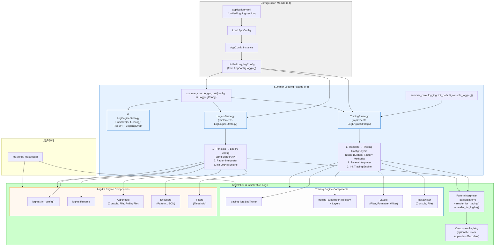

# **Summer Framework - 日志模块 (F8) 详细设计说明书 (DDS)**

**版本历史**

| 版本 | 日期       | 作者      | 变更说明                                                                                                             |
| :--- | :--------- | :-------- | :------------------------------------------------------------------------------------------------------------------- |
| 1.0  | 2025-05-03 | FaustoFan | 基于 ODD 和 Logback 相似性要求创建初稿 (仅 Tracing)                                                                  |
| 2.0  | 2025-05-04 | FaustoFan | 集成 `log4rs` 作为可选后端，重构配置，定义双初始化 API                                                             |
| 3.0  | 2025-05-05 | FaustoFan | **重大修订:** 采用统一日志配置结构，移除独立引擎配置块，增加翻译层设计。补充配置集成、启动流程、模块交互细节。 |
| 4.0  | 2025-05-05 | FaustoFan | **架构优化:** 应用策略、构建器、工厂方法、解释器等设计模式优化架构，提升模块化、可扩展性和内聚性。             |
| 4.1  | YYYY-MM-DD | (待定)    | (根据后续详细设计评审和开发迭代更新)                                                                                 |

---

## 1. 引言

### 1.1 目的

本文档为 Summer Framework 的日志模块 (对应 SRS 中的 F8) 提供详细的设计方案。目标是设计一个功能强大、可配置、高性能且**架构清晰、扩展良好**的日志系统。通过**统一的配置接口**和**策略模式 (Strategy Pattern)** 支持不同的底层实现引擎（`tracing` 或 `log4rs`）。框架内部通过**翻译层 (Translation Layer)** 和**构建器模式 (Builder Pattern)** 将统一配置适配到所选引擎。推荐使用标准的 `log` crate 宏进行日志记录，以确保用户代码的可移植性。

### 1.2 范围

本 DDS 覆盖日志模块的**统一配置结构设计**、基于**策略模式**的双引擎适配层架构、核心组件（Appender、Encoder、Filter、RollingPolicy）的**统一模型**及其到 `tracing` 和 `log4rs` 的**翻译策略**（应用**构建器模式**、**工厂方法模式 (Factory Method Pattern)** 和**解释器模式 (Interpreter Pattern)** 概念）、初始化流程（包括默认和自定义初始化）、异步处理考量、错误处理、与框架配置模块 (F4) 的集成、在应用启动流程中的定位、与框架其他模块的互动设计，以及通过可选的**注册表模式 (Registry Pattern)** 实现的扩展性考量。

### 1.3 与 ODD 的关系

本文档是 ODD 中对日志模块描述的细化和扩展，**核心变更为采用统一配置模型、策略模式驱动的翻译层设计**，并详细阐述了其在框架内的集成与交互，强调了设计模式的应用以优化内部结构。

### 1.4 参考文献

- Summer Framework - 需求规格说明书 (SRS) v1.0
- Summer Framework - 概要设计说明书 (ODD) v1.1+
- [Logback 官方文档](http://logback.qos.ch/documentation.html) (作为统一配置风格和 Pattern 语法的参考)
- [`log4rs` 官方文档和示例](https://docs.rs/log4rs/)
- [`tracing` crate](https://docs.rs/tracing/)
- [`tracing-subscriber` crate](https://docs.rs/tracing-subscriber/)
- [`tracing-appender` crate](https://docs.rs/tracing-appender/)
- [`tracing-log` crate](https://docs.rs/tracing-log/) (用于桥接 `log` 和 `tracing`)
- [`log` crate](https://docs.rs/log/) (推荐的用户 API)
- [`config-rs` crate](https://docs.rs/config/) (用于配置模块 F4)
- [`serde` crate](https://docs.rs/serde/) (用于配置解析)
- [`chrono` crate](https://docs.rs/chrono/) (用于时间格式化)
- Design Patterns: Elements of Reusable Object-Oriented Software (GoF Book) (参考策略、构建器、工厂方法、解释器模式)

### 1.5 术语

遵循 SRS 附录 A 术语表，并补充/强调：

- **Engine:** 指日志模块底层的实现库，可选 `tracing` 或 `log4rs`。
- **Unified Configuration Model:** 用户面对的、引擎无关的配置结构。
- **Translation Layer:** 框架内部负责将统一配置模型转换为特定引擎原生配置的逻辑层。
- **Strategy Pattern:** 用于封装不同日志引擎初始化逻辑的设计模式。`LogEngineStrategy` 为策略接口，`TracingStrategy`, `Log4rsStrategy` 为具体策略。
- **Builder Pattern:** 用于逐步构建复杂对象（如 `log4rs::Config` 或 `tracing` 的 Layer 配置）的设计模式。
- **Factory Method Pattern:** 在策略类内部用于创建具体组件（Appender, Encoder）实例的方法。
- **Interpreter Pattern (概念应用):** 用于处理和翻译统一 Pattern Layout 语法的逻辑。
- **Registry Pattern (可选):** 用于支持用户注册自定义组件（如 Appender）的模式。
- **Target (`tracing`):** `tracing` 中的概念，通常对应模块路径。
- **Logger (`log4rs`):** `log4rs` 中的概念，用于按名称配置级别和 Appender。
- **Layer (`tracing`):** `tracing-subscriber` 的核心抽象，处理过滤、格式化、分发。
- **Appender (统一模型 & `log4rs`):** 日志的输出目的地。
- **Encoder/Layout (统一模型 & `log4rs`):** 日志的格式化方式。
- **Filter (统一模型 & `log4rs` & `tracing`):** 用于日志事件过滤的规则（如级别过滤）。
- **Rolling Policy (统一模型 & `log4rs`):** 文件 Appender 的滚动策略。
- **`log` Facade:** 指 `log` crate 提供的宏和 API。
- **`AppConfig`:** 应用程序顶层的配置结构体。
- **`LoggingConfig`:** `AppConfig` 中用于日志模块配置的子结构体，采用统一模型。

---

## 2. 系统概述

Summer 日志模块的核心目标是提供强大的日志功能和用户友好的统一配置体验。通过应用**策略模式**等设计模式，实现了用户配置与底层日志引擎实现的解耦，同时保证了内部结构的清晰和可扩展性。

- **API:** 推荐使用与后端无关的 `log` crate 宏 (`log::info!` 等)，以确保代码在切换底层引擎时保持兼容。用户如果确定使用 `tracing` 引擎并需要 Span 功能，也可以直接使用 `tracing` 宏。
- **配置:** 用户通过 `application.yaml` 中的 `logging:` 部分进行配置，采用**统一的、类 Logback 风格的结构**。此配置由主配置模块 (F4) 负责加载。
- **引擎切换:** 用户通过 `logging.engine` 字段 (`tracing` 或 `log4rs`) 透明地选择底层实现。框架默认为 `tracing`。
- **核心架构:**
  - **策略模式:** `LogEngineStrategy` trait 定义了引擎初始化接口，`TracingStrategy` 和 `Log4rsStrategy` 提供具体实现，封装了各自的翻译和初始化逻辑。`logging::init` 函数根据配置选择并执行相应策略。
  - **翻译层:** 每个策略内部负责将统一的 `LoggingConfig` 翻译为各自引擎的原生配置。此过程应用**构建器模式**来构造复杂的配置对象。
  - **工厂方法:** 策略内部可能使用工厂方法来创建具体的 Appender、Encoder 等组件，隐藏实例化细节。
  - **解释器 (概念):** 统一 Pattern Layout 的解析和翻译逻辑被抽象出来，确保一致性。
- **核心功能:** 支持 Console 和 File Appender（含时间和/或大小滚动）、Pattern 和 JSON Encoder、Root 及特定 Logger 的级别/Additivity 控制。
- **特性映射:** 统一模型优先覆盖核心和常用特性。引擎特有能力（如 `tracing` Span 集成、`log4rs` 高级 Pattern）通过统一模型中的选项进行映射。
- **启动集成:** 日志初始化是启动流程的关键早期步骤，位于配置加载之后、IOC 等核心模块之前。
- **模块交互:** 初始化后，日志系统作为全局服务，被框架内其他模块和用户代码通过 `log` API 调用。
- **扩展性:** 策略模式易于添加新的引擎支持。可选的**注册表模式**允许用户或插件注册自定义 Appender 或 Encoder 类型。

---

## 3. 详细设计

### 3.1 核心架构与组件 (应用设计模式)

核心架构采用**策略模式**来管理不同的日志引擎实现。公共的 `init` 函数作为上下文 (Context)，根据配置选择并执行相应的策略。



**核心组件职责:**

- **`summer_core::logging::init` (Context):**
  - 接收统一的 `LoggingConfig`。
  - 根据 `config.engine` 选择合适的 `LogEngineStrategy` 实现（通过简单的 `match` 或工厂）。
  - 调用所选策略的 `initialize` 方法。
  - 处理策略返回的 `Result`，包装并返回 `LoggingError`。
- **`LogEngineStrategy` (Trait - 策略接口):**
  - 定义统一的初始化接口: `fn initialize(&self, config: &LoggingConfig) -> Result<(), LoggingError>;` 该接口封装了翻译和引擎设置两个步骤。
- **`TracingStrategy` (Concrete Strategy):**
  - 实现 `LogEngineStrategy`。
  - `initialize` 方法内协调 `translate_to_tracing` 和 `setup_tracing_engine` 的调用。
  - 内部使用**工厂方法** (`create_tracing_writer`, `create_tracing_formatter` 等) 创建 `tracing` 组件配置。
  - 调用 `PatternInterpreter` 处理统一 Pattern 字符串，生成 `tracing` 的格式化逻辑。
  - 负责调用 `tracing_log::LogTracer::init()` 和 `tracing_subscriber::registry()....init()`。
  - **高内聚:** 所有与 `tracing` 引擎初始化相关的逻辑都封装在此策略中。
- **`Log4rsStrategy` (Concrete Strategy):**
  - 实现 `LogEngineStrategy`。
  - `initialize` 方法内协调 `translate_to_log4rs_config` 和 `setup_log4rs_engine` 的调用。
  - 使用 `log4rs::config::Config::builder()` (**构建器模式**) 生成 `log4rs` 配置对象。
  - 内部使用**工厂方法** (`create_log4rs_appender`, `create_log4rs_encoder`) 创建 `log4rs` 组件配置片段，供 Builder 使用。
  - 调用 `PatternInterpreter` 处理统一 Pattern 字符串，生成 `log4rs` 的 Pattern 字符串。
  - 负责调用 `log4rs::init_config()`。
  - **高内聚:** 所有与 `log4rs` 引擎初始化相关的逻辑都封装在此策略中。
- **Translation Logic (内嵌于 Strategy):**
  - 每个 Strategy 内部包含将统一 `LoggingConfig` 转换为特定引擎配置的复杂过程。
  - 应用**构建器模式**逐步构建目标配置对象。
  - 利用**解释器**(概念)处理 Pattern 字符串。
  - **低耦合:** 不同引擎的翻译逻辑相互独立，只依赖于统一配置模型和解释器接口。
- **`PatternInterpreter` (组件/模块):**
  - **职责:** 提供解析统一 Pattern 字符串的核心功能，并能将其转换为目标引擎理解的格式：
    - 对于 `tracing`：可能生成配置信息用于自定义 `FormatEvent` 实现，或直接参与 `FormatEvent` 的构建。
    - 对于 `log4rs`：生成符合其语法的 Pattern 字符串。
  - **高内聚:** 将复杂的 Pattern 语法解析、颜色处理、截断逻辑、变量替换等集中处理。
- **`ComponentRegistry` (可选组件 - 用于扩展):**
  - **职责:** 允许第三方代码（如插件）注册自定义的 Appender 或 Encoder 类型及其对应的工厂。
  - **机制:**
    1. 提供注册 API，例如 `logging::register_appender_factory("kafka", Box::new(KafkaAppenderFactory))`。
    2. `init` 函数或 Strategy 可以访问此注册表。
    3. 当翻译逻辑遇到配置中自定义的 `kind` (如 `appender.kind: kafka`) 时，查找注册表中的工厂。
    4. 调用工厂的 `create_engine_specific_component(config)` 方法来生成特定引擎所需的组件配置（如 `tracing` 的 Layer 或 `log4rs` 的 Appender Trait 对象）。
  - **优点:** 极大地提高了框架的可扩展性，符合开闭原则。**初期可以不实现，但设计上应考虑预留此扩展点。**

### 3.2 统一配置设计

用户面对的是一套引擎无关的配置结构，定义见 [Section 4. 数据结构](#4-数据结构)。其在 `application.yaml` 中的示例如下（与 v3.0 示例相同，强调其统一性）：

```yaml
# Example Unified Logging Configuration in application.yaml
logging:
  engine: tracing # REQUIRED: Choose 'tracing' or 'log4rs'

  # Root logger configuration
  root:
    level: INFO # Default level for all loggers unless overridden
    # appenders: [stdout, file] # Optional: Default is all appenders apply to root

  # Logger specific configurations (overrides root level)
  loggers:
    "my_app::service::user": DEBUG # Set specific level for user service
    "hyper": WARN # Quieten a noisy dependency
    "my_app::controller":
      level: INFO
      additivity: false # Don't pass controller logs to root appenders (e.g., file)
      appenders: [stdout] # Override: controller logs ONLY go to stdout

  # Define named appenders (output destinations)
  appenders:
    stdout:
      kind: console
      target: stdout # 'stdout' or 'stderr'
      level_filter: TRACE # Optional: Only log TRACE and above through console
      encoder: pattern_colored # Reference shared encoder below
    file:
      kind: file
      path: ./logs/app.log # File path is mandatory for 'file' kind
      encoder: # Inline encoder definition
        kind: json
        # Common JSON options
        pretty_print: false
        timestamp_format: "%Y-%m-%dT%H:%M:%S%.3fZ" # ISO 8601 UTC format
        include_timestamp: true
        include_level: true
        include_target: true # Module path
        include_thread_id: true
        include_message: true
        # Optional fields (can be less performant)
        # include_file: true
        # include_line: true
        # Tracing specific fields (ignored by log4rs translator)
        # include_span_fields: ["http.method", "user_id"]
        # include_trace_id: true
      rolling: # Rolling policy for the file appender
        kind: size_and_time # 'time', 'size', or 'size_and_time'
        pattern: ./logs/app-%d{yyyy-MM-dd}.%i.log.gz # Date pattern, index, compression
        max_size: "10 MB" # Max size before rolling (if kind includes 'size')
        max_history: 7 # Number of archives to keep (if kind includes 'time')

  # Define named shared encoders (optional)
  encoders:
    pattern_colored:
      kind: pattern
      # Unified pattern syntax (inspired by Logback)
      pattern: "%d{HH:mm:ss.SSS} [%t] %highlight(%-5level) %cyan(%logger{30}) : %msg %kv%n"
      # Example: time, thread, colored-level, cyan-logger(truncated), message, key-values(MDC/Span), newline
    json_default:
      kind: json
      # Default JSON settings (can be simple or detailed)
      include_timestamp: true
      include_level: true
      include_target: true
      include_message: true
```

**统一 Pattern 语法约定 (需要详细文档定义):**

- `%d{format}` / `%date{format}`: 时间戳 (支持 `chrono` 格式, e.g., `yyyy-MM-dd HH:mm:ss.SSS`, `iso8601`, `unix_ms`)。
- `%t` / `%thread`: 线程名或 ID。
- `%level` / `%p`: 日志级别 (TRACE, DEBUG, INFO, WARN, ERROR)。
- `%highlight(pattern)`: 为 `pattern` 内容根据日志级别应用 ANSI 颜色 (用于控制台)。翻译器负责映射到引擎支持的颜色标记（如 `log4rs` 的 `{h()}`）。
- `%color(name)(pattern)`: 为 `pattern` 内容应用指定 ANSI 颜色 (e.g., `red`, `green`, `cyan`)。翻译器负责映射。
- `%logger{len}` / `%c{len}`: Target/Logger 名称，`{len}` 指定最大长度，超长时从**左侧**截断 (e.g., `...ule.path`)。翻译器负责映射到引擎的截断语法（如 `log4rs` 的 `{M:<len}` 或 `{M:.len}`）。
- `%msg` / `%message`: 日志消息体。
- `%n`: 平台相关的换行符。
- `%file` / `%F`: 源文件名 (使用 `log::Record::file()` 获取，可能影响性能)。
- `%line` / `%L`: 源文件行号 (使用 `log::Record::line()` 获取，可能影响性能)。
- `%M`: 方法名 (使用 `log::Record::module_path()` 或 `target()`，通常不包含方法名，此项支持有限)。
- `%X{key}` / `%mdc{key}`: 输出 MDC 上下文 `key` 对应的值 (需配合 MDC 库使用)。
- `%kv`: 输出所有 MDC 上下文或 `tracing` Span 字段的 Key-Value 对 (格式需定义, e.g., ` {key1=value1 key2=value2}`)。
- `%span{field_name}`: (仅 `tracing` 引擎) 输出 Span 中特定字段的值。翻译到 `log4rs` 时忽略。
- `%trace_id`, `%span_id`: (仅 `tracing` 引擎, 需追踪集成)。翻译到 `log4rs` 时忽略。

### 3.3 初始化流程 (应用策略模式)

#### 3.3.1 公共初始化函数 `init(config: &LoggingConfig)`

1. **读取 Engine:** 从 `config.engine` 确定要使用的引擎。
2. **选择策略:** 根据 `engine` 字段的值，实例化对应的 `LogEngineStrategy` 实现（例如 `TracingStrategy` 或 `Log4rsStrategy`）。
   ```rust
   // Simplified example inside init
   let strategy: Box<dyn LogEngineStrategy> = match config.engine {
       LoggingEngine::Tracing => Box::new(TracingStrategy::new(/* pass potential registry */)),
       LoggingEngine::Log4rs => Box::new(Log4rsStrategy::new(/* pass potential registry */)),
   };
   ```
3. **执行策略:** 调用 `strategy.initialize(config)`，将统一配置传递给所选策略进行处理。
4. **返回结果:** 返回策略执行的结果 `Result<(), LoggingError>`。

#### 3.3.2 `Strategy::initialize` (抽象流程)

每个具体的 Strategy 实现 `initialize` 方法，其内部大致流程为：

1. **翻译配置:** 调用内部的翻译函数（如 `translate_to_tracing` 或 `translate_to_log4rs`），将传入的 `LoggingConfig` 转换为特定引擎的原生配置对象或构建器状态。这个过程会：
   - 使用 `PatternInterpreter` 处理 Pattern 字符串。
   - 使用内部的工厂方法创建 Appender/Encoder 等组件的配置片段。
   - 应用构建器模式逐步构建最终配置。
   - 处理配置中的错误（如无效级别、大小格式错误）并返回 `LoggingError`。
2. **设置引擎:** 调用内部的引擎设置函数（如 `setup_tracing_engine` 或 `setup_log4rs_engine`），使用上一步生成的原生配置来完成引擎的全局初始化。
   - 对于 `tracing`，包括设置 `tracing-log` 桥接和全局 Subscriber。
   - 对于 `log4rs`，包括调用 `log4rs::init_config`。
3. 捕获并返回引擎设置过程中可能出现的错误。

#### 3.3.3 默认初始化函数 `init_default_console_logging()`

- 提供一个便捷的、无需配置文件的初始化方式。
- 内部实例化 `TracingStrategy` 并使用一套硬编码的、简单的默认 `LoggingConfig`（或直接调用 `tracing-subscriber` 的便捷设置方法，如示例所示）来初始化一个彩色输出到控制台、级别为 INFO（可通过 `RUST_LOG` 覆盖）的 `tracing` 日志记录器。

  ```rust
  // Implementation detail sketch
  use crate::error::LoggingError;
  use tracing_subscriber::{fmt, EnvFilter};

  pub fn init_default_console_logging() -> Result<(), LoggingError> {
      // 1. Initialize tracing-log bridge
      tracing_log::LogTracer::init().map_err(|e| LoggingError::TracingLogBridge(e.to_string()))?;

      // 2. Define default filter (INFO unless RUST_LOG is set)
      let filter = EnvFilter::try_from_default_env()
                     .unwrap_or_else(|_| EnvFilter::new("info"));

      // 3. Build and initialize the subscriber
      fmt()
          .with_env_filter(filter)
          .with_target(true)         // Show module path
          .with_thread_ids(true)     // Show thread IDs
          .with_ansi(true)           // Enable ANSI color
          // .with_timer(fmt::time::UtcTime::rfc_3339()) // Example timer format
          .compact() // Use a more compact format
          .init(); // Set as global default subscriber

      Ok(())
  }
  ```

### 3.4 核心组件实现细节 (强调模式应用)

- **`TracingStrategy` / `Log4rsStrategy`:** 实现策略模式的核心。它们封装了所有引擎特定的逻辑，实现了高内聚（单一职责：初始化特定引擎）和低耦合（不直接依赖其他策略）。
- **翻译逻辑 (Translation):** 每个策略内部的 `translate_to_*` 函数是关键。应广泛使用**构建器模式**，特别是 `log4rs::config::Config::builder()`，使得配置的构建过程分步进行，清晰可控。
- **`PatternInterpreter`:** 这是一个重要的内部组件（可以是 Trait 和实现，或一组函数）。它负责将统一 Pattern 字符串解析成某种中间表示或直接翻译成目标格式。例如，解析 `%highlight(%-5level)` 需要知道当前级别才能决定颜色，并需要知道目标是 `tracing` 的 `FormatEvent` 还是 `log4rs` 的 `{h({l:<5})}`。这提高了 Pattern 处理逻辑的**内聚性**和**可复用性**。
- **工厂方法 (Factory Methods):** 在 Strategy 内部，可以定义如 `create_appender_config`, `create_encoder_config` 等方法。这些方法接收统一配置中的 Appender/Encoder 定义，并返回用于构建器模式的、特定于引擎的配置片段或对象。这隐藏了具体组件的创建细节。
- **大小滚动 (Tracing):** 仍然是一个需要关注的点。如果 `tracing-appender` 无法满足要求，需要明确设计决策：是引入额外依赖（如 `rolling-file-appender` 并为其编写 `MakeWriter` 适配器），还是在统一配置中限制或禁用对 `tracing` 引擎的大小滚动支持，并在文档中说明。**建议初期优先保证时间滚动，大小滚动作为后续增强或标记为实验性。**
- **异步处理:** `tracing` 基于 Tokio，天然异步。`log4rs` Appender 默认为同步，需要注意其对性能的影响，或考虑使用 `log4rs::append::BufferAppender` 来缓冲写入，或探索异步 Appender 的可能性（作为高级特性或扩展）。

### 3.5 上下文处理

- **`tracing` Engine:** 能自动捕获和传播 Span 上下文。统一配置中的 `include_span_fields`, `include_trace_id` 等选项，在 `translate_to_tracing` 时会被用来配置 `tracing-subscriber` 的 Formatter。
- **`log4rs` Engine:** 默认无法访问 `tracing` Span。需要依赖用户通过 `log_mdc` 等库手动设置上下文，并通过 `%X{key}` 或 `%kv` 在 Pattern 中输出。翻译逻辑会忽略 `tracing` 特有的上下文配置项。

### 3.6 对外 API

- 保持简洁，主要提供两个初始化函数和推荐使用 `log` 宏。
  - **`summer_core::logging::init(config: &LoggingConfig) -> Result<(), LoggingError>`**
  - **`summer_core::logging::init_default_console_logging() -> Result<(), LoggingError>`**
  - **`log::{trace, debug, info, warn, error}`** (推荐的记录方式)

---

## 4. 数据结构

### 4.1 统一配置映射结构体

此部分定义了用户在配置文件中使用的、引擎无关的 Rust 结构体。

```rust
use serde::Deserialize;
use std::collections::HashMap;

// --- Main Logging Config ---
/// Top-level configuration for the logging module.
#[derive(Deserialize, Debug, Clone, Default)]
#[serde(deny_unknown_fields)] // Disallow unknown fields in the config file
pub struct LoggingConfig {
    /// Specifies the underlying logging engine to use.
    #[serde(default = "default_engine")]
    pub engine: LoggingEngine,

    /// Configuration for the root logger.
    #[serde(default)]
    pub root: RootLoggerConfig,

    /// Configuration for specific loggers (typically module paths).
    /// Overrides root logger settings for the specified paths and their children (if additivity is true).
    #[serde(default)]
    pub loggers: HashMap<String, LoggerConfig>, // Key: logger name (e.g., "my_app::service")

    /// Definitions for named appenders (output destinations).
    #[serde(default)]
    pub appenders: HashMap<String, AppenderConfig>, // Key: appender name (e.g., "stdout", "file_audit")

    /// Definitions for named, reusable encoders (formatting rules). Optional.
    #[serde(default)]
    pub encoders: HashMap<String, EncoderConfig>, // Key: encoder name (e.g., "pattern_detailed")
}

/// Enumerates the supported logging engines.
#[derive(Deserialize, Debug, PartialEq, Eq, Clone, Copy)]
#[serde(rename_all = "lowercase")] // Allows "tracing" or "log4rs" in YAML
pub enum LoggingEngine {
    Tracing,
    Log4rs,
}

/// Default logging engine if not specified in the configuration.
fn default_engine() -> LoggingEngine { LoggingEngine::Tracing }

// --- Logger Configuration ---
/// Configuration for the root logger.
#[derive(Deserialize, Debug, Clone)]
#[serde(deny_unknown_fields)]
pub struct RootLoggerConfig {
    /// The minimum logging level for the root logger.
    /// Must be one of: TRACE, DEBUG, INFO, WARN, ERROR (case-insensitive).
    #[serde(default = "default_root_level")]
    pub level: String,
    /// Optional list of appender names to attach exclusively to the root logger.
    /// If None or empty, all defined appenders are attached by default.
    #[serde(default)]
    pub appenders: Option<Vec<String>>,
}

/// Default level for the root logger.
fn default_root_level() -> String { "INFO".to_string() }

impl Default for RootLoggerConfig {
    fn default() -> Self {
        Self { level: default_root_level(), appenders: None }
    }
}

/// Configuration for a specific named logger (e.g., a module path).
#[derive(Deserialize, Debug, Clone)]
#[serde(deny_unknown_fields)]
pub struct LoggerConfig {
    /// The minimum logging level for this specific logger. Overrides the root level.
    pub level: String,
    /// Whether log events handled by this logger should also be passed to the appenders
    /// of its parent logger (and eventually the root logger). Defaults to true.
    #[serde(default = "default_additivity")]
    pub additivity: bool,
    /// Optional list of appender names to attach exclusively to this logger.
    /// If None or empty, inherits appenders based on additivity.
    #[serde(default)]
    pub appenders: Option<Vec<String>>,
}

/// Default additivity setting for loggers.
fn default_additivity() -> bool { true }

// --- Appender Configuration ---
/// Defines a log output destination (appender).
#[derive(Deserialize, Debug, Clone)]
#[serde(deny_unknown_fields)]
pub struct AppenderConfig {
    /// The kind of appender (e.g., console, file). Determines available options.
    pub kind: AppenderKind,
    /// Optional: Filters log events based on level. Only events at or above this level
    /// will be processed by this appender. Parsed case-insensitively.
    #[serde(default)]
    pub level_filter: Option<String>, // e.g., "WARN"
    /// Specifies the encoder (formatter) to use for this appender.
    /// Can be a reference to a named encoder defined in `encoders` or an inline definition.
    pub encoder: EncoderRefOrInline,

    // --- Fields specific to AppenderKind ---
    /// Target stream for `console` appender (`stdout` or `stderr`). Defaults to `stdout`.
    #[serde(default)]
    pub target: Option<ConsoleTarget>, // Only relevant if kind is Console
    /// File path for `file` appender. Mandatory if kind is File.
    #[serde(default)]
    pub path: Option<String>, // Only relevant if kind is File
    /// Rolling policy configuration for `file` appender. Optional.
    #[serde(default)]
    pub rolling: Option<RollingPolicyConfig>, // Only relevant if kind is File
}

/// Enumerates the built-in appender kinds.
#[derive(Deserialize, Debug, PartialEq, Eq, Clone, Copy)]
#[serde(rename_all = "lowercase")]
pub enum AppenderKind {
    Console,
    File,
    // Future kinds like Tcp, Udp, Syslog could be added here
}

/// Target stream for the console appender.
#[derive(Deserialize, Debug, PartialEq, Eq, Clone, Copy)]
#[serde(rename_all = "lowercase")]
pub enum ConsoleTarget { Stdout, Stderr }

impl Default for ConsoleTarget { // Default for Option<ConsoleTarget>
    fn default() -> Self { ConsoleTarget::Stdout }
}

// --- Encoder Configuration ---
/// Represents either a reference to a named encoder or an inline encoder definition.
#[derive(Deserialize, Debug, Clone)]
#[serde(untagged)] // Allows a string value or a map value
pub enum EncoderRefOrInline {
    /// The name of an encoder defined in the top-level `encoders` map.
    Ref(String),
    /// An inline definition of an encoder.
    Inline(EncoderConfig),
}

/// Defines the configuration for an encoder (log event formatter).
#[derive(Deserialize, Debug, Clone)]
#[serde(deny_unknown_fields)]
pub struct EncoderConfig {
    /// The kind of encoder (e.g., pattern, json). Determines available options.
    pub kind: EncoderKind,

    // --- Fields specific to EncoderKind ---
    /// The pattern string for `pattern` encoder, using the unified syntax.
    #[serde(default)]
    pub pattern: Option<String>, // Mandatory if kind is Pattern

    // Common options for `json` encoder
    #[serde(default)]
    pub pretty_print: Option<bool>, // Pretty print JSON output
    #[serde(default)]
    pub timestamp_format: Option<String>, // Format string (chrono) or "unix_ms", "iso8601" etc.
    #[serde(default = "default_true")]
    pub include_timestamp: Option<bool>,
    #[serde(default = "default_true")]
    pub include_level: Option<bool>,
    #[serde(default = "default_true")]
    pub include_target: Option<bool>, // Module path / logger name
    #[serde(default = "default_true")]
    pub include_thread_id: Option<bool>,
    #[serde(default = "default_true")]
    pub include_message: Option<bool>,
    #[serde(default)]
    pub include_file: Option<bool>, // Source file, potentially expensive
    #[serde(default)]
    pub include_line: Option<bool>, // Source line, potentially expensive

    // Tracing-specific JSON fields (will be ignored by log4rs translator)
    // #[serde(default)] pub include_span_fields: Option<Vec<String>>,
    // #[serde(default)] pub include_trace_id: Option<bool>,
}

/// Enumerates the built-in encoder kinds.
#[derive(Deserialize, Debug, PartialEq, Eq, Clone, Copy)]
#[serde(rename_all = "lowercase")]
pub enum EncoderKind {
    Pattern,
    Json,
}

// Helper for serde defaults
fn default_true() -> Option<bool> { Some(true) }

// --- Rolling Policy Configuration ---
/// Defines the rolling policy for a `file` appender.
#[derive(Deserialize, Debug, Clone)]
#[serde(deny_unknown_fields)]
pub struct RollingPolicyConfig {
    /// The type of rolling trigger mechanism.
    pub kind: RollingKind,
    /// The pattern for naming rolled archive files. Supports `%d{...}` for date/time
    /// formatting (chrono syntax) and `%i` for a rolling index.
    /// File extension (e.g., `.gz`, `.zip`) implies compression (requires translator support).
    pub pattern: String,
    /// Maximum size of a log file before rolling (used if kind involves `size`).
    /// Examples: "10MB", "100 KB", "1 GiB". Needs robust parsing.
    #[serde(default)]
    pub max_size: Option<String>,
    /// Maximum number of archive files to keep (used if kind involves `time`).
    #[serde(default = "default_max_history")]
    pub max_history: usize,
}

/// Enumerates the rolling policy kinds.
#[derive(Deserialize, Debug, PartialEq, Eq, Clone, Copy)]
#[serde(rename_all = "snake_case")] // Matches common naming conventions
pub enum RollingKind {
    /// Rolls based on time intervals inferred from the date pattern in `pattern`.
    Time,
    /// Rolls when the file size exceeds `max_size`.
    Size,
    /// Rolls based on either time interval or file size, whichever comes first.
    SizeAndTime,
}

/// Default number of archive files to keep.
fn default_max_history() -> usize { 7 }

// --- Helper Functions needed ---
// - Function to parse level string (case-insensitive) to log::LevelFilter or tracing::LevelFilter.
// - Function to parse size string (e.g., "10MB") to bytes.
// - PatternInterpreter logic for unified pattern syntax translation.
```

---

## 5. 接口设计

### 5.1 公共接口

这些是暴露给 Summer 框架用户或其他模块调用的接口。

- **`summer_core::logging::init(config: &LoggingConfig) -> Result<(), LoggingError>`**
  - **描述:** 主要的日志系统初始化函数。应用程序启动时应调用此函数一次。它会读取传入的统一日志配置，选择并初始化底层的日志引擎（`tracing` 或 `log4rs`），并设置全局日志记录器。
  - **参数:** `config: &LoggingConfig` - 从主应用程序配置 (`AppConfig`) 中提取的、包含统一日志配置的引用。
  - **返回:** `Ok(())` 表示成功，`Err(LoggingError)` 表示初始化过程中发生错误。
  - **线程安全:** 此函数通常在单线程的启动阶段调用，但设置全局记录器的操作需要是线程安全的（底层库通常会保证）。
- **`summer_core::logging::init_default_console_logging() -> Result<(), LoggingError>`**
  - **描述:** 一个便捷的初始化函数，用于在没有配置文件或需要快速启动简单日志（例如开发或测试环境）的场景下。它会使用一套预定义的默认配置（基于 `tracing`，输出到控制台，`INFO` 级别，支持 `RUST_LOG` 环境变量覆盖）。
  - **参数:** 无。
  - **返回:** `Ok(())` 或 `Err(LoggingError)`。
- **日志记录宏 (推荐): `log::{trace, debug, info, warn, error}`**
  - **描述:** 这是推荐给用户和框架内部模块使用的日志记录 API。它们是 `log` crate 提供的标准宏，与具体的日志后端实现解耦。
  - **用法:** `log::info!(target: "my_target", "User {} logged in", user_id);` 或 `log::warn!("Configuration value missing: {}", key);`
- **日志记录宏 (可选): `tracing::{trace, debug, info, warn, error, span, event}`**
  - **描述:** 如果用户选择了 `tracing` 引擎并且需要利用其 Span 上下文或更丰富的事件记录功能，可以直接使用 `tracing` crate 的宏。
  - **注意:** 如果底层引擎是 `log4rs`，这些宏的调用通常会被忽略（除非有额外的桥接库，但本设计不包含）。

### 5.2 内部接口

这些接口定义在日志模块内部，用于实现策略模式和翻译逻辑，不直接暴露给外部用户。

- **`LogEngineStrategy` Trait** (策略接口)
  - **定义:**
    ```rust
    trait LogEngineStrategy: Send + Sync { // Send + Sync if strategies need to be shared
        fn initialize(&self, config: &LoggingConfig) -> Result<(), LoggingError>;
    }
    ```
  - **职责:** 定义了所有日志引擎策略必须实现的初始化方法。
- **`TracingStrategy`, `Log4rsStrategy`** (具体策略实现)
  - **职责:** 实现 `LogEngineStrategy` trait，分别封装 `tracing` 和 `log4rs` 的翻译与初始化逻辑。
- **(策略内部) Translation & Builder Functions:**
  - `fn translate_to_tracing(...) -> Result<impl SubscriberBuilder, LoggingError>` (概念签名)
  - `fn translate_to_log4rs(...) -> Result<log4rs::config::Config, LoggingError>` (概念签名)
  - **职责:** 执行核心的配置翻译逻辑，应用构建器模式。
- **(策略内部) Setup Functions:**
  - `fn setup_tracing_engine(...) -> Result<(), LoggingError>`
  - `fn setup_log4rs_engine(config: log4rs::Config) -> Result<(), LoggingError>`
  - **职责:** 调用底层引擎的最终初始化 API。
- **`PatternInterpreter` Component/API (概念):**
  - `fn parse_unified_pattern(pattern: &str) -> Result<IntermediatePatternRepr, LoggingError>`
  - `fn render_for_tracing(repr: &IntermediatePatternRepr, ...) -> Result<impl FormatEvent, LoggingError>`
  - `fn render_for_log4rs(repr: &IntermediatePatternRepr) -> Result<String, LoggingError>`
  - **职责:** 解析统一 Pattern 并生成特定引擎的格式化表示。
- **(策略内部) Factory Methods:**
  - `fn create_appender(...)`, `fn create_encoder(...)`, `fn create_writer(...)` 等。
  - **职责:** 根据统一配置创建特定引擎的组件配置或实例，封装创建细节。

---

## 6. 错误处理

- **`LoggingError` Enum:** 定义统一的错误类型，用于表示日志模块初始化过程中可能发生的各种问题。

  ```rust
  #[derive(Debug, thiserror::Error)] // Using thiserror for convenient display/source handling
  pub enum LoggingError {
      #[error("Logging configuration is missing or invalid: {0}")]
      ConfigError(String),

      // Note: UnknownEngine might be less likely now with the enum, but good for robustness
      #[error("Unknown or unsupported logging engine specified: {0:?}")]
      UnknownEngine(LoggingEngine),

      // Configuration parsing/translation errors
      #[error("Failed to parse level string: '{level_str}' for target '{target}'")]
      LevelParseError { level_str: String, target: String },
      #[error("Failed to parse size string: '{size_str}' for appender '{appender}'")]
      SizeParseError { size_str: String, appender: String },
      #[error("Failed to parse or interpret pattern string for {engine:?} encoder '{encoder}': {details}")]
      PatternParseError{ engine: LoggingEngine, encoder: String, details: String },
      #[error("Failed to translate unified configuration to {engine:?} configuration: {details}")]
      TranslationError{ engine: LoggingEngine, details: String }, // Generic translation failure
      #[error("Invalid rolling file pattern '{pattern}': {details}")]
      InvalidRollingPattern { pattern: String, details: String },
      #[error("Missing required field '{field}' for {component_type} '{name}'")]
      MissingRequiredField { field: String, component_type: String, name: String },


      // Tracing specific errors during initialization
      #[error("Failed to initialize tracing-log bridge: {0}")]
      TracingLogBridge(String), // Wrap the underlying error message
      #[error("Failed to create tracing log writer for appender '{appender_name}': {source}")]
      TracingWriterCreation{
          appender_name: String,
          #[source] // Include the source error
          source: Box<dyn std::error::Error + Send + Sync>,
      },
      #[error("Failed to set global tracing subscriber: {0}")]
      SetTracingGlobalDefault(#[from] tracing::subscriber::SetGlobalDefaultError),
      #[error("Tracing rolling file configuration error for appender '{appender}': {details}")]
      TracingRollingFileError{ appender: String, details: String },

      // Log4rs specific errors during initialization
      // Use thiserror's #[from] to automatically convert log4rs::config::Errors
      #[error("Failed to build log4rs configuration: {0}")]
      Log4rsConfigBuild(#[from] log4rs::config::Errors),
      // Use thiserror's #[from] to automatically convert log4rs::Error
      #[error("Failed to initialize log4rs from config: {0}")]
      Log4rsInitialization(#[from] log4rs::Error),

      // Generic I/O or other errors during setup
      #[error("I/O error during logging setup for '{resource}': {source}")]
      IoError {
          resource: String, // e.g., file path, console target
          #[source]
          source: std::io::Error
      },
  }
  ```
- **运行时错误:** 底层日志库（`tracing-subscriber`, `tracing-appender`, `log4rs`）通常会尝试处理运行时写入错误（如磁盘满、网络中断），避免让应用程序 panic。它们可能会将错误信息打印到 `stderr` 或内部进行计数。Summer 框架层面不主动介入运行时的日志写入错误处理，依赖底层库的健壮性。

---

## 7. 与配置模块 (F4) 的集成

### 7.1 统一配置结构

- Summer Framework 的主配置模块 (F4) 负责加载整个应用程序的配置。预期会定义一个顶层的 `AppConfig` 结构体。
- `AppConfig` 结构体**必须**包含一个公共字段（约定为 `logging`），其类型为本 DDS [Section 4.1](#4-数据结构) 中定义的**统一 `LoggingConfig` 结构体**。

  ```rust
  // Example: summer_core::config::AppConfig
  use serde::Deserialize;
  // Assuming LoggingConfig is defined in summer_core::logging::config_structs
  use crate::logging::config_structs::LoggingConfig;

  #[derive(Deserialize, Debug, Default)]
  pub struct AppConfig {
      // Example other config sections
      #[serde(default)]
      pub server: ServerConfig,
      #[serde(default)]
      pub database: DatabaseConfig,

      /// Logging configuration using the UNIFIED structure.
      #[serde(default)] // Ensure AppConfig can be created even if 'logging' is missing
      pub logging: LoggingConfig,

      // ... other application configurations ...
  }

  #[derive(Deserialize, Debug, Default)] pub struct ServerConfig { /* ... */ }
  #[derive(Deserialize, Debug, Default)] pub struct DatabaseConfig { /* ... */ }
  ```
- 通过这种方式，日志配置成为整个应用配置的一部分，由配置模块统一管理。

### 7.2 配置文件示例 (`application.yaml`)

- 用户在主配置文件（如 `application.yaml`, `application-dev.yaml` 等）中定义 `logging:` 部分。
- 该部分的结构**必须**遵循 [Section 3.2](#32-统一配置设计) 中定义的**统一模型**，包含 `engine` 字段和统一的 `root`, `loggers`, `appenders`, `encoders` 定义。用户不再需要编写特定于 `tracing` 或 `log4rs` 的子配置块。

### 7.3 初始化流程集成

1. **加载主配置:** 应用程序启动时，调用配置模块 (F4) 的加载函数（例如 `summer_core::config::load_app_config()`）。此函数负责读取文件（如 `application.yaml`）、合并环境变量、处理 profiles，最终返回一个填充好的 `AppConfig` 实例。
2. **提取日志配置:** 从加载成功的 `AppConfig` 实例中，获取对 `logging` 字段的引用：`let logging_config = &app_config.logging;`。
3. **调用日志初始化:** 将获取到的 `&LoggingConfig` 引用传递给日志模块的**唯一**公共初始化函数 `summer_core::logging::init(logging_config)`。

   ```rust
   // Simplified startup sequence focusing on config and logging init
   fn start_application() -> Result<(), Box<dyn std::error::Error>> {
       // Step 1: Load configuration using the Configuration Module (F4)
       let app_config = summer_core::config::load_app_config()
           .map_err(|e| format!("Failed to load application configuration: {}", e))?;

       // Step 2: Initialize logging using the loaded configuration
       match summer_core::logging::init(&app_config.logging) {
           Ok(_) => {
               // Logging is now active. Log successful initialization.
               log::info!(
                   target: "summer_core::bootstrap", // Example target
                   "Logging system initialized successfully using '{}' engine.",
                   app_config.logging.engine // Access engine info for the log message
               );
           }
           Err(logging_err) => {
               // Critical error during logging setup. Print to stderr and exit/propagate.
               eprintln!("FATAL: Failed to initialize logging system: {}", logging_err);
               // Depending on policy, either exit or return a specific error
               // std::process::exit(1);
               return Err(Box::new(logging_err));
           }
       }

       // Step 3: Proceed with initializing other components that may now use logging...
       log::info!(target: "summer_core::bootstrap", "Initializing IOC container...");
       // ... initialize IOC (F3/F5) ...
       log::info!(target: "summer_core::bootstrap", "Initializing Web server...");
       // ... initialize Web Server (F1/F2/F9) ...

       // ... start the server ...
       Ok(())
   }
   ```
4. **日志模块内部处理:** `logging::init` 函数接收到统一配置后，内部通过策略模式选择引擎，执行翻译逻辑，并完成底层日志库的设置。

### 7.4 优点

- **用户体验一致:** 用户只需关心一套统一的日志配置语法。
- **配置集中化:** 日志配置与应用其他配置放在一起，便于管理。
- **解耦:** 日志模块的初始化逻辑不关心配置是如何被加载的，只依赖于传入的 `LoggingConfig` 数据结构。配置模块 (F4) 也不需要知道日志模块的具体实现细节。
- **类型安全:** 利用 `serde` 在加载时进行结构和类型校验。

---

## 8. 启动流程集成

### 8.1 在启动流程中的位置与依赖关系

日志模块的初始化在整个 Summer Framework 应用程序的启动序列中占据一个明确且关键的位置。理解这个位置和它与其他模块的依赖关系对于确保系统稳定性和可观测性至关重要。

**核心启动顺序:**

1. **`main` 函数入口:**
   - 应用程序执行的起点。
   - 可选：解析命令行参数（可能影响配置加载，如指定 profile）。
2. **配置加载 (F4 模块):**
   - **输入:** 命令行参数、环境变量、默认配置文件路径。
   - **动作:** 读取和解析所有配置源，合并产生最终的 `AppConfig` 实例。**这是第一步关键依赖。**
   - **输出:** `AppConfig`。
3. **日志初始化 (F8 模块):**
   - **输入:** `&LoggingConfig` (从 `AppConfig` 获取)。
   - **动作:** 调用 `summer_core::logging::init()`。内部执行：
     - 选择引擎策略。
     - 翻译统一配置到引擎原生配置。
     - 初始化底层日志库（`tracing` 或 `log4rs`）。
     - 设置全局日志记录器。
     - (如果 `tracing` 引擎) 设置 `tracing-log` 桥接。
   - **输出:** 全局可用的日志系统。
   - **关键性:** **必须在此步骤成功完成后才能继续执行后续步骤。** 失败通常应导致应用程序启动中止。
4. **IOC 容器初始化 (F3 / F5 模块):**
   - **输入:** `AppConfig` (用于配置注入和条件判断)，可能还有扫描路径信息。
   - **动作:** 扫描组件，解析依赖，实例化 Bean，执行自动配置逻辑（创建 Starters 提供的 Bean），调用 `@PostConstruct`。
   - **日志依赖:** 此过程会**大量使用**已初始化的日志系统来记录 Bean 创建、依赖注入、自动配置的详细信息和潜在错误。
   - **输出:** 初始化完成的 `AppContext` (IOC 容器)。
5. **插件初始化 (F9 / F5 模块):**
   - **输入:** `AppContext` (获取依赖)，`AppConfig` (获取配置)。
   - **动作:** 查找并执行 `Plugin` Bean 的 `init` 方法。
   - **日志依赖:** 插件初始化逻辑应使用日志记录其状态。
6. **应用程序生命周期钩子 (可选用户代码):**
   - **输入:** `AppContext`，命令行参数等。
   - **动作:** 执行用户定义的 `ApplicationRunner` / `CommandLineRunner` 等 Bean。
   - **日志依赖:** 用户代码使用日志。
7. **Web 服务器启动 (F1 / F2 / F9 模块):**
   - **输入:** `AppContext` (获取 Controller/Middleware Beans)，`AppConfig` (获取服务器配置)。
   - **动作:** 配置并启动底层 HTTP 服务器 (Hyper)，设置请求处理管道（中间件 -> 路由 -> 控制器）。
   - **日志依赖:** 记录服务器启动信息、监听端口、请求处理（高频）、错误等。
   - **输出:** 运行中的 Web 服务器。

**依赖关系总结:**

- 日志模块 (F8) **依赖于** 配置模块 (F4) 提供配置数据。
- 所有后续模块（F3, F5, F9, F1, F2，以及用户代码）**依赖于** 日志模块 (F8) 成功初始化后提供的全局日志记录能力。

### 8.2 总结

日志模块的初始化是应用程序引导过程中的一个**基础性、前置性**步骤。其在配置加载之后、核心业务逻辑和服务器启动之前的精确位置，保证了整个启动过程和后续运行期间的可观测性。采用统一配置和策略模式优化了内部实现，但其在启动流程中的关键作用和时序要求保持不变。

---

## 9. 与其他模块的互动设计

日志模块一旦通过 `init` 函数成功初始化并设置了全局记录器，它就从一个主动初始化的组件转变为一个**被动服务**。框架的其他模块和用户代码通过标准的日志 API (主要是 `log` crate 宏) 与之互动。

### 9.1 配置模块 (F4) -> 日志模块 (F8)

- **互动类型:** 初始化时的数据提供。
- **机制:** F4 在启动时加载 `AppConfig`，其中包含的 `logging: LoggingConfig` 部分被传递给 F8 的 `init` 函数一次。
- **时序:** F4 加载 -> F8 初始化。
- **数据流:** `AppConfig` -> `LoggingConfig` -> `logging::init()`。
- **目的:** 使日志系统能根据用户配置进行设置。

### 9.2 IOC 容器 (F3) / 自动配置 (F5) -> 日志 API (`log::*!`)

- **互动类型:** 运行时日志事件生产者。
- **机制:** 在 Bean 的扫描、定义解析、依赖注入分析、实例化过程、自动配置条件检查和 Bean 创建 (`@Bean` 方法执行) 等环节，调用 `log::debug!` 或 `log::info!` 记录关键步骤和结果，调用 `log::warn!` 或 `log::error!` 记录配置问题或初始化失败。
- **时序:** 在 F8 初始化成功后，F3/F5 的初始化过程中。
- **目的:** 提供容器和服务启动的详细追踪，方便诊断配置错误、依赖循环、Bean 创建失败等问题。
- **示例:** `log::debug!(target: "summer_core::ioc", "Scanning components in module 'my_app::services'");`, `log::info!(target: "summer_core::autoconfigure", "Auto-configuring DataSource bean due to presence of SQLx dependency");`

### 9.3 AOP (F6) -> 日志 API (`log::*!` / `tracing::span!`)

- **互动类型:** 运行时日志事件生产者。
- **机制:** 定义的切面 (`@Aspect` Bean) 在其通知方法 (`@Before`, `@AfterReturning`, `@Around` 等) 中调用日志宏。
  - 记录方法调用入口和出口 (`log::trace!`, `log::debug!`)。
  - 记录方法参数和返回值（注意敏感信息脱敏）。
  - 记录方法执行耗时（通常在 `@Around` 或结合 `@Before` 与 `@After` 实现）。
  - 如果使用 `tracing` 引擎，可以在 `@Around` 通知中使用 `tracing::span!` 包裹目标方法调用，自动获得计时和上下文关联。
- **时序:** 应用程序运行时，当被 AOP 拦截的方法被调用时。
- **目的:** 实现如方法调用追踪、性能监控、参数审计等横切关注点，而无需修改业务代码。

### 9.4 Web 层 (F1, F2, F9-Middleware) -> 日志 API (`log::*!` / `tracing::span!`)

- **互动类型:** 运行时高频日志事件生产者。
- **机制:**
  - **F1 (HTTP Server):** 底层库（如 Hyper）的日志可能需要通过适配器桥接到 `log` 或 `tracing`。框架应记录服务器生命周期事件（启动、关闭、错误）。
  - **F9 (Middleware):** **推荐的请求日志记录点**。
    - 请求到达时，记录方法、URI、协议、来源 IP、User-Agent 等。
    - 响应返回前，记录状态码、响应大小、请求处理总耗时。
    - **强烈建议:** 如果使用 `tracing` 引擎，在此处为每个请求创建一个 `tracing::span!`，span 名称可以包含请求路径和方法，字段可以包含请求 ID、用户信息等。后续处理链中的所有日志将自动归属此 Span。
  - **F2 (MVC):**
    - `log::debug!` 记录路由匹配结果。
    - `log::warn!` 或 `log::debug!` 记录参数绑定或请求体验证失败的原因。
  - **统一错误处理:** 捕获到未处理异常（来自 Controller, Service 等）时，调用 `log::error!` 记录完整的错误信息（类型、消息、堆栈跟踪），可能包含请求上下文。
- **时序:** Web 服务器运行期间，处理每个 HTTP 请求。
- **目的:** 提供 Web 服务的可观测性，包括流量监控、性能分析、错误排查、安全审计等。

### 9.5 插件 (F9) / Starters (F5) -> 日志 API (`log::*!`)

- **互动类型:** 日志事件生产者。
- **机制:**
  - 插件在其 `init` / `shutdown` 生命周期方法中记录初始化和清理日志。
  - Starter 提供的与外部系统交互的组件（如数据库客户端、消息队列生产者/消费者、缓存客户端）在其操作中记录关键事件，如连接状态、查询执行（可能需要配置开关）、消息收发、缓存命中/未命中等。
- **时序:** 插件初始化、应用程序运行期间、插件关闭。
- **目的:** 监控插件和所集成服务的健康状况和性能，诊断集成问题。

### 9.6 用户应用程序代码 -> 日志 API (`log::*!` / `tracing::span!`)

- **互动类型:** 最主要的日志事件生产者。
- **机制:** 开发者在自己的 Controller, Service, Repository, 或其他业务组件中，根据需要自由调用 `log::*!` 宏。
  - `log::trace!/debug!`: 记录详细的执行步骤、中间变量，用于调试。
  - `log::info!`: 记录重要的业务事件、状态转换。
  - `log::warn!`: 记录潜在问题、非关键错误、废弃用法调用等。
  - `log::error!`: 记录业务逻辑错误、处理失败等需要关注的问题。
  - 如果使用 `tracing` 引擎，可以使用 `tracing::span!` 包裹特定的业务操作单元，进行计时或添加业务相关的上下文信息。
- **时序:** 应用程序运行期间。
- **目的:** 理解业务流程执行情况，调试业务逻辑，监控业务指标，排查生产问题。

### 9.7 总结

日志模块通过其初始化函数与配置模块解耦。一旦初始化完成，它便通过标准的 `log` API（以及可选的 `tracing` API）为整个框架和应用程序提供服务。其统一配置和策略模式的内部设计对这些调用者是透明的。日志模块是连接框架各部分、提供系统可观测性的关键纽带。

---

## 10. 设计原理与权衡

- **统一配置与翻译层:**
  - **优点:** 极大地改善了用户体验，用户只需学习一套配置语法即可使用不同的底层引擎，降低了学习曲线和配置维护成本。引擎切换变得更加容易。
  - **缺点:** 显著增加了框架日志模块内部的实现复杂度。翻译层需要精确地将统一模型映射到两个（或未来更多）具有不同特性和语法的引擎上，这可能非常具有挑战性，特别是对于 Pattern Layout 和 Rolling Policy。可能无法 100% 覆盖所有引擎的细微特性，导致某些高级或边缘功能在统一模型下不可用。翻译逻辑本身的健壮性和性能需要得到保证。
- **策略模式应用:**
  - **优点:** 清晰地隔离了不同引擎的初始化和翻译逻辑，使得代码结构更清晰、职责更单一（高内聚）。添加对新日志引擎的支持变得更容易（只需添加新的 Strategy 实现），符合开闭原则。降低了主 `init` 函数的复杂度。
  - **缺点:** 引入了额外的抽象层次（Trait 和 Struct），对于简单场景可能略显过度设计，增加了少量的代码量和间接性。
- **构建器模式应用:**
  - **优点:** 特别适用于构建复杂的配置对象（如 `log4rs::config::Config`），使得构建过程更安全、更易读、更易于管理。
  - **缺点:** 代码量可能比直接构造对象稍多。
- **工厂方法模式应用:**
  - **优点:** 将具体组件（Appender, Encoder）的创建逻辑封装在 Strategy 内部的工厂方法中，使得 Strategy 本身更专注于协调流程，降低了对具体组件实现类的直接依赖。
  - **缺点:** 增加了少许间接性。
- **解释器模式 (概念应用):**
  - **优点:** 将复杂的 Pattern 语法解析和翻译逻辑集中处理，提高了该部分逻辑的内聚性和可维护性。修改或扩展 Pattern 语法时，只需关注这个解释器组件。
  - **缺点:** 实现一个健壮且高效的 Pattern 解释器本身具有相当的复杂度。
- **`log` Facade 优先:**
  - **优点:** 提供了最佳的代码可移植性，用户代码不与特定日志引擎绑定。
  - **缺点:** 当使用 `log4rs` 作为后端时，无法自动利用 `tracing` 的 Span 上下文信息，需要用户进行额外的手动上下文管理（如 MDC）。
- **特性损失 vs. 统一性:**
  - 这是一个核心权衡。为了提供统一简单的配置接口，必然会牺牲掉一些底层引擎独有的、难以抽象或不常用的特性。设计目标是覆盖 80% 的核心常用功能，对于剩余 20% 的高级需求，用户可能需要等待框架提供更高级的配置选项（如 `engine_specific` 逃生舱口）或直接使用原生库。
- **低耦合、高内聚:** 通过策略模式将引擎实现解耦；通过将翻译、Pattern 处理、组件创建等逻辑封装到特定组件/方法/策略中，提高了内聚性。这是本设计追求的核心目标之一，有助于提升代码质量和可维护性。
- **依赖管理:** 框架需要将 `tracing` 和 `log4rs` 及其相关依赖都作为可选依赖项进行管理（例如使用 Cargo feature gates），用户最终的应用只会包含所选引擎的依赖。

---

**最终总结:**
本 DDS v4.0 详细描述了一个采用统一配置模型和策略模式驱动的双引擎日志模块设计。通过应用多种设计模式优化了内部架构，旨在提供用户友好的配置体验、良好的扩展性以及清晰、可维护的代码结构。设计中也明确了核心的权衡点，尤其是在统一性与特性完整性之间、以及内部复杂性与用户易用性之间。这是一个力求在多方面取得平衡的、相对完善的设计方案。
