# **Summer Framework - 日志模块 (F8) 详细设计说明书 (DDS)**

**版本历史**

| 版本 | 日期       | 作者      | 变更说明                                                                                                       |
| :--- | :--------- | :-------- | :------------------------------------------------------------------------------------------------------------- |
| 1.0  | 2025-05-03 | FaustoFan | 基于 ODD 和 Logback 相似性要求创建初稿 (仅 Tracing)                                                            |
| 2.0  | 2025-05-04 | FaustoFan | 集成 `log4rs` 作为可选后端，重构配置，定义双初始化 API                                                         |
| 3.0  | 2025-05-05 | FaustoFan | **重大修订:** 采用统一日志配置结构，移除独立引擎配置块，增加翻译层设计。补充配置集成、启动流程、模块交互细节。 |
| 3.1  | YYYY-MM-DD | (待定)    | (根据后续详细设计评审和开发迭代更新)                                                                           |

---

## 1. 引言

### 1.1 目的

本文档为 Summer Framework 的日志模块 (对应 SRS 中的 F8) 提供详细的设计方案。目标是设计一个功能强大、可配置、高性能的日志系统，提供**统一的配置接口**。用户只需学习一套配置模式，并通过 `engine` 字段选择底层实现引擎（`tracing` 或 `log4rs`）。框架内部负责将统一配置**翻译**成所选引擎的原生配置。推荐使用标准的 `log` crate 宏进行日志记录。

### 1.2 范围

本 DDS 覆盖日志模块的**统一配置结构设计**、**双引擎适配层架构**、核心组件（Appender、Encoder、Filter、RollingPolicy）的**统一模型**及其到 `tracing` 和 `log4rs` 的**翻译策略**、初始化流程（包括默认和自定义初始化）、异步处理考量、错误处理、与框架配置模块 (F4) 的集成、在应用启动流程中的定位、与框架其他模块的互动设计，以及扩展性考量。

### 1.3 与 ODD 的关系

本文档是 ODD 中对日志模块描述的细化和扩展，**核心变更为采用统一配置模型和翻译层设计**，并详细阐述了其在框架内的集成与交互。

### 1.4 参考文献

- Summer Framework - 需求规格说明书 (SRS) v1.0
- Summer Framework - 概要设计说明书 (ODD) v1.1+
- [Logback 官方文档](http://logback.qos.ch/documentation.html) (作为统一配置风格和 Pattern 语法的参考)
- [`log4rs` 官方文档和示例](https://docs.rs/log4rs/)
- [`tracing` crate](https://docs.rs/tracing/)
- [`tracing-subscriber` crate](https://docs.rs/tracing-subscriber/)
- [`tracing-appender` crate](https://docs.rs/tracing-appender/)
- [`tracing-log` crate](https://docs.rs/tracing-log/) (用于桥接 `log` 和 `tracing`)
- [`log` crate](https://docs.rs/log/) (推荐的用户 API)
- [`config-rs` crate](https://docs.rs/config/) (用于配置模块 F4)
- [`serde` crate](https://docs.rs/serde/) (用于配置解析)
- [`chrono` crate](https://docs.rs/chrono/) (用于时间格式化)

### 1.5 术语

遵循 SRS 附录 A 术语表，并补充/强调：

- **Engine:** 指日志模块底层的实现库，可选 `tracing` 或 `log4rs`。
- **Unified Configuration Model:** 用户面对的、引擎无关的配置结构。
- **Translation Layer:** 框架内部负责将统一配置模型转换为特定引擎原生配置的逻辑层。
- **Target (`tracing`):** `tracing` 中的概念，通常对应模块路径。
- **Logger (`log4rs`):** `log4rs` 中的概念，用于按名称配置级别和 Appender。
- **Layer (`tracing`):** `tracing-subscriber` 的核心抽象，处理过滤、格式化、分发。
- **Appender (统一模型 & `log4rs`):** 日志的输出目的地（控制台、文件等）。
- **Encoder/Layout (统一模型 & `log4rs`):** 日志的格式化方式（Pattern, JSON）。
- **Filter (统一模型 & `log4rs` & `tracing`):** 用于决定日志事件是否应被处理的规则（如级别过滤）。
- **Rolling Policy (统一模型 & `log4rs`):** 文件 Appender 的滚动策略。
- **`log` Facade:** 指 `log` crate 提供的宏和 API。
- **`AppConfig`:** 应用程序顶层的配置结构体，由配置模块 (F4) 加载。
- **`LoggingConfig`:** `AppConfig` 中用于日志模块配置的子结构体，采用统一模型。

---

## 2. 系统概述

Summer 日志模块的核心目标是提供强大的日志功能和用户友好的统一配置体验。

- **API:** 推荐使用 `log` crate 宏 (`log::info!` 等)，以确保代码在切换底层引擎时保持兼容。
- **配置:** 用户在 `application.yaml` 的 `logging:` 部分定义日志行为，采用**统一配置结构**，风格借鉴 Logback。配置由主配置模块 (F4) 负责加载。
- **引擎切换:** 通过 `logging.engine` 字段 (`tracing` 或 `log4rs`) 选择底层实现。
- **翻译层:** 这是框架日志模块内部的核心。`summer_core::logging::init` 函数包含此逻辑，负责读取统一配置，并根据所选引擎将其翻译为 `tracing-subscriber` 的 Layers 或 `log4rs` 的 `Config` 对象。
- **核心功能:** 支持 Console 和 File (包括基于时间和/或大小的滚动) Appender。支持 Pattern 和 JSON Encoder。支持配置 Root Logger 和特定 Logger 的日志级别及 Additivity。
- **特性映射:** 统一模型尝试覆盖常用特性。
  - **共有特性:** 级别、目标过滤、基本格式化等直接映射。
  - **引擎特有:**
    - `tracing` Span 信息可通过 JSON 或 Pattern Encoder 的选项（如 `include_span_fields`）暴露。
    - `log4rs` 的高级 Pattern（颜色、截断）通过在统一 Pattern 中定义类似标记（如 `%highlight`, `%logger{len}`）并在翻译时映射实现。
- **启动集成:** 日志初始化位于应用启动流程的早期关键位置，在配置加载之后、核心模块（IOC、Web 等）之前。
- **模块交互:** 初始化后，日志系统成为全局服务，被框架内其他模块和用户代码广泛调用。
- **扩展性:** 设计考虑了未来添加更多 Appender 类型（如网络、数据库）的可能性，可通过扩展统一配置模型和翻译逻辑实现。



---

## 3. 详细设计

### 3.1 核心架构与组件 (含翻译层)

日志模块的核心是 `init` 函数内部的翻译层，它根据 `engine` 配置将统一的 `LoggingConfig` 适配到所选的后端。

### 3.2 统一配置设计

用户面对的是一套引擎无关的配置结构，定义见 [Section 4. 数据结构](#4-数据结构)。其在 `application.yaml` 中的示例如下：

```yaml
# Example Unified Logging Configuration in application.yaml
logging:
  engine: tracing # REQUIRED: Choose 'tracing' or 'log4rs'

  # Root logger configuration
  root:
    level: INFO # Default level for all loggers unless overridden
    # appenders: [stdout, file] # Optional: Default is all appenders apply to root

  # Logger specific configurations (overrides root level)
  loggers:
    "my_app::service::user": DEBUG # Set specific level for user service
    "hyper": WARN # Quieten a noisy dependency
    "my_app::controller":
      level: INFO
      additivity: false # Don't pass controller logs to root appenders (e.g., file)
      appenders: [stdout] # Override: controller logs ONLY go to stdout

  # Define named appenders (output destinations)
  appenders:
    stdout:
      kind: console
      target: stdout # 'stdout' or 'stderr'
      level_filter: TRACE # Optional: Only log TRACE and above through console
      encoder: pattern_colored # Reference shared encoder below
    file:
      kind: file
      path: ./logs/app.log # File path is mandatory for 'file' kind
      encoder: # Inline encoder definition
        kind: json
        # Common JSON options
        pretty_print: false
        timestamp_format: "%Y-%m-%dT%H:%M:%S%.3fZ" # ISO 8601 UTC format
        include_timestamp: true
        include_level: true
        include_target: true # Module path
        include_thread_id: true
        include_message: true
        # Optional fields (can be less performant)
        # include_file: true
        # include_line: true
        # Tracing specific fields (ignored by log4rs translator)
        # include_span_fields: ["http.method", "user_id"]
        # include_trace_id: true
      rolling: # Rolling policy for the file appender
        kind: size_and_time # 'time', 'size', or 'size_and_time'
        pattern: ./logs/app-%d{yyyy-MM-dd}.%i.log.gz # Date pattern, index, compression
        max_size: "10 MB" # Max size before rolling (if kind includes 'size')
        max_history: 7 # Number of archives to keep (if kind includes 'time')

  # Define named shared encoders (optional)
  encoders:
    pattern_colored:
      kind: pattern
      # Unified pattern syntax (inspired by Logback)
      pattern: "%d{HH:mm:ss.SSS} [%t] %highlight(%-5level) %cyan(%logger{30}) : %msg %kv%n"
      # Example: time, thread, colored-level, cyan-logger(truncated), message, key-values(MDC/Span), newline
    json_default:
      kind: json
      # Default JSON settings (can be simple or detailed)
      include_timestamp: true
      include_level: true
      include_target: true
      include_message: true
```

**统一 Pattern 语法约定 (需要详细文档定义):**

- `%d{format}` / `%date{format}`: 时间戳 (支持 `chrono` 格式, e.g., `yyyy-MM-dd HH:mm:ss.SSS`, `iso8601`, `unix_ms`)。
- `%t` / `%thread`: 线程名或 ID。
- `%level` / `%p`: 日志级别 (TRACE, DEBUG, ...)。
- `%highlight(pattern)`: 为 `pattern` 内容根据日志级别应用 ANSI 颜色 (用于控制台)。
- `%color(color_name)(pattern)`: 为 `pattern` 内容应用指定 ANSI 颜色 (e.g., `red`, `green`, `cyan`)。
- `%logger{len}` / `%c{len}`: Target/Logger 名称，`{len}` 指定最大长度，超长时从**左侧**截断 (e.g., `...ule.path`)。
- `%msg` / `%message`: 日志消息体。
- `%n`: 平台相关的换行符。
- `%file` / `%F`: 源文件名 (可能影响性能)。
- `%line` / `%L`: 源文件行号 (可能影响性能)。
- `%M`: 方法名 (尽力而为，不可靠)。
- `%X{key}` / `%mdc{key}`: 输出 MDC 上下文 `key` 对应的值。
- `%kv`: 输出所有 MDC 上下文或 `tracing` Span 字段的 Key-Value 对 (格式需定义, e.g., ` {key1=value1 key2=value2}`)。
- `%span{field_name}`: (仅 `tracing` 引擎) 输出 Span 中特定字段的值。
- `%trace_id`, `%span_id`: (仅 `tracing` 引擎, 需追踪集成)。

### 3.3 初始化流程 (含翻译)

#### 3.3.1 公共初始化函数 `init(config: &LoggingConfig)`

1. 读取 `config.engine`。
2. 根据引擎调用相应的翻译和内部初始化函数。
3. 返回 `Result<(), LoggingError>`。

#### 3.3.2 `translate_to_tracing(config: &LoggingConfig)` (内部)

1. **目标:** 构建 `tracing_subscriber::Registry` + Layers。
2. **Filter:** 解析 `config.root` 和 `config.loggers`，构建 `EnvFilter`。处理 `additivity` 可能需要为特定 Logger 的 Layer 单独设置 Filter，或忽略此特性简化处理（**初步建议简化**，所有匹配的 Layer 都处理）。
3. **Appenders & Layers:** 遍历 `config.appenders`：
   - 查找或创建对应的 **Encoder** (`FormatEvent`):
     - `kind: json` -> 配置 `fmt::format::Json`，映射 `include_...` 等选项。
     - `kind: pattern` -> 实例化自定义的 `PatternFormatter`，传入 `pattern` 字符串。`PatternFormatter` 内部实现 `FormatEvent`，解析统一 Pattern，处理 `%highlight`, `%color`, `%logger{len}`, `%kv`, `%span{...}` 等。需要访问事件元数据、Span 数据。
   - 查找或创建对应的 **Writer** (`MakeWriter`):
     - `kind: console` -> `tokio::io::stdout`/`stderr` (或同步版本)。
     - `kind: file` -> 解析 `path`, `rolling` 配置。使用 `tracing_appender::rolling` 配置时间滚动。**大小滚动** 需要寻找额外库（如 `rolling-file-appender` 并包装）或**暂时只支持时间滚动**（**需明确设计决策**）。解析文件名模式 (`%d`, `%i`), 处理压缩 (`.gz`)。
   - 创建 **Level Filter**: 解析 `appender.level_filter`，创建 `LevelFilter`。
   - **构建 Layer:** 使用 `fmt::layer()`, `.with_writer()`, `.event_format()`, `.with_filter(LevelFilter)` 组合。
4. **组合 Layers:** 将所有构建的 Layer 通过 `.with()` 添加到 `Registry` 上，并应用全局的 `EnvFilter`。
5. **返回:** `Result<impl SubscriberBuilder, LoggingError>` (或类似)。

#### 3.3.3 `translate_to_log4rs(config: &LoggingConfig)` (内部)

1. **目标:** 构建 `log4rs::config::Config` 对象。
2. **使用 Builder API:** `log4rs::config::Config::builder()`。
3. **Appenders:** 遍历 `config.appenders`：
   - 查找或创建对应的 **Encoder**:
     - `kind: json` -> 创建 `log4rs::encode::json::JsonEncoder`。映射 `pretty_print`, `include_...` 等选项。
     - `kind: pattern` -> 创建 `log4rs::encode::pattern::PatternEncoder`。**关键翻译:** 将统一 Pattern 翻译成 `log4rs` 语法 (e.g., `%d{...}`->`{d(%...)}`, `%highlight`->`{h(...)}`, `%logger{len}`->`{M:<len}` or `{M:.len}`, `%kv` 或 `%X` -> `{m}{n}` 配合后续可能的 MDC 集成)。
   - 创建对应的 **Appender**:
     - `kind: console` -> `ConsoleAppender::builder().encoder(...)`. 设置 `target`。
     - `kind: file` ->
       - 解析 `path`, `rolling`。
       - 无滚动: `FileAppender::builder().encoder(...).path(...)`.
       - 有滚动: `RollingFileAppender::builder().encoder(...).append(...)`. 配置 `CompoundPolicy`，包含 `SizeTrigger` (解析 `max_size`) 和/或时间触发器 (基于 `rolling.kind`)，以及 `FixedWindowRoller` (解析 `max_history`, **翻译文件名模式**到 `log4rs` 的 `{}` 索引格式) 或 `DeleteRoller`。处理压缩 (e.g., `.gz` -> `roller(GzCompress::wrap(roller))`)。
   - **Level Filter:** 创建 `ThresholdFilter` 并附加到 Appender Builder。
   - 调用 `config_builder.appender(Appender::builder(name, Box::new(appender)).filter(...))` 注册。
4. **Root Logger:** 调用 `config_builder.root(Root::builder().level(...).appenders(...))` 配置根 Logger，引用 Appender 名称。
5. **Loggers:** 遍历 `config.loggers`，调用 `config_builder.logger(Logger::builder(name).level(...).appenders(...).additive(...))` 配置特定 Logger。
6. **构建 Config:** 调用 `config_builder.build()`。
7. **返回:** `Result<log4rs::config::Config, LoggingError>`。

#### 3.3.4 内部初始化函数 (`..._internal`)

- 负责调用实际的引擎初始化 API (`subscriber.init()` 或 `log4rs::init_config()`)。
- `init_tracing_internal` 还需要调用 `tracing_log::LogTracer::init()`。

#### 3.3.5 默认初始化函数 `init_default_console_logging()`

- (同 DDS v2.1) 使用 `tracing`，`INFO` 级别，彩色控制台输出，支持 `RUST_LOG`。

### 3.4 核心组件实现细节

- **翻译层逻辑:** 是本设计的核心和难点，需要健壮、可测试。
- **Tracing Pattern Formatter:** 需要自定义实现 `FormatEvent` 来解析统一 Pattern 语法，处理颜色、截断、上下文等。
- **解析工具:** 需要辅助函数解析 Level 字符串、Size 字符串 ("10MB")、统一时间格式模式。
- **大小滚动 (Tracing):** 仍是潜在问题点，需确认 `tracing-appender` 是否有更新或选择替代方案。

### 3.5 上下文处理

- (同 DDS v2.1) `tracing` 能自动处理 Span 上下文；`log4rs` 需要手动 MDC。

### 3.6 对外 API

- (同 DDS v2.1) 两个公共 `init` 函数，推荐 `log` 宏。

---

## 4. 数据结构

### 4.1 **统一**配置映射结构体

(采用 DDS v3.0 Section 4.1 中定义的统一结构 `LoggingConfig`, `RootLoggerConfig`, `LoggerConfig`, `AppenderConfig`, `EncoderConfig`, `RollingPolicyConfig` 等。)

---

## 5. 接口设计

### 5.1 公共接口

- **`summer_core::logging::init(config: &LoggingConfig) -> Result<(), LoggingError>`:** 主要初始化接口，接收统一配置。
- **`summer_core::logging::init_default_console_logging() -> Result<(), LoggingError>`:** 无配置的默认初始化。
- **日志记录宏 (推荐):** `log::{trace, debug, info, warn, error}`。

### 5.2 内部接口

- `translate_to_tracing(config: &LoggingConfig) -> Result<..., LoggingError>`
- `translate_to_log4rs(config: &LoggingConfig) -> Result<log4rs::Config, LoggingError>`
- `init_tracing_internal(...)`
- `init_log4rs_internal(config: log4rs::Config)`
- (`tracing` engine) `PatternFormatter`: 实现 `FormatEvent`。
- 各种解析辅助函数。

---

## 6. 错误处理

- **`LoggingError` Enum (修订):** 包含配置错误、引擎未知错误、**翻译错误**、级别/大小解析错误、以及两种引擎各自的初始化错误。

  ```rust
  #[derive(Debug, thiserror::Error)]
  pub enum LoggingError {
      #[error("Logging configuration is missing or invalid: {0}")]
      ConfigError(String),
      #[error("Unknown logging engine specified: {0}")] // Should be less likely with Enum
      UnknownEngine(String),

      // Configuration parsing/translation errors
      #[error("Failed to parse level string: '{level_str}' for logger/filter '{target}'")]
      LevelParseError { level_str: String, target: String },
      #[error("Failed to parse size string: '{size_str}' for appender '{appender}'")]
      SizeParseError { size_str: String, appender: String },
      #[error("Failed to parse pattern string for {engine} encoder '{encoder}': {details}")]
      PatternParseError{ engine: String, encoder: String, details: String },
      #[error("Failed to translate unified config to {engine} config: {details}")]
      TranslationError{ engine: String, details: String },

      // Tracing specific errors during initialization
      #[error("Failed to initialize tracing-log bridge: {0}")]
      TracingLogBridge(String),
      #[error("Failed to create tracing log writer for appender '{appender_name}': {source}")]
      TracingWriterCreation{ appender_name: String, source: Box<dyn std::error::Error + Send + Sync> },
      #[error("Failed to set global tracing subscriber: {0}")]
      SetTracingGlobalDefault(#[from] tracing::subscriber::SetGlobalDefaultError),
      #[error("Tracing rolling file configuration error for pattern '{pattern}': {details}")]
      TracingRollingFileError{ pattern: String, details: String }, // e.g., size rolling issue

      // Log4rs specific errors during initialization
      #[error("Failed to build log4rs configuration: {0}")]
      Log4rsConfigBuild(#[from] log4rs::config::Errors),
      #[error("Failed to initialize log4rs from config: {0}")]
      Log4rsInitialization(#[from] log4rs::Error),

      #[error("I/O error during logging setup: {0}")]
      IoError(#[from] std::io::Error), // Catch-all for underlying IO issues
  }
  ```

- 运行时错误由底层库处理。

---

## 7. 与配置模块 (F4) 的集成

### 7.1 统一配置结构

- 应用程序顶层配置结构体 `AppConfig`（由 F4 加载）应包含一个 `logging` 字段，类型为本文档 [Section 4.1](#4-数据结构) 定义的**统一 `LoggingConfig` 结构体**。

  ```rust
  // Example: summer_core::config::AppConfig
  use serde::Deserialize;
  // Assuming LoggingConfig is defined in summer_core::logging::config_structs
  use crate::logging::config_structs::LoggingConfig;

  #[derive(Deserialize, Debug, Default)]
  pub struct AppConfig {
      // ... other config sections (server, database etc.) ...

      // Logging config using the UNIFIED structure
      #[serde(default)]
      pub logging: LoggingConfig,
  }
  ```

### 7.2 配置文件示例 (`application.yaml`)

- 主配置文件 (`application.yaml`, `application-{profile}.yaml`) 包含一个顶级的 `logging` 部分，其内容严格遵循本文档 [Section 3.2](#32-统一配置设计) 定义的**统一结构**。用户不再需要关心 `tracing_config` 或 `log4rs_config` 子块。

  ```yaml
  # Example: application.yaml using UNIFIED config
  server:
    port: 8080

  database:
    url: "postgres://..."

  logging: # Top-level unified logging configuration
    engine: tracing # User chooses engine here

    root:
      level: INFO
      # appenders: [stdout, file] # Optional override

    loggers:
      "my_app::service": DEBUG
      "hyper": WARN

    appenders:
      stdout:
        kind: console
        encoder: pattern_colored # Reference encoder below
      file:
        kind: file
        path: ./logs/app.log
        encoder: # Inline encoder
          kind: json
          # ... json options
        rolling:
          kind: size_and_time
          # ... rolling options

    encoders:
      pattern_colored:
        kind: pattern
        pattern: "%d{HH:mm:ss.SSS} [%t] %highlight(%-5level) %cyan(%logger{30}) : %msg %kv%n"
  # ... other application configurations ...
  ```

### 7.3 初始化流程集成

1. **加载主配置:** 应用启动时，配置模块 (F4) 调用其加载逻辑（例如 `summer_core::config::load_app_config()`）读取并解析 `application.yaml` 等，生成完整的 `AppConfig` 实例。这个实例包含了填充好的、统一结构的 `logging: LoggingConfig` 字段。
2. **传递日志配置:** 主启动流程从 `AppConfig` 实例中获取 `app_config.logging` 的引用 (`&LoggingConfig`)。
3. **调用日志初始化:** 将获取到的 `&LoggingConfig` 传递给日志模块的**唯一**公共初始化函数 `summer_core::logging::init()`。

   ```rust
   // Example: Application main function or startup sequence
   fn main() -> Result<(), Box<dyn std::error::Error>> {
       // 1. Load the entire application configuration (including unified logging section)
       let app_config = summer_core::config::load_app_config()?;

       // 2. Initialize logging using the UNIFIED 'logging' section
       //    The 'init' function now contains the translation logic based on app_config.logging.engine
       match summer_core::logging::init(&app_config.logging) {
           Ok(_) => {
                // Use log macro AFTER successful init
                log::info!("Logging system initialized successfully using '{}' engine.", app_config.logging.engine);
           }
           Err(err) => {
                // Critical failure, print to stderr and exit
                eprintln!("FATAL: Failed to initialize logging system: {}", err);
                // Consider alternative minimal logging here if possible
                // std::process::exit(1); // Or return error
                return Err(Box::new(err));
           }
       }

       // 3. Proceed with initializing other framework modules...
       // let ioc_container = summer_core::ioc::init(&app_config, ...)?;
       // let web_server = summer_core::web::init(&app_config.server, ...)?;
       // ...

       Ok(())
   }
   ```

4. **日志模块处理:** `summer_core::logging::init()` 内部读取 `engine` 字段，调用相应的翻译逻辑，并将统一配置转换为特定引擎的配置，最后完成引擎的初始化和全局设置。

### 7.4 优点

- **用户友好:** 用户只需学习和维护一套配置格式。
- **引擎可切换:** 用户可以在不修改大量配置的情况下切换底层日志引擎。
- **集中管理:** 日志配置与其他应用配置一起管理。
- **类型安全:** 统一的 `LoggingConfig` 结构体提供编译时和加载时的结构检查。

---

## 8. 启动流程集成

### 8.1 在启动流程中的位置与依赖关系

- **核心顺序:**
  1. `main` 函数入口，命令行参数解析 (可选)。
  2. **配置加载 (F4):** 加载 `AppConfig`，包含统一的 `logging` 配置。
  3. **日志初始化 (F8):** 调用 `logging::init(&app_config.logging)`，内部完成翻译和引擎设置。**必须在此步骤成功后才能继续。**
  4. IOC 容器初始化 (F3/F5): 依赖配置，使用日志记录过程。
  5. 插件初始化 (F9/F5): 依赖 IOC 和配置，使用日志。
  6. 应用生命周期钩子 (可选用户代码): 依赖 IOC，使用日志。
  7. Web 服务器启动 (F1/F2/F9): 依赖 IOC 和配置，高频使用日志。
- **日志模块定位:** 承上启下，接收配置模块的输出，为后续所有模块提供基础服务。

### 8.2 总结

日志模块的初始化在启动流程中处于**关键的早期位置**。它的成功初始化是后续所有组件能够正常运行和被监控的前提。采用统一配置模型简化了用户操作，但将复杂性转移到了框架内部的翻译层。

---

## 9. 与其他模块的互动设计

日志模块初始化成功并设置为全局记录器后，它通过标准的 `log` crate 宏（或可选的 `tracing` 宏）与框架其他部分互动：

### 9.1 配置模块 (F4) -> 日志模块 (F8)

- **互动:** F4 在启动时提供统一的 `LoggingConfig` 数据给 F8 的 `init` 函数。
- **性质:** 单向数据提供。

### 9.2 IOC 容器 (F3) / 自动配置 (F5) -> 日志 API (`log::*!`)

- **互动:** F3/F5 在执行组件扫描、依赖注入、Bean 实例化、自动配置决策和执行等操作时，调用 `log::debug!`、`log::info!`、`log::warn!` 记录详细过程、成功信息和潜在问题。
- **性质:** 日志消费者，用于初始化过程的可观测性。

### 9.3 AOP (F6) -> 日志 API (`log::*!` / `tracing::span!`)

- **互动:** AOP 切面（用户或框架提供）在其通知逻辑（如方法进入/退出、异常捕获）中调用 `log::trace!`、`log::debug!` 等记录横切关注点。如果使用 `tracing` 引擎，可以使用 `tracing::span!` 进行性能计时和上下文关联。
- **性质:** 日志消费者，用于运行时行为监控。

### 9.4 Web 层 (F1, F2, F9-Middleware) -> 日志 API (`log::*!` / `tracing::span!`)

- **互动:**
  - F1 (HTTP Server): 底层网络事件日志可能桥接到日志系统。
  - F9 (Middleware): **高频日志点**。记录请求开始（方法、URI、头部）、请求结束（状态码、耗时）。推荐在此处（请求入口）创建 `tracing::span!` (如果用 `tracing` 引擎)。
  - F2 (MVC): 记录路由查找、参数绑定/验证错误。
  - 统一错误处理：捕获未处理异常时，调用 `log::error!` 记录详细错误信息。
- **性质:** 日志生产者，用于请求追踪和错误诊断。

### 9.5 插件 (F9) / Starters (F5) -> 日志 API (`log::*!`)

- **互动:** 插件在其 `init` 和 `shutdown` 生命周期中记录状态。Starter 提供的组件（如数据库客户端）在运行时记录关键操作或与外部系统交互的信息。
- **性质:** 日志消费者，用于扩展功能的可观测性。

### 9.6 用户应用程序代码 -> 日志 API (`log::*!` / `tracing::span!`)

- **互动:** 最终用户在业务逻辑代码中调用 `log::*!` 记录业务流程、状态、决策、错误等。可选择使用 `tracing::span!` 包裹业务单元。
- **性质:** 最主要的日志生产者。

### 9.7 总结

日志模块通过 `init` 函数一次性接收配置，之后便成为一个被动服务。框架其他模块和用户代码通过标准 `log` API (或 `tracing` API) 主动向其发送日志事件。日志模块的统一配置简化了上游模块的使用，因为它们无需关心底层的引擎细节。

---

## 10. 设计原理与权衡

- **统一配置:**
  - **优点:** 极大提升用户体验，降低学习成本，配置更简洁，引擎切换更容易。
  - **缺点:** 增加框架内部实现复杂性（翻译层）；可能无法 100% 映射所有引擎的细微特性或导致行为轻微差异；统一的 Pattern 语法需要精心设计和文档化。
- **翻译层:**
  - **优点:** 解耦用户配置与引擎实现。
  - **缺点:** 核心复杂点，需要健壮实现和充分测试，特别是 Pattern 和 Rolling Policy 的翻译。
- **主导风格选择 (类 Logback):**
  - 提供一定熟悉度，但需确保翻译到 `log4rs` 时尽可能保留其能力。
- **特性损失 vs. 扩展性:**
  - 为保持统一，可能牺牲部分引擎的边缘特性。未来可考虑 `engine_specific` 配置 "逃生舱口" 作为高级扩展。
- **`log` Facade 优先:**
  - 保证代码可移植性，但 `log4rs` 引擎下损失自动 Span 上下文。
- **依赖:**
  - 框架需同时将 `tracing` 相关库和 `log4rs` 作为可选依赖（通过 feature gates 控制）。

---
