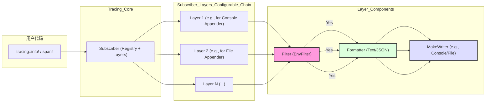

# **Summer Framework - 日志模块 (F8) 详细设计说明书 (DDS)**

**版本历史**

| 版本 | 日期       | 作者      | 变更说明                               |
| ---- | ---------- | --------- | -------------------------------------- |
| 1.0  | 2025-05-03 | FaustoFan | 基于 ODD 和 Logback 相似性要求创建初稿 |
| 1.1  | YYYY-MM-DD | (待定)    | (根据详细设计评审和开发迭代更新)       |

---

## 1. 引言

### 1.1 目的

本文档为 Summer Framework 的日志模块 (对应 SRS 中的 F8) 提供详细的设计方案。目标是设计一个功能强大、可配置、高性能的日志系统，其**配置方式和核心概念借鉴 Logback**，但底层基于 Rust 的 **`tracing`** 生态实现。

### 1.2 范围

本 DDS 覆盖日志模块的内部架构、配置解析、核心组件（Appender、Layout/Encoder、Filter）的实现策略、初始化流程、异步处理以及与框架其他部分的集成点。

### 1.3 与 ODD 的关系

本文档是 ODD 中对日志模块描述的细化，提供了更具体的实现细节和数据结构设计。

### 1.4 参考文献

- Summer Framework - 需求规格说明书 (SRS) v1.0
- Summer Framework - 概要设计说明书 (ODD) v1.0
- [Logback 官方文档](http://logback.qos.ch/documentation.html)
- [`tracing` crate](https://docs.rs/tracing/)
- [`tracing-subscriber` crate](https://docs.rs/tracing-subscriber/)
- [`tracing-appender` crate](https://docs.rs/tracing-appender/)
- [`config-rs` crate](https://docs.rs/config/)
- [`serde` crate](https://docs.rs/serde/)

### 1.5 术语

遵循 SRS 附录 A 术语表，并补充：

- **Target:** `tracing` 中的概念，通常对应于日志事件发生的模块路径 (e.g., `my_app::service::user`)，类似于 Logback 的 Logger 名称。
- **Layer:** `tracing-subscriber` 的核心抽象，用于处理过滤、格式化和分发日志事件/Span。
- **Subscriber:** `tracing` 的全局事件处理器，通常由一个或多个 Layer 组成。
- **MakeWriter:** `tracing-subscriber` 中的 Trait，用于创建可以写入日志的 `io::Write` 实例（支持异步和按需创建，如文件轮转）。
- **Appender (类似 Logback):** 在本文档中指代日志的输出目的地及其配置，底层通过 `Layer` 和 `MakeWriter` 实现。
- **Layout/Encoder (类似 Logback):** 在本文档中指代日志的格式化方式，底层通过 `tracing-subscriber` 的格式化器实现。

---

## 2. 系统概述

Summer 的日志模块旨在提供一个灵活且高性能的日志记录解决方案。它利用 `tracing` crate 提供 API（`info!`, `debug!`, `span!` 等），并基于 `tracing-subscriber` 构建一个可配置的事件处理管道。用户可以通过 YAML 或 JSON 文件（由框架的配置管理模块 F4 加载）配置日志级别、输出目的地（Appender）、日志格式（Layout/Encoder）和过滤规则，其配置结构将力求与 Logback 的核心概念保持一致性，以降低熟悉 Logback 的用户的学习成本。模块将支持结构化日志 (JSON) 和文本日志，并确保日志写入是异步非阻塞的。

---

## 3. 详细设计

### 3.1 核心架构与组件

日志模块的核心将围绕 `tracing-subscriber` 构建。其基本流程如下：

1. **事件/Span 产生:** 用户代码通过 `tracing` 宏 (`info!`, `span!`, etc.) 产生事件或进入/退出 Span。
2. **Subscriber 分发:** 全局设置的 `Subscriber` 接收这些事件/Span。
3. **Layer 处理:** `Subscriber` 将事件/Span 传递给注册的 `Layer` 链。每个 `Layer` 可以：
   - **过滤 (Filtering):** 根据 Target (模块路径)、级别、Span 数据等决定是否处理该事件。将主要使用 `EnvFilter` 实现基于配置的等级和 target 过滤。
   - **格式化 (Formatting):** 将事件/Span 转换为字符串（文本或 JSON）。
   - **写入 (Writing):** 将格式化后的字符串写入目标（通过 `MakeWriter`）。
4. **写入目标:** `MakeWriter` 负责实际的写入操作，例如写入控制台或滚动文件。

**组件交互图:**



### 3.2 配置设计 (类 Logback 风格)

配置将由主配置模块 (F4) 加载，并通过特定的 Key（如 `logging`）访问。我们将设计一套 YAML/JSON 结构来映射 Logback 的核心概念。

#### 3.2.1 配置结构 (YAML/JSON)

```yaml
# Conceptual YAML Structure (under 'logging' key)
logging:
  # (Optional) Default level for root logger if not specified elsewhere
  # level: INFO

  # Configure loggers (targets)
  loggers:
    "my_app::service": DEBUG # Set level for a specific module
    "hyper": WARN # Set level for a dependency crate
    # Additivity concept might be simplified or omitted initially
    # "my_app::controller":
    #   level: INFO
    #   additivity: false # If false, events are not passed to parent/root appenders

  # Define named appenders (output destinations)
  appenders:
    stdout: # Appender name
      type: console
      target: Stdout # or Stderr
      encoder: # Reference to an encoder/layout defined below (or inline)
        type: pattern
        pattern: "%d{yyyy-MM-dd HH:mm:ss.SSS} [%t] %-5level %logger{36} - %msg%n"

    file_appender: # Another appender name
      type: file
      path: ./logs/application.log # File path
      encoder:
        type: json
        # JSON specific options
        # include_fields: ["timestamp", "level", "target", "message"]
        # flatten_event: true
      rolling_policy: # Optional rolling policy
        type: size_and_time # or 'size', 'time'
        max_file_size: 10MB
        # For time-based: daily, hourly, minutely. Pattern determines filename.
        file_name_pattern: ./logs/application-%d{yyyy-MM-dd}.%i.log.gz # %i for index, .gz for compression
        max_history: 7 # Keep 7 rotated files


  # (Optional) Define named encoders/layouts if reused by multiple appenders
  # encoders:
  #   json_default:
  #     type: json
  #   pattern_brief:
  #     type: pattern
  #     pattern: "%level: %msg%n"
```

#### 3.2.2 Logger 配置

- 使用 `loggers` Map 来配置不同 Target (模块路径) 的日志级别。
- Key 是 Target 字符串，Value 是 Level 字符串 (`TRACE`, `DEBUG`, `INFO`, `WARN`, `ERROR`).
- 这部分配置将主要用于生成 `EnvFilter` 的指令。
- **Additivity:** Logback 的 Additivity（事件是否向上传递给父 Logger 的 Appender）在 `tracing-subscriber` 中没有直接对应。可以通过为每个 Layer 配置独立的 Filter 来模拟部分行为，但初期可以简化或省略此特性，默认所有匹配的 Layer 都会处理事件。

#### 3.2.3 Appender 配置

- 使用 `appenders` Map 定义命名的输出目的地。
- 每个 Appender 必须有 `type` 字段 (`console`, `file`)。
- **`console` type:**
  - `target`: `Stdout` 或 `Stderr` (默认 `Stdout`)。
  - `encoder`: 内联或引用定义的 Encoder 配置。
- **`file` type:**
  - `path`: 日志文件路径。
  - `encoder`: 内联或引用定义的 Encoder 配置。
  - `rolling_policy` (可选):
    - `type`: `time` (基于时间滚动), `size` (基于大小滚动), `size_and_time`。
    - `max_file_size`: (用于 `size` 或 `size_and_time`) 文件大小限制 (e.g., "10MB", "1GB")。
    - `file_name_pattern`: (用于 `time` 或 `size_and_time`) 滚动文件的命名模式，支持日期格式 (`%d{...}`) 和索引 (`%i`)。文件扩展名可用于启用压缩 (e.g., `.gz`)。
    - `max_history`: (用于 `time` 或 `size_and_time`) 保留的滚动文件数量。

#### 3.2.4 Encoder/Layout 配置

- 配置日志记录的格式。可以内联在 Appender 配置中，或在顶层 `encoders` Map 中定义并被引用。
- 每个 Encoder 必须有 `type` 字段 (`pattern`, `json`)。
- **`pattern` type:**
  - `pattern`: 类似 Logback 的模式字符串。需要实现一个自定义的 `FormatEvent` 来解析此模式。支持常见的转换符:
    - `%d{...}` 或 `%date{...}`: 时间戳 (支持 `chrono` 格式)
    - `%t` or `%thread`: 线程名/ID
    - `%level` or `%p`: 日志级别
    - `%logger{length}` or `%c{length}`: Target (模块路径), 可选长度限制
    - `%M` or `%method`: (可能难以可靠获取，初期可省略) 方法名
    - `%L` or `%line`: 行号
    - `%F` or `%file`: 文件名
    - `%msg` or `%message`: 日志消息
    - `%n`: 换行符
    - `%span{field}`: Span 字段值
    - `%trace_id`, `%span_id`: (如果集成了追踪)
    - `%mdc{key}`: (如果实现 MDC)
- **`json` type:**
  - (可选) `include_fields`: 指定要包含在 JSON 输出中的字段列表 (e.g., `timestamp`, `level`, `message`, `target`, `span_fields`, `file`, `line`)。
  - (可选) `flatten_event`: 是否将事件的字段直接平铺到 JSON 顶层。
  - (可选) 时间戳格式配置。

### 3.3 初始化流程

框架将提供一个公共的初始化函数，例如 `summer_core::logging::init(config: &AppConfig)`，其中 `AppConfig` 是包含 `logging` 配置部分的反序列化结构体。

1. **读取配置:** 从传入的 `AppConfig` 中获取 `logging` 配置。如果不存在，则使用默认配置（例如，INFO 级别输出到控制台）。
2. **解析 Appenders 和 Writers:**
   - 遍历 `appenders` 配置。
   - 根据 `type` (`console`, `file`) 创建相应的 `MakeWriter` 实例。
     - 对于 `file` 类型，使用 `tracing_appender` 根据 `path` 和 `rolling_policy` 配置创建 `RollingFileAppender` (它实现了 `MakeWriter`)。注意：文件写入必须是**异步非阻塞**的。
     - 对于 `console` 类型，使用 `tokio::io::stdout()` 或 `tokio::io::stderr()`。
   - 将创建的 `MakeWriter` 实例存储起来（可能用 `Arc` 包装，并按名称放入 `HashMap`）。
3. **解析 Formatters/Encoders:**
   - 根据 Appender 配置中的 `encoder` 部分，创建相应的 `FormatEvent` 实现。
     - 对于 `json` 类型，配置 `tracing_subscriber::fmt::format::Json`。
     - 对于 `pattern` 类型，需要实现一个自定义的 `FormatEvent` Trait 来解析模式字符串并格式化事件。
   - 将格式化逻辑与对应的 `MakeWriter` 关联。
4. **构建 Filters (EnvFilter):**
   - 创建一个 `EnvFilter` 实例。
   - 从环境变量 `RUST_LOG` 读取初始指令（如果需要支持）。
   - 解析 `logging.level` (根级别) 和 `logging.loggers` 配置，将它们转换为 `EnvFilter` 指令 (e.g., `my_app=debug,hyper=warn`) 并添加到 `EnvFilter` 中。
5. **构建 Layers:**
   - 对于每个在配置中被 Logger 引用的 Appender（或者所有 Appender，取决于 Additivity 的简化策略），创建一个 `Layer`。
   - 通常使用 `tracing_subscriber::fmt::layer()` 或 `tracing_subscriber::fmt::layer().json()`。
   - 配置 Layer 使用步骤 2 中创建的 `MakeWriter` 和步骤 3 中创建的 Formatter。
   - 将 Layer 与步骤 4 中创建的 `EnvFilter` 结合（使用 `.with_filter()`）。
6. **构建并设置全局 Subscriber:**
   - 使用 `tracing_subscriber::registry()` 作为基础。
   - 将所有创建的、带过滤器的 Layer 通过 `.with()` 添加到 Registry 上。
   - 调用 `.init()` 将构建的 Subscriber 设置为全局默认值。
7. **错误处理:** 在配置解析、Writer 创建、Subscriber 初始化过程中捕获并报告错误（例如，打印到 stderr）。

### 3.4 核心组件实现细节

#### 3.4.1 Subscriber 构建

如初始化流程所述，使用 `tracing_subscriber::registry()` 并组合多个 `Layer`。

#### 3.4.2 Layer 实现

主要使用 `tracing_subscriber::fmt::Layer`。通过其 `with_writer()`, `event_format()`, `.json()`, `with_filter()` 等方法进行配置，将 Filter, Formatter, Writer 粘合在一起。

#### 3.4.3 Filter 实现 (基于 EnvFilter)

- 主要依赖 `tracing_subscriber::filter::EnvFilter`。
- 将配置中的 `loggers` 映射解析为 `Directive` 并添加到 `EnvFilter`。例如，`{"my_app::service": "DEBUG"}` 转换为 `Directive::try_from("my_app::service=debug").unwrap()`。
- 提供对全局默认级别的支持（如果配置了 `logging.level` 或未匹配到任何特定 logger）。

#### 3.4.4 Formatter/Encoder 实现

- **JSON:** 使用 `tracing_subscriber::fmt::format::Json`。通过其配置方法 `.with_current(true/false)`, `.with_span_list(true/false)`, `.with_span_events(...)` 等来控制输出内容，映射配置中的 `include_fields` 等选项。
- **Pattern:**
  - 需要实现 `tracing_subscriber::fmt::FormatEvent` trait。
  - 创建一个结构体，例如 `PatternFormatter`，在构造时接收 pattern 字符串。
  - 在 `format_event` 方法中，解析 pattern 字符串（可能在构造时预处理），并根据当前的 `FmtContext` 和 `Event` 动态生成输出字符串。
  - 需要访问事件的元数据（级别、target、文件、行号）、消息字段、Span 上下文（通过 `ctx.lookup_current()` 或 `ctx.visit_spans()`)。
  - 时间戳格式化使用 `chrono`。
  - 这是一个相对复杂的任务，需要仔细处理各种转换符和格式化选项。

#### 3.4.5 Appender/Writer 实现 (Console, File, Rolling)

- **Console:** 使用 `tokio::io::stdout` 或 `tokio::io::stderr` 作为 `MakeWriter`。可以直接使用 `tracing_subscriber::fmt::layer().with_writer(std::io::stdout)`（同步）或需要适配 `tokio` 的异步版本（如果严格要求全异步）。_注意：对于控制台，通常同步写入也可以接受，但文件写入必须异步。_
- **File & Rolling:** 使用 `tracing_appender::rolling` 模块提供的 `RollingFileAppender`。
  - `rolling::daily(path, filename_prefix)`
  - `rolling::hourly(path, filename_prefix)`
  - `rolling::minutely(path, filename_prefix)`
  - `rolling::never(path, filename_prefix)`
  - 对于基于大小的滚动，需要结合 `tracing_appender` 的其他机制或自行实现 `MakeWriter`，或者寻找支持大小滚动的第三方库集成。_更新：`tracing-appender` 本身似乎不直接支持基于大小的滚动，这可能是一个需要自研或寻找额外库的点，或者初期只支持基于时间的滚动。_ **（设计决策/风险点）** 如果需要严格的大小滚动，可能要考虑 `rolling-file-appender` crate 并将其包装为 `MakeWriter`。
  - 文件名模式解析和压缩需要在创建 `RollingFileAppender` 时配置。

#### 3.4.6 异步处理

- **关键:** 确保日志写入操作，尤其是文件写入，不会阻塞 `tokio` 的工作线程。
- 使用 `tracing_appender` 创建的 `RollingFileAppender` 本身设计为非阻塞写入。
- 确保 `Subscriber` 的整体设置是异步兼容的。`tracing-subscriber` 默认设计为在异步环境中使用。

### 3.5 上下文处理 (Span 集成)

- 利用 `tracing` 的 Span 机制自动携带上下文信息。
- 配置 Formatter (JSON 或 Pattern) 以包含 Span 数据：
  - `fmt::Layer::with_span_events(FmtSpan::FULL)` 或类似选项。
  - `JsonLayer::with_current_span(true)`, `with_span_list(true)`.
  - 在 Pattern Formatter 中，实现 `%span{field_name}` 转换符来提取特定字段。
- **Trace ID / Span ID:** 如果使用了 `tracing-opentelemetry` 或类似集成，这些 ID 会自动附加到 Span 上，可以通过 Formatter 输出。如果没有集成，可以考虑在请求入口处（如中间件）手动创建包含唯一 ID 的根 Span。
- **MDC (可选):** 暂时不实现独立的 MDC API，优先利用 Span 的字段来存储上下文信息 (`span!("request", user_id = "123", method = "GET")`)。

### 3.6 对外 API

- **核心 API:** 用户主要通过 `tracing` 提供的宏 (`trace!`, `debug!`, `info!`, `warn!`, `error!`, `span!`) 进行日志记录。
- **初始化 API:** 提供一个公共函数，如：

  ```rust
  use summer_core::config::AppConfig; // Assuming a central config struct

  /// Initializes the logging system based on the provided configuration.
  /// Should be called once at application startup.
  ///
  /// # Errors
  /// Returns an error if configuration parsing or subscriber setup fails.
  pub fn init(config: &AppConfig) -> Result<(), LoggingError> {
      // Implementation based on section 3.3
      // ...
      Ok(())
  }

  // Associated error type
  #[derive(Debug, thiserror::Error)] // Example using thiserror
  pub enum LoggingError {
      #[error("Failed to parse logging configuration: {0}")]
      ConfigParse(String),
      #[error("Failed to create log writer: {0}")]
      WriterCreation(String),
      #[error("Failed to set global subscriber: {0}")]
      SetGlobalDefault(#[from] tracing::subscriber::SetGlobalDefaultError),
      // ... other potential errors
  }
  ```

---

## 4. 数据结构

### 4.1 配置映射结构体

需要定义一系列 `struct` 并使用 `serde::Deserialize` 来映射 YAML/JSON 配置。

```rust
use serde::Deserialize;
use std::collections::HashMap;
use tracing::Level; // Use tracing::Level directly if possible, or map strings

// Main logging configuration structure
#[derive(Deserialize, Debug, Default)]
#[serde(deny_unknown_fields)]
pub struct LoggingConfig {
    // level: Option<String>, // Root level - handle parsing to Level
    #[serde(default)]
    loggers: HashMap<String, String>, // Target -> Level (as string initially)
    #[serde(default)]
    appenders: HashMap<String, AppenderConfig>,
    // encoders: Option<HashMap<String, EncoderConfig>>, // Optional shared encoders
}

#[derive(Deserialize, Debug)]
#[serde(tag = "type", rename_all = "lowercase")]
pub enum AppenderConfig {
    Console(ConsoleAppenderConfig),
    File(FileAppenderConfig),
}

#[derive(Deserialize, Debug, Default)]
#[serde(deny_unknown_fields)]
pub struct ConsoleAppenderConfig {
    #[serde(default = "default_stdout_target")]
    target: ConsoleTarget,
    encoder: EncoderConfig, // Encoder must be defined inline or referenced
}

#[derive(Deserialize, Debug, PartialEq, Eq)]
#[serde(rename_all = "lowercase")]
pub enum ConsoleTarget {
    Stdout,
    Stderr,
}

fn default_stdout_target() -> ConsoleTarget { ConsoleTarget::Stdout }


#[derive(Deserialize, Debug)]
#[serde(deny_unknown_fields)]
pub struct FileAppenderConfig {
    path: String,
    encoder: EncoderConfig,
    rolling_policy: Option<RollingPolicyConfig>,
}

#[derive(Deserialize, Debug)]
#[serde(tag = "type", rename_all = "snake_case")]
pub enum RollingPolicyConfig {
    Time(TimeBasedRollingPolicy),
    // Size(SizeBasedRollingPolicy), // If implemented
    SizeAndTime(SizeAndTimeBasedRollingPolicy),
}

#[derive(Deserialize, Debug)]
pub struct TimeBasedRollingPolicy {
    file_name_pattern: String, // e.g., "app-%d{yyyy-MM-dd}.log"
    #[serde(default = "default_max_history")]
    max_history: usize,
}


#[derive(Deserialize, Debug)]
pub struct SizeAndTimeBasedRollingPolicy {
    file_name_pattern: String, // e.g., "app-%d{yyyy-MM-dd}.%i.log.gz"
    max_file_size: String, // e.g., "10MB", needs parsing
    #[serde(default = "default_max_history")]
    max_history: usize,
}

fn default_max_history() -> usize { 7 } // Example default

#[derive(Deserialize, Debug, Clone)] // Clone might be needed
#[serde(tag = "type", rename_all = "lowercase")]
pub enum EncoderConfig {
    Pattern(PatternEncoderConfig),
    Json(JsonEncoderConfig),
}

#[derive(Deserialize, Debug, Clone, Default)]
pub struct PatternEncoderConfig {
    pattern: String,
}

#[derive(Deserialize, Debug, Clone, Default)]
pub struct JsonEncoderConfig {
    // include_fields: Option<Vec<String>>,
    // flatten_event: Option<bool>,
    // timestamp_format: Option<String>,
    // ... other JSON specific flags from tracing-subscriber
    #[serde(flatten)] // Allow direct inclusion of JsonLayer builder flags
    json_options: HashMap<String, serde_json::Value>,
}


// Need helper functions to parse level strings, file sizes, etc.
```

---

## 5. 接口设计

### 5.1 公共接口

- **`summer_core::logging::init(config: &AppConfig) -> Result<(), LoggingError>`:** 应用程序启动时调用的唯一公共初始化函数。
- **`tracing` 宏:** `trace!`, `debug!`, `info!`, `warn!`, `error!`, `span!` 等，由 `tracing` crate 提供。

### 5.2 内部接口 (暂定)

- `PatternFormatter`: 实现 `FormatEvent` trait。
- 可能需要内部帮助函数来解析配置、构建 `MakeWriter` 和 `Layer`。

---

## 6. 错误处理

- **初始化时:** `init()` 函数返回 `Result<(), LoggingError>`。`LoggingError` 枚举包含配置解析错误、无法创建 Appender/Writer（如文件权限问题）、设置全局 Subscriber 失败等。
- **运行时:** `tracing` 和 `tracing-subscriber` 本身设计为在日志记录失败时尽量不 panic 或严重影响应用程序。写入错误（例如磁盘满）通常会被内部处理（可能打印到 stderr 或被忽略），但需要验证 `tracing-appender` 的具体行为。

---

## 7. 设计原理与权衡

- **类 Logback 配置 vs. `tracing` 原生配置 (`EnvFilter`):** 采用类 Logback 结构是为了降低熟悉 Java 生态的用户的学习曲线。底层仍然映射到 `tracing` 的概念（主要是 `EnvFilter` 和 `Layer` 配置）。这增加了配置解析的复杂性，但提高了易用性。
- **Pattern Layout 实现:** 实现自定义的 Pattern Layout 解析器比直接使用 `tracing-subscriber` 的内置格式化器更复杂，但提供了与 Logback 更相似的体验。需要确保性能和正确性。
- **异步写入:** 强制文件写入异步是保证性能的关键，依赖 `tracing-appender`。
- **大小滚动:** `tracing-appender` 对大小滚动的直接支持有限，这是一个潜在的功能差距或需要额外工作/依赖的地方。初期可能优先实现基于时间的滚动。
- **Additivity:** 简化处理，不直接模拟 Logback 的 Additivity，依赖 Layer 自身的过滤。
- **依赖:** 引入 `tracing-appender` 等额外依赖。

---
