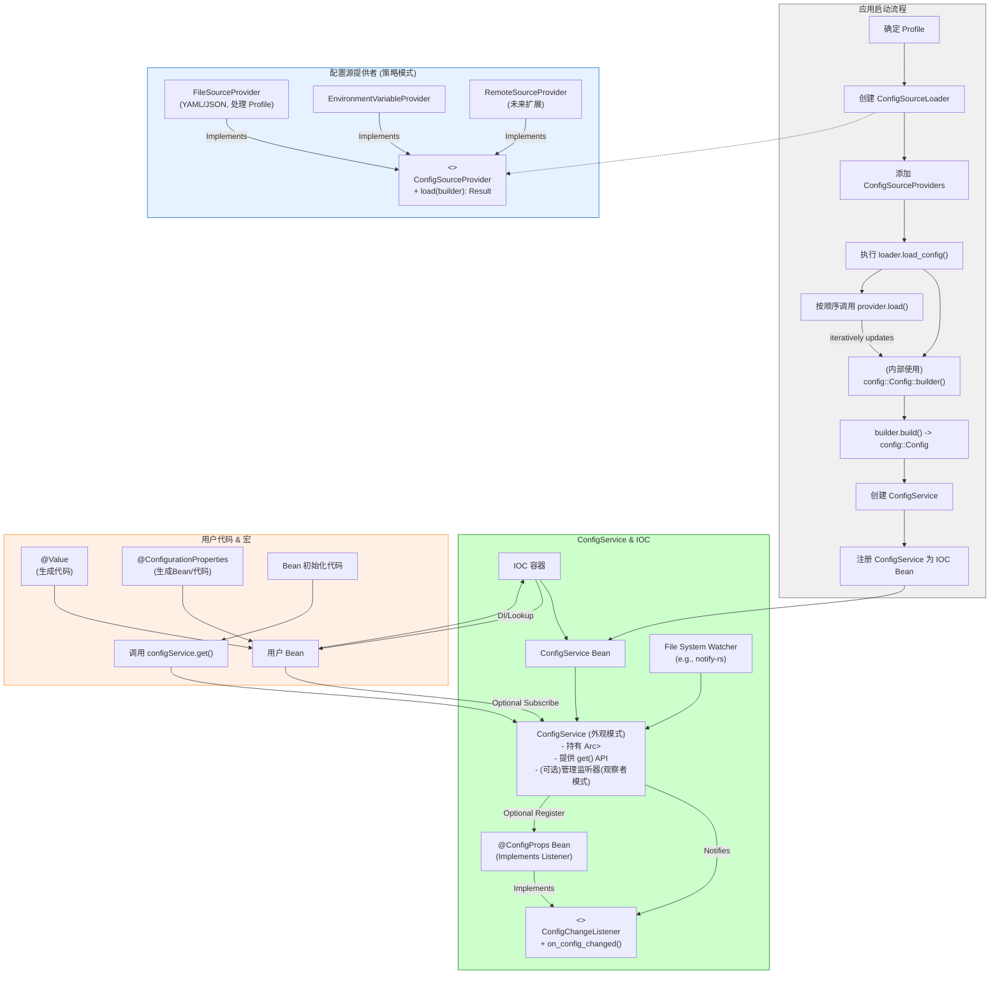

# **Summer Framework - 配置管理模块 (F4) 详细设计说明书 (DDS)**

**版本历史**

| 版本 | 日期       | 作者      | 变更说明                                                                                       |
| :--- | :--------- | :-------- | :--------------------------------------------------------------------------------------------- |
| 1.0  | 2025-05-03 | FaustoFan | 基于 ODD 和需求创建初稿                                                                        |
| 2.0  | 2025-05-06 | FaustoFan | **架构优化:** 应用策略、构建器、外观、观察者(可选)等模式优化加载流程和热加载设计，提升扩展性。 |
| 2.1  | YYYY-MM-DD | (待定)    | (根据后续详细设计评审和开发迭代更新)                                                           |

---

## 1. 引言

### 1.1 目的

本文档旨在详细说明 Summer Framework 配置管理模块 (F4) 的内部设计和实现策略。目标是设计一个**架构清晰、扩展良好**、支持分层加载、多格式、类型安全访问，并能与 IOC 容器紧密集成以实现配置注入的系统。本文档通过应用**策略模式 (Strategy Pattern)**、**构建器模式 (Builder Pattern)**、**外观模式 (Facade Pattern)** 以及为可选的热加载功能引入**观察者模式 (Observer Pattern)** 来优化设计。

### 1.2 范围

本 DDS 覆盖配置源的**策略化加载机制**、`config-rs` 库的封装与使用、核心服务 (`ConfigService` - **外观模式**) 的设计、与 IOC 容器的集成方式（`@Value` 和 `@ConfigurationProperties` 注解的实现细节）、错误处理策略，以及可选的热加载功能的详细设计（应用**观察者模式**）。

### 1.3 与 ODD 的关系

本文档是对 ODD 中配置管理模块高层设计的具体化和细化，**核心变更为采用策略模式优化配置源加载**，明确 `ConfigService` 的外观角色，并为热加载提供了基于观察者模式的详细设计方案，强调了设计模式在提升模块质量方面的应用。

### 1.4 参考文献

- Summer Framework - 需求规格说明书 (SRS) v1.0
- Summer Framework - 概要设计说明书 (ODD) v1.0
- [`config` crate (config-rs) 文档](https://docs.rs/config/)
- [`serde` crate 文档](https://serde.rs/)
- Rust 过程宏 (Proc-Macro) 相关文档
- Design Patterns: Elements of Reusable Object-Oriented Software (GoF Book) (参考策略、构建器、外观、观察者模式)
- [`notify-rs` crate 文档 (用于热加载)](https://docs.rs/notify/)

### 1.5 术语

遵循 SRS 和 ODD 术语，并强调：

- **配置源 (Configuration Source):** 提供配置数据的地方（如文件、环境变量、远程服务）。
- **配置源提供者 (ConfigSourceProvider - 策略模式):** 负责从特定类型源加载配置的策略接口/实现。
- **配置加载器 (ConfigSourceLoader):** 负责按顺序协调执行多个 `ConfigSourceProvider` 的组件。
- **分层加载 (Layered Loading):** 按特定优先级顺序加载多个配置源，后加载的覆盖先加载的。
- **Profile (环境):** 用于区分部署环境的标识符，影响加载哪些配置文件。
- **`ConfigService` (外观模式):** 框架内部提供统一、简化的配置访问接口的核心服务组件。
- **`@Value`:** 将单个配置项注入 Bean 字段的注解。
- **`@ConfigurationProperties`:** 将配置子树绑定到结构体 Bean 的注解。
- **热加载 (Hot Reloading):** 在应用运行时重新加载配置文件的能力。
- **观察者模式 (Observer Pattern):** 用于实现热加载时配置变更通知的模式。`ConfigService` 作为主题 (Subject)，相关 Bean 作为观察者 (Observer)。

---

## 2. 系统概述

配置管理模块 (F4) 是 Summer Framework 的关键基础设施，负责为整个应用程序提供统一、灵活、类型安全的配置访问。其核心设计围绕以下原则：

- **策略化加载:** 使用**策略模式**将不同配置源（文件、环境变量等）的加载逻辑解耦，便于扩展新的配置源类型（如远程配置中心）。
- **有序协调:** 一个**配置加载器 (ConfigSourceLoader)** 负责按预定义优先级顺序调用各个配置源策略 (ConfigSourceProvider)，利用 `config-rs` 的**构建器模式**逐步构建最终配置。
- **统一访问接口:** `ConfigService` 作为**外观模式**的体现，封装了底层 `config::Config` 实例和访问逻辑（以及可选的热加载通知机制），为框架和用户代码提供简洁、线程安全的 API。
- **声明式注入:** 通过与 IOC 容器和过程宏 (`summer-macros`) 的紧密集成，支持 `@Value` 和 `@ConfigurationProperties` 注解，实现配置到 Bean 的自动注入。
- **可选热加载:** 通过引入文件系统监听和**观察者模式**，提供配置变更时自动重新加载并通知相关组件（如 `@ConfigurationProperties` Bean）的能力（此功能设计为可选，可能在 v1.0 后实现）。

---

## 3. 详细设计

### 3.1 核心架构 (应用设计模式)

优化后的架构采用策略模式处理配置源，并明确了各组件的角色。



**核心组件职责:**

- **`ConfigSourceLoader`:**
  - **职责:** 协调整个配置加载过程。
  - **机制:** 持有一个有序的 `Vec<Box<dyn ConfigSourceProvider>>` 列表。`load_config` 方法按顺序迭代调用每个 Provider 的 `load` 方法，将 `config::ConfigBuilder` 传递下去，最终调用 `builder.build()` 生成 `config::Config` 实例。
- **`ConfigSourceProvider` (Trait - 策略接口):**
  - **定义:** `fn load(&self, builder: config::Builder<impl config::Source + ...>) -> Result<config::Builder<...>, ConfigError>;` (签名需根据 `config-rs` 的 Builder 类型确定)
  - **职责:** 定义了从特定来源加载配置并将其添加到 `config-rs` Builder 的统一接口。
- **`FileSourceProvider` (Concrete Strategy):**
  - **职责:** 实现 `ConfigSourceProvider`，负责加载文件配置。
  - **机制:** 内部根据传入的 Profile 和基础文件名 (`application`) 构建文件路径列表（如 `config/application.yaml`, `config/application-{profile}.yaml`）。按顺序尝试加载这些文件（YAML 优先或 JSON 优先，或自动检测），并将找到的文件源添加到 Builder 中。处理 `required(false)` 逻辑。需要健壮的文件路径查找策略。
- **`EnvironmentVariableProvider` (Concrete Strategy):**
  - **职责:** 实现 `ConfigSourceProvider`，负责加载环境变量。
  - **机制:** 使用 `config::Environment::with_prefix("SUMMER").separator("__")...` 创建环境变量源，并添加到 Builder 中。
- **`ConfigService` (外观模式 & 主题模式 - 可选):**
  - **职责:**
    1.  作为配置访问的统一入口点 (Facade)，封装底层 `config::Config` 的复杂性。
    2.  提供类型安全的 `get<T>()` 等方法。
    3.  (可选热加载) 作为观察者模式中的主题 (Subject)，持有配置实例 (`Arc<RwLock<config::Config>>`)，管理监听器列表，并在配置更新时通知监听者。
  - **实现:** 作为一个单例 IOC Bean。
- **`@Value`, `@ConfigurationProperties` Macros:**
  - **职责:** 在编译时处理注解，生成与 `ConfigService` 交互的代码，实现声明式配置注入。
- **`ConfigChangeListener` (Trait - 观察者接口, 可选):**
  - **定义:** `fn on_config_changed(&self, updated_keys: &HashSet<String>);` (或更简单的无参数版本)
  - **职责:** 定义了配置变更时被通知的对象的行为接口。
- **`@ConfigurationProperties` Bean (观察者实现, 可选):**
  - 带有 `@ConfigurationProperties` 注解的 Bean 可以选择实现 `ConfigChangeListener` 接口，并在 `on_config_changed` 方法中重新从 `ConfigService` 获取配置进行绑定。

### 3.2 配置加载流程 (策略模式优化)

启动流程中配置加载的核心步骤：

1.  **确定 Profile:** 通过命令行参数 (最高优先级) 或环境变量 (`SUMMER_PROFILE`) 确定当前的 Profile 名称。如果均未设置，则使用默认值 (如 `None` 或 `"default"`）。
2.  **创建 `ConfigSourceLoader`:** 实例化 `ConfigSourceLoader`。
3.  **创建并注册 Providers:**
    - 实例化 `FileSourceProvider`，传入 Profile 名称和基础文件名 ("application")。
    - 实例化 `EnvironmentVariableProvider`，传入前缀 ("SUMMER") 和分隔符 ("\_\_")。
    - (未来) 实例化其他 Provider (如 `RemoteSourceProvider`)。
    - 按照优先级将这些 Provider 注册到 `ConfigSourceLoader` 的列表中 (e.g., File -> Env -> Remote)。
4.  **执行加载:** 调用 `config_source_loader.load_config()`。
    - Loader 内部初始化一个 `config::Config::builder()`。
    - 按顺序调用每个 Provider 的 `load(builder)` 方法，每个 Provider 将其来源添加到传入的 builder 并返回更新后的 builder。
    - 最后调用 `builder.build()` 生成最终的 `config::Config` 实例。
5.  **创建 `ConfigService`:** 使用上一步生成的 `config::Config` 实例和 Profile 名称创建 `ConfigService`。
6.  **注册 Bean:** 将 `ConfigService` 实例注册为单例 Bean 到 IOC 容器。

**优点:**

- **解耦:** 加载逻辑与具体来源分离。
- **可扩展:** 添加新配置源只需实现 `ConfigSourceProvider` trait 并注册即可，无需修改 `ConfigSourceLoader`。
- **清晰:** 加载流程更结构化。

### 3.3 `ConfigSourceProvider` 实现细节

- **`FileSourceProvider`:**
  - 需要确定文件搜索路径（如 `./config/`, 可执行文件同级目录下的 `config/` 等）。
  - 处理 YAML 和 JSON 格式（可能需要 `config-rs` 的 `yaml` 和 `json` features）。
  - 根据 Profile 构建文件名 (e.g., `application.yaml`, `application-dev.yaml`) 并按顺序尝试加载。
  - 使用 `File::new(...).required(false)`。
- **`EnvironmentVariableProvider`:**
  - 配置前缀 (`SUMMER`)、分隔符 (`__`)、是否尝试解析类型 (`try_parsing`)、列表分隔符 (`,`) 等。

### 3.4 `ConfigService` 组件

#### 3.4.1 职责 (回顾)

- Facade: 简化配置访问。
- 持有配置状态 (`config::Config`)。
- (可选) Subject: 管理配置变更监听器。

#### 3.4.2 结构 (考虑热加载)

```rust
use config::{Config, ConfigError};
use serde::de::DeserializeOwned;
use std::collections::{HashMap, HashSet};
use std::sync::{Arc, Weak};
use tokio::sync::{Mutex, RwLock}; // Use async locks if reload happens in async context

// Trait for configuration change listeners (Observer)
#[async_trait::async_trait] // If on_config_changed needs async
pub trait ConfigChangeListener: Send + Sync {
    async fn on_config_changed(&self, changed_keys: &HashSet<String>); // Pass changed keys if possible
}

// Mark with #[component] or similar
pub struct ConfigService {
    // Use RwLock for read-heavy access, Arc for shared ownership
    config: Arc<RwLock<Config>>,
    active_profile: Option<String>,

    // --- Optional Hot Reloading Fields ---
    // Use Mutex for infrequent modification of listeners list
    // Weak references prevent ConfigService from keeping listeners alive indefinitely
    listeners: Mutex<Vec<Weak<dyn ConfigChangeListener>>>,
}

impl ConfigService {
    pub(crate) fn new(initial_config: Config, active_profile: Option<String>) -> Arc<Self> {
        Arc::new(Self {
            config: Arc::new(RwLock::new(initial_config)),
            active_profile,
            listeners: Mutex::new(Vec::new()),
        })
    }

    // --- Core Access Methods ---
    pub async fn get<T: DeserializeOwned>(&self, key: &str) -> Result<T, ConfigError> {
        let config_guard = self.config.read().await; // Async read lock
        config_guard.get(key)
    }

    // get_or_default, get_or, get_opt (async versions)
    pub async fn get_or_default<T: DeserializeOwned + Default>(&self, key: &str) -> T {
        self.get(key).await.unwrap_or_default()
    }
    // ... other get variants adapted for async ...

    pub fn get_active_profile(&self) -> Option<&str> {
        self.active_profile.as_deref()
    }

    // --- Optional Hot Reloading Methods ---

    /// Registers a listener for configuration changes.
    /// Listeners are stored as Weak references.
    pub async fn register_listener(&self, listener: Weak<dyn ConfigChangeListener>) {
        let mut listeners_guard = self.listeners.lock().await; // Async write lock
        listeners_guard.push(listener);
        // Clean up dead weak references occasionally
        listeners_guard.retain(|weak| weak.strong_count() > 0);
    }

    /// Called internally when configuration is reloaded.
    /// Updates the internal config atomically and notifies listeners.
    pub(crate) async fn update_config(&self, new_config: Config, changed_keys: HashSet<String>) {
        { // Limit scope of write lock
            let mut config_guard = self.config.write().await;
            *config_guard = new_config;
        } // Write lock released here

        self.notify_listeners(changed_keys).await;
    }

    /// Notifies registered listeners about configuration changes.
    async fn notify_listeners(&self, changed_keys: HashSet<String>) {
        let mut listeners_guard = self.listeners.lock().await;
        // Iterate over weak refs, upgrade to Arc, and call listener
        let mut cleanup_needed = false;
        let futures = listeners_guard.iter().filter_map(|weak_listener| {
            weak_listener.upgrade().map(|listener| {
                // Clone keys for each listener call? Or Arc? Arc is better.
                let keys_arc = Arc::new(changed_keys.clone());
                 // Use tokio::spawn if on_config_changed can block or is long-running
                // Be careful with async trait methods and Send bounds
                async move {
                    listener.on_config_changed(&keys_arc).await;
                }
            })
        }).collect::<Vec<_>>();

        // Remove dead listeners after iteration
        listeners_guard.retain(|weak| {
            let exists = weak.strong_count() > 0;
            if !exists { cleanup_needed = true; }
            exists
        });
        drop(listeners_guard); // Release lock before awaiting futures

        // Await all notifications concurrently (or sequentially if needed)
        futures::future::join_all(futures).await;

        if cleanup_needed {
           // Optional: log that cleanup happened
        }
    }
}
```

#### 3.4.3 IOC 集成

- `ConfigService` (作为 `Arc<ConfigService>`) 被注册为单例 Bean。
- 其他 Bean 通过构造函数注入或字段注入 (`#[autowired]`) 获取 `Arc<ConfigService>`。

### 3.5 与 IOC 的集成：配置注入

配置注入依然依赖 `summer-macros` 实现。

#### 3.5.1 `@Value` 注解实现

- **宏解析:** (同 v1.0) 解析 `key` 和 `defaultValue`。
- **代码生成 (考虑 async ConfigService):**

  - 生成的代码现在需要在 Bean 的初始化逻辑中（可能在 `async fn` 或需要 `block_on` 的地方）与 `ConfigService` 交互。
  - 如果 Bean 的初始化是同步的，而 `ConfigService::get` 是异步的，需要处理运行时阻塞 (`tokio::runtime::Handle::current().block_on(...)`)，或者要求 Bean 初始化也是异步的。**这是框架设计的重要决策点。如果追求全异步，Bean 初始化也应支持异步。**
  - **假设初始化是同步的，需要阻塞 (简单但不推荐):**

    ```rust
    // Inside synchronous bean init code generated by macros
    {
        let config_service = context.get_bean::<::summer_config::ConfigService>().unwrap();
        const CONFIG_KEY: &str = "config.key";
        const DEFAULT_VALUE_STR: Option<&str> = Some("defaultValue");

        // BLOCKING call - requires access to a Tokio runtime handle
        let final_value = tokio::runtime::Handle::current().block_on(async {
            let value_result = config_service.get::<FieldType>(CONFIG_KEY).await;
            match value_result {
                Ok(v) => v,
                Err(_) => { /* ... parse default or panic ... */ }
            }
        });
        target_struct_instance.field_name = final_value;
    }
    ```

  - **假设初始化是异步的 (更好):**

    ```rust
    // Inside async bean init function generated by macros
    async fn initialize_bean(context: &AppContext, instance: &mut MyBean) -> Result<(), Error> {
        let config_service = context.get_bean::<::summer_config::ConfigService>().unwrap();
        const CONFIG_KEY: &str = "config.key";
        const DEFAULT_VALUE_STR: Option<&str> = Some("defaultValue");

        let value_result = config_service.get::<FieldType>(CONFIG_KEY).await;
        instance.field_name = match value_result {
            Ok(v) => v,
            Err(_) => { /* ... parse default or return/panic ... */ }
        };
        Ok(())
    }
    ```

- **默认值解析:** 依然是挑战，需要 `FieldType: DeserializeOwned + FromStr` 或特定类型处理。

#### 3.5.2 `@ConfigurationProperties` 注解实现

- **首选方式 (作为 Bean Definition):**

  - `@configuration_properties` 宏标记该 struct 为一个特殊的配置 Bean。
  - IOC 容器的 Bean 工厂负责创建此 Bean。
  - **创建逻辑 (考虑 async):**

    ```rust
    // IOC's async bean factory logic
    async fn create_config_props_bean<T: DeserializeOwned + Send + Sync + 'static>(context: &AppContext, prefix: &str) -> Result<T, Error> {
        let config_service = context.get_bean::<::summer_config::ConfigService>().unwrap();
        // Use async get
        let properties_bean = config_service.get::<T>(prefix).await
            .map_err(|e| /* Wrap error */ Error::ConfigBindError { prefix: prefix.to_string(), type_name: std::any::type_name::<T>(), source: e })?;

        // --- Optional Hot Reloading Integration ---
        // If T implements ConfigChangeListener and hot reload enabled:
        // let weak_ref = Arc::downgrade(&(/* the Arc'd bean instance */));
        // config_service.register_listener(weak_ref).await;
        // -----------------------------------------

        Ok(properties_bean)
    }
    ```

- **热加载集成:** 如果启用了热加载，并且该 Properties Bean 实现了 `ConfigChangeListener`，IOC 在创建 Bean 后需要将其（的 `Weak` 引用）注册到 `ConfigService` 的监听器列表中。

### 3.6 配置格式支持

- 依赖 `config-rs`，通过启用其 `yaml`, `json`, `toml` 等 feature 来支持相应格式。
- `FileSourceProvider` 需要能处理多种扩展名。

### 3.7 热加载 (可选/未来 - 基于观察者模式)

1.  **启用:** 可能通过 `AppConfig` 中的一个标志或特定的 Profile 启用。
2.  **文件监听:** 在 `ConfigService` 初始化时（如果启用了热加载），启动一个后台任务（使用如 `notify-rs`），监控配置文件（`application.yaml`, `application-{profile}.yaml`）的变化。需要处理好 debounce（短时间内多次修改只触发一次）和错误。
3.  **重新加载:** 监听到稳定变化后，该后台任务：
    - 调用与启动时类似的加载逻辑 (`ConfigSourceLoader` or simplified version) 重新加载所有源，生成 `new_config: config::Config`。
    - (可选) 计算 `new_config` 相对于旧配置实际发生变化的 key 集合 (`HashSet<String>`)。这比较复杂，或者可以简单地传递一个空集合表示“某些配置已变”。
    - 调用 `config_service.update_config(new_config, changed_keys).await`。
4.  **原子更新与通知:**
    - `ConfigService::update_config` 获取 `config` 的写锁，更新内部 `Config` 实例。
    - 然后获取 `listeners` 的锁，遍历 `Weak` 引用，升级为 `Arc`，并异步调用每个监听器的 `on_config_changed(&changed_keys)` 方法。
5.  **监听者实现 (`@ConfigurationProperties` Bean):**
    - 带有 `@ConfigurationProperties` 的 Bean 如果希望支持热更新，需要：
      - 实现 `ConfigChangeListener` trait。
      - `on_config_changed` 方法内部（可能需要检查 `changed_keys` 是否与自己的 `prefix` 相关）重新调用 `config_service.get::<Self>(self.prefix).await` 来获取新的配置值，并更新自身状态（可能需要 `Mutex` 或 `RwLock` 保护自身字段）。
      - 在被 IOC 创建后，将其 `Weak` 引用注册到 `ConfigService`。

---

## 4. 数据结构

### 4.1 核心内部结构

- **`ConfigSourceLoader`:**
  ```rust
  struct ConfigSourceLoader {
      providers: Vec<Box<dyn ConfigSourceProvider>>,
  }
  ```
- **`ConfigSourceProvider` Trait:**
  ```rust
  trait ConfigSourceProvider: Send + Sync { // Bounds depend on usage
      // Signature might need adjustment based on config-rs builder specifics
      fn load(&self, builder: config::Builder<...>) -> Result<config::Builder<...>, ConfigError>;
  }
  ```
- **`ConfigService`:** (见 [3.4.2 结构 (考虑热加载)](#342-结构-考虑热加载))
- **`ConfigChangeListener` Trait:** (见 [3.4.2 结构 (考虑热加载)](#342-结构-考虑热加载))

### 4.2 用户配置结构体

(同 v1.0) 用户根据自己的 `application.yaml` 结构定义相应的 `struct` 并派生 `Deserialize`。

---

## 5. 接口设计

### 5.1 公共接口

- **`ConfigService` 方法 (async):**
  - `async fn get<T: DeserializeOwned>(&self, key: &str) -> Result<T, ConfigError>`
  - `async fn get_or_default<T: DeserializeOwned + Default>(&self, key: &str) -> T`
  - `async fn get_or<T: DeserializeOwned>(&self, key: &str, default: T) -> T`
  - `async fn get_opt<T: DeserializeOwned>(&self, key: &str) -> Result<Option<T>, ConfigError>`
  - `fn get_active_profile(&self) -> Option<&str>` (这个通常不需要 async)
  - **(可选热加载)** `async fn register_listener(&self, listener: Weak<dyn ConfigChangeListener>)`
- **注解接口 (通过 Proc-Macros):**
  - `#[value("${key:defaultValue}")]`
  - `#[configuration_properties(prefix = "prefix.path")]`

### 5.2 内部接口

- **`LogEngineStrategy` Trait & Implementations:** (来自日志模块，但配置模块需理解其输入是 `LoggingConfig`)
- **`ConfigSourceLoader` 方法:**
  - `fn new() -> Self`
  - `fn add_provider(&mut self, provider: Box<dyn ConfigSourceProvider>)`
  - `fn load_config(&self) -> Result<config::Config, ConfigError>`
- **`ConfigSourceProvider` Trait:**
  - `fn load(...) -> Result<config::Builder<...>, ConfigError>`
- **`ConfigChangeListener` Trait:**
  - `async fn on_config_changed(&self, changed_keys: &HashSet<String>)`
- **`ConfigService` 内部方法 (用于热加载):**
  - `async fn update_config(...)`
  - `async fn notify_listeners(...)`

---

## 6. 错误处理

- **加载阶段 (`ConfigSourceLoader::load_config`):**
  - 返回 `ConfigError`，封装来自各个 `ConfigSourceProvider::load` 的错误（文件未找到但 `required(true)`、文件解析失败、IO 错误等）。启动流程应捕获此错误并中止。
- **初始化阶段 (`ConfigService` 创建/注册, 宏处理):**
  - `ConfigService` 创建失败通常是由于加载阶段错误。
  - `@Value` / `@ConfigurationProperties` 注入失败（Key 未找到无默认、默认值解析失败、类型不匹配）**默认应 Panic**，以快速暴露配置错误。`LoggingError` 中需要定义相应的 Panic 信息或特定的 Error 类型。
- **运行时访问 (`ConfigService::get*`):**
  - `get` 返回 `Result<T, ConfigError>`，调用方需处理 `NotFound`, `Deserialize` 等错误。
  - `get_or_default`, `get_or`, `get_opt` 提供了不同的错误处理策略（默认值或 `Option`）。
- **热加载阶段 (可选):**
  - 文件监控错误 (e.g., `notify-rs` 错误)。
  - 重新加载配置时的错误（同加载阶段）。
  - 通知监听者时的错误（监听者自身的 `on_config_changed` 可能失败）。需要设计健壮的通知机制，单个监听者失败不应影响其他监听者。

---

## 7. 与配置模块 (F4) 的集成

本 DDS 定义的就是配置模块 (F4) 自身的设计。它与其他模块的集成主要通过以下方式：

1.  **提供 `ConfigService` Bean:** 其他模块通过 IOC 获取 `ConfigService` 来访问配置。
2.  **支持配置注入宏:** `@Value` 和 `@ConfigurationProperties` 使得 Bean 可以声明式地获取配置，宏生成的代码在后台与 `ConfigService` 交互。

---

## 8. 启动流程集成

配置模块 (F4) 在启动流程中扮演**早期核心角色**：

1.  **紧随入口点之后:** 配置加载是应用程序了解其运行环境和参数的第一步。
2.  **先于日志初始化:** 加载出的 `LoggingConfig` 是初始化日志模块的输入。
3.  **先于 IOC 容器:** IOC 容器需要 `AppConfig` 来进行条件装配和配置属性注入。
4.  **先于所有业务逻辑:** 业务逻辑依赖于框架初始化完成，包括配置的可用性。

**失败处理:** 配置加载失败通常是**致命错误**，应阻止应用程序继续启动。

---

## 9. 与其他模块的互动设计

配置模块 (F4) 通过其核心产物 `ConfigService` Bean 与其他模块互动。其他模块**不应**直接依赖配置加载的具体实现（如 `ConfigSourceLoader` 或 Providers），而应**仅依赖** `ConfigService` 提供的接口。

- **日志模块 (F8) -> ConfigService:**
  - 在 `logging::init` 函数中，如果需要读取除传入的 `LoggingConfig` 之外的其他配置（虽然通常不需要），理论上可以尝试从（尚未完全初始化的）IOC 容器中获取 `ConfigService`，但这会引入启动顺序问题，**应避免**。日志模块的主要输入是启动流程传递的 `LoggingConfig`。
- **IOC 容器 (F3) / 自动配置 (F5) -> ConfigService:**
  - **高频互动:**
    - 读取 `@Value` 注解指定的配置项。
    - 读取 `@ConfigurationProperties` 注解指定的配置前缀，并将子树反序列化为 Bean。
    - 读取用于 `@ConditionalOnProperty` 等条件注解判断的配置项。
- **数据库/缓存/消息队列 Starters (F5/F9) -> ConfigService:**
  - 这些 Starters 通常会定义自己的 `@ConfigurationProperties` Bean 来接收连接信息、池大小等参数。
  - 或者在其 `@Bean` 工厂方法内部直接注入 `ConfigService` 并调用 `get()` 获取所需配置。
- **Web 层 (F1/F2) -> ConfigService:**
  - 读取服务器端口 (`server.port`)、主机 (`server.host`)、线程数、TLS 配置等。通常通过 `ServerProperties` Bean (`@ConfigurationProperties`) 实现。
- **AOP (F6) / 插件 (F9) / 用户代码 -> ConfigService:**
  - 任何需要访问配置的组件，都可以通过 IOC 注入 `Arc<ConfigService>` 并调用其 `get*` 方法来获取所需配置值。

**总结:** `ConfigService` 作为配置数据的唯一、统一访问点，确保了其他模块与配置系统的**低耦合**。配置系统的内部实现（加载策略、热加载等）对其他模块是透明的。

---

## 10. 设计原理与权衡

- **基于 `config-rs`:**
  - **优点:** 复用成熟库，功能丰富。
  - **缺点:** 受限于库本身能力，升级可能带来兼容问题。
- **策略模式 (ConfigSourceProvider):**
  - **优点:** 加载逻辑解耦，易于扩展新配置源（如数据库、远程配置中心），符合开闭原则。
  - **缺点:** 增加了少量抽象层。
- **外观模式 (ConfigService):**
  - **优点:** 简化了对配置系统的访问，隐藏了底层 `config::Config` 和可选的热加载复杂性。
  - **缺点:** 所有访问都通过一个中心点。
- **声明式注入 (`@Value`, `@ConfigurationProperties`):**
  - **优点:** 极大提升易用性，减少样板代码，类似 Spring Boot 体验。
  - **缺点:** 依赖复杂的过程宏实现，增加编译时开销，宏的调试可能困难。
- **Panic on Injection Error:**
  - **优点:** 快速失败，强制开发者处理配置缺失或错误。
  - **缺点:** 对某些场景可能不够健壮，缺乏灵活性。可以考虑提供配置开关或替代注解来改变行为（如返回 `Option` 或 `Result`）。
- **热加载 (观察者模式):**
  - **优点:** 提高系统灵活性，允许运行时调整配置而无需重启。
  - **缺点:** 显著增加复杂性（文件监控、线程安全、原子更新、变更通知、监听者状态管理），可能引入潜在的运行时问题。设计为可选功能是明智的。
- **低耦合、高内聚:** 通过策略模式分离了配置源加载逻辑；通过外观模式封装了核心服务；通过宏将注入逻辑与业务代码分离。这些都有助于实现低耦合和高内聚。

---

**最终总结:**
本 DDS v2.0 提出了一个经过设计模式优化的配置管理模块方案。它通过策略模式增强了配置源加载的灵活性和可扩展性，通过外观模式提供了简洁稳定的访问接口，并通过与 IOC 和宏的集成实现了强大的声明式配置注入能力。可选的热加载功能采用观察者模式进行了详细设计。该设计在提升易用性的同时，注重内部结构的清晰、内聚和可扩展性，但也意识到了宏和热加载带来的复杂性，并在设计中进行了权衡。
