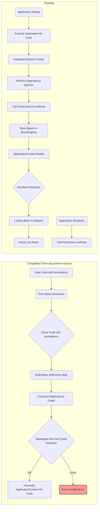

# **Summer Framework - IOC 容器模块 (F3) 详细设计说明书 (DDS)**

**版本历史**

| 版本 | 日期       | 作者      | 变更说明                         |
| ---- | ---------- | --------- | -------------------------------- |
| 1.0  | 2025-05-03 | FaustoFan | 基于 ODD 和需求创建初稿          |
| 1.1  | YYYY-MM-DD | (待定)    | (根据详细设计评审和开发迭代更新) |

---

## 1. 引言

### 1.1 目的

本文档为 Summer Framework 的 Inversion of Control (IOC) 容器模块 (对应 SRS 中的 F3) 提供详细的设计方案。目标是设计一个高效、类型安全、易于使用的依赖注入容器，其核心机制通过 Rust 的过程宏在编译时完成大部分工作，提供类似 Spring 的开发体验。

### 1.2 范围

本 DDS 覆盖 IOC 容器的组件发现、依赖解析、实例化、注入、生命周期管理、作用域（初期为 Singleton）、AOP 集成以及运行时 Bean 访问的详细设计。重点在于过程宏如何处理注解以及生成的代码如何构建和操作运行时容器。

### 1.3 与 ODD 的关系

本文档是对 ODD 中 IOC 容器模块高层设计的具体化和细化，深入探讨了编译时处理逻辑、运行时数据结构以及关键算法。

### 1.4 参考文献

- Summer Framework - 需求规格说明书 (SRS) v1.0
- Summer Framework - 概要设计说明书 (ODD) v1.0
- Rust 过程宏 (Proc-Macro) 文档, `syn`, `quote` crates
- `std::any::TypeId`, `std::any::Any`
- `std::sync::Arc`
- (如有参考) `shaku`, `inject` 等 Rust DI 库的设计

### 1.5 术语

遵循 ODD 术语，并强调：

- **Bean Definition:** 关于一个 Bean 的元数据，包含其类型、依赖、生命周期方法等信息，主要在编译时使用。
- **Bean Registry:** 运行时存储已实例化 Bean (通常是 `Arc<T>`) 的数据结构。
- **ApplicationContext:** 运行时 IOC 容器的实例，持有 Bean Registry 并提供访问接口。
- **编译时处理:** 利用过程宏在 `cargo build` 期间分析代码、生成元数据和代码。
- **运行时:** 应用程序实际执行期间。

---

## 2. 系统概述

Summer IOC 容器的核心设计理念是将尽可能多的工作（组件扫描、依赖分析、代码生成）移到**编译时**完成，以换取**运行时的高性能和类型安全**。用户通过注解（如 `@Component`, `@Autowired`）声明组件及其依赖。`summer-macros` crate 中的过程宏负责解析这些注解，构建内部的 Bean Definition 表示，进行依赖图分析（包括循环依赖检测），并最终生成 Rust 代码。生成的代码包含了一个轻量级的**运行时容器** (`ApplicationContext`) 的初始化逻辑，该逻辑负责按照正确的顺序实例化所有 Bean、执行依赖注入和调用生命周期方法。运行时容器主要充当一个**Bean 注册表**，提供对已创建的单例 Bean (存储为 `Arc<T>`) 的访问。

---

## 3. 详细设计

### 3.1 核心架构: 编译时处理 + 轻量运行时



### 3.2 编译时处理 (通过 `summer-macros`)

这是 IOC 模块的核心和复杂所在，由 `summer-macros` crate 实现。可能需要一个主应用构建宏（例如，在 `main` 函数或启动函数上加 `#[summer_boot::main]`）来触发整个扫描和代码生成过程。

#### 3.2.1 组件发现 (`@Component`, `@Service`, `@Controller` 等)

- **宏类型:** 属性宏 (`#[component]`, `#[service]` 等)。
- **功能:**
  1.  应用于 `struct` 定义。
  2.  解析结构体名称和泛型信息。
  3.  记录该类型为一个需要管理的 Bean。
  4.  (关键) 可能生成一个静态注册函数或将类型信息添加到某个编译期收集器中，供后续处理。例如，生成一个函数 `fn register_my_component_bean_def(registry: &mut CompileTimeRegistry)`。
  5.  确定 Bean 的 `TypeId`。

#### 3.2.2 依赖识别 (`@Autowired` 字段注入)

- **宏类型:** 属性宏 (`#[autowired]`)。
- **功能:**
  1.  应用于结构体的字段。
  2.  解析字段名和字段类型（`fieldType`）。
  3.  **类型处理:** 需要正确处理 `fieldType`，特别是 `Option<T>`, `Arc<T>`, `Arc<dyn Trait>`。
      - `Arc<T>`: 依赖的具体类型是 `T`。
      - `Arc<dyn Trait>`: 依赖的是实现了 `Trait` 的某个 Bean。需要一种机制来确定哪个 Bean 实现该 Trait（如果只有一个实现则简单，多个则需要 `@Qualifier` 或类似机制，初期可简化为仅支持单一实现或编译错误）。
      - `Option<T>`/`Option<Arc<T>>`: 标记为可选依赖。
  4.  将此依赖信息（字段名、依赖类型 `TypeId`、是否可选、Trait 依赖信息）添加到该 Bean 的 Definition 中。

#### 3.2.3 依赖识别 (构造函数注入)

- **触发:** 默认启用，或通过 `@Component(constructor_inject = true)` 等方式显式启用。宏需要检查结构体是否有关联函数 `fn new(...) -> Self`（或用户指定的构造函数名）。
- **功能:**
  1.  分析构造函数 (`new` 方法) 的参数列表。
  2.  对每个参数，解析其类型（处理 `Arc<T>`, `Arc<dyn Trait>`, `Option<T>` 等）。
  3.  将这些参数类型记录为该 Bean 的构造函数依赖。
  4.  如果同时存在构造函数依赖和 `@Autowired` 字段，优先使用构造函数注入（或报错指示冲突，推荐前者）。

#### 3.2.4 生命周期回调识别 (`@PostConstruct`, `@PreDestroy`)

- **宏类型:** 属性宏 (`#[post_construct]`, `#[pre_destroy]`)。
- **功能:**
  1.  应用于结构体的**方法** (通常是 `&self` 或 `&mut self` 方法)。
  2.  验证方法签名（例如，`@PostConstruct` 方法不应有额外参数，`@PreDestroy` 也类似）。
  3.  将方法名记录到对应 Bean 的 Definition 中。

#### 3.2.5 AOP 代理标记 (与 AOP 模块协作)

- AOP 宏 (`@Aspect`, `@Around` 等) 在处理目标 Bean 时，需要一种方式通知 IOC 宏：这个 Bean 需要被代理。
- **机制:** 可能通过向 Bean Definition 中添加一个 `needs_proxy: bool` 标记，或者 AOP 宏直接修改由 IOC 宏生成的实例化代码。**后者（AOP 修改实例化代码）更直接**：IOC 生成 `let bean = MyServiceImpl::new(dep);`，AOP 宏检查到切点匹配，将其改为 `let bean = MyServiceImplProxy::new(dep);`。

#### 3.2.6 生成 Bean Definition 元数据 (中间表示)

- 在宏处理过程中，为每个 Bean 创建一个内部的 `BeanDefinition` 结构，包含：
  - `struct_type_id`: `TypeId` of the bean struct.
  - `bean_name`: (Optional) Explicit name or default based on type.
  - `scope`: Currently always `Singleton`.
  - `constructor_dependencies`: List of `DependencyInfo` (TypeId, is_optional, trait_type_id).
  - `field_dependencies`: Map of `field_name` to `DependencyInfo`.
  - `provides_traits`: List of `TypeId`s for traits this bean implements (if needed for `dyn Trait` injection).
  - `post_construct_method`: Optional method name.
  - `pre_destroy_method`: Optional method name.
  - `needs_aop_proxy`: Boolean flag (or handled by code generation modification).
  - `source_location`: Span information for error reporting.

#### 3.2.7 生成上下文初始化代码

- 这是最关键的生成步骤，可能由主应用宏 (`#[summer_boot::main]`) 触发。
- **输入:** 所有 Bean Definitions 和它们的依赖关系图。
- **输出:** 一个 Rust 函数（例如 `fn __summer_init_context() -> ApplicationContext`），其内容包括：
  1.  根据拓扑排序结果，按正确顺序生成 Bean 的**实例化代码**。
  2.  **构造函数注入:** 在 `::new()` 调用时传入从已创建 Bean 或 Context 获取的依赖 (`context.get_bean::<Dep>()`)。
  3.  **字段注入:** 在 Bean 实例化后，生成代码设置标记了 `@Autowired` 的字段 (`instance.field = context.get_bean::<Dep>()`)。
  4.  **生命周期调用:** 在所有依赖注入完成后，生成调用 `@PostConstruct` 方法的代码 (`instance.post_construct_method()`)。
  5.  **注册 Bean:** 将创建好的 `Arc<BeanInstance>` 存储到运行时 `BeanRegistry` 的 `HashMap` 中。
  6.  **AOP 集成:** 如果 `needs_aop_proxy` 为 true，生成的实例化代码应创建代理类实例而非原始类实例。
  7.  处理 `@PreDestroy`：生成一个包含所有 `@PreDestroy` 调用的关闭函数，并将其存储在 `ApplicationContext` 中。

### 3.3 运行时容器 (`ApplicationContext`)

#### 3.3.1 职责

- 持有 Bean 注册表 (`BeanRegistry`)。
- 提供访问 Bean 实例的 API。
- 管理整个容器的生命周期（主要是触发关闭回调）。

#### 3.3.2 结构

```rust
use std::sync::Arc;
// Potentially include ConfigService, shutdown hooks etc.

pub struct ApplicationContext {
    bean_registry: BeanRegistry,
    // Store pre-generated shutdown logic
    shutdown_hook: Option<Box<dyn FnOnce(&Self) + Send + Sync>>,
    // Maybe Arc<ConfigService> for convenience? Or force users to get it as a bean.
    // config_service: Arc<ConfigService>,
}

impl ApplicationContext {
    // Private constructor called by generated code
    pub(crate) fn new(bean_registry: BeanRegistry, shutdown_hook: Option<Box<dyn FnOnce(&Self) + Send + Sync>>) -> Self {
        ApplicationContext { bean_registry, shutdown_hook }
    }

    // Public methods for bean access and shutdown
    // ... get_bean, get_bean_dyn, shutdown ...
}

// Context likely needs to be Send + Sync if shared across threads
```

#### 3.3.3 Bean 注册表 (`BeanRegistry`)

- **核心数据结构:** `HashMap<TypeId, Arc<dyn Any + Send + Sync>>`
  - Key: `TypeId` of the **concrete struct type** of the bean.
  - Value: `Arc` 包裹的、类型擦除 (`dyn Any`) 的 Bean 实例。`Send + Sync` 约束是必要的，因为 `ApplicationContext` 可能被共享。
- **管理:** 由生成的初始化代码填充，由 `ApplicationContext` 持有。

#### 3.3.4 Bean 访问 API

```rust
use std::any::{Any, TypeId};
use std::sync::Arc;

impl ApplicationContext {
    /// Gets a bean instance by its concrete type `T`.
    /// Panics if the bean of type `T` is not found.
    pub fn get_bean<T: Any + Send + Sync>(&self) -> Arc<T> {
        let type_id = TypeId::of::<T>();
        self.bean_registry.get(&type_id)
            .and_then(|arc_any| arc_any.clone().downcast::<T>().ok()) // Clone Arc, then downcast
            .unwrap_or_else(|| panic!("Bean of type {} not found", std::any::type_name::<T>()))
    }

    /// Gets an optional bean instance by its concrete type `T`.
    /// Returns `None` if the bean is not found.
    pub fn get_opt_bean<T: Any + Send + Sync>(&self) -> Option<Arc<T>> {
        let type_id = TypeId::of::<T>();
         self.bean_registry.get(&type_id)
            .and_then(|arc_any| arc_any.clone().downcast::<T>().ok())
    }

    // Getting beans via Trait (`Arc<dyn Trait>`) is more complex with TypeId mapping.
    // Option 1: Require explicit registration mapping Trait TypeId to concrete TypeId at compile time.
    // Option 2: Iterate through registry and perform runtime downcast checks (less efficient).
    // Option 3 (Recommended): Rely on user injecting the concrete type `Arc<ServiceImpl>`
    //           where the trait is needed, or provide the Arc<dyn Trait> directly if
    //           the bean was registered specifically as that type (requires macro support).
    // Let's assume compile-time generation handles `Arc<dyn Trait>` injection correctly
    // by knowing the concrete type providing the trait. A direct runtime lookup for
    // `dyn Trait` might be omitted initially for simplicity or require a dedicated registry.

     /// Attempts to get a bean that implements a specific trait `T`.
     /// This requires compile-time knowledge or specific registration.
     /// Note: Implementation depends heavily on compile-time strategy.
     /// This might return the first found instance implementing the trait.
     /// Add #[qualifier] support if multiple beans implement the same trait.
    pub fn get_bean_dyn<T: ?Sized + Any + Send + Sync>(&self) -> Arc<T> {
        // TODO: Implement based on chosen compile-time strategy for trait mapping.
        // This might involve a separate map or iteration + downcasting.
        // Placeholder - panics until implemented properly.
        let trait_name = std::any::type_name::<T>();
        panic!("Dynamic trait bean lookup for {} not fully implemented yet.", trait_name);
        // Example (less efficient runtime check):
        // self.bean_registry.values()
        //     .find_map(|arc_any| arc_any.clone().downcast::<T>().ok()) // Checks if concrete type IS T (trait object)
        //     .or_else(|| /* More complex check if stored concrete type impls T */ )
        //     .unwrap_or_else(|| panic!("Bean implementing trait {} not found", trait_name))
    }
}

// Internal Registry Structure
use std::collections::HashMap;
pub(crate) struct BeanRegistry {
    // Stores Arc<ConcreteType> but type-erased
    instances: HashMap<TypeId, Arc<dyn Any + Send + Sync>>,
    // Optional: Map from Trait TypeId to Concrete TypeId(s) generated at compile time
    // trait_to_concrete_map: HashMap<TypeId, Vec<TypeId>>,
}
```

#### 3.3.5 生命周期管理 (启动与关闭)

- **启动:** 由生成的初始化代码驱动，完成所有 Bean 的实例化、注入和 `@PostConstruct` 调用。
- **关闭:**
  - 应用程序需要显式调用 `ApplicationContext::shutdown()`（或类似方法）。
  - `shutdown()` 方法执行存储在 `shutdown_hook` 中的闭包。
  - 该闭包由编译时生成，包含了按照**依赖关系逆序**调用所有 `@PreDestroy` 方法的逻辑。

### 3.4 依赖解析与实例化

#### 3.4.1 依赖图构建 (编译时)

- 在宏处理阶段，根据收集到的 `BeanDefinition` 和它们的依赖信息（构造函数、字段），构建一个有向图。节点是 Bean，边表示依赖关系 (A -> B means A depends on B)。

#### 3.4.2 拓扑排序与实例化顺序

- 对依赖图执行拓扑排序。
- 排序结果决定了 Bean 的实例化顺序（被依赖的 Bean 先实例化）。
- 生成的初始化代码严格按照此顺序执行。

#### 3.4.3 循环依赖处理

- 在构建依赖图或进行拓扑排序时检测循环依赖。
- 如果检测到循环，宏应**立即产生编译错误**，并清晰地指出涉及循环的 Bean。
- **不支持**运行时的循环依赖注入（如 Spring 通过 Setter 注入或代理解决的方式），以保持简单和编译期确定性。

### 3.5 依赖注入机制

由生成的初始化代码 (`__summer_init_context`) 实现。

#### 3.5.1 构造函数注入实现

生成的代码在调用 `Bean::new(...)` 时，从 `ApplicationContext` (或一个临时的、正在构建的上下文) 中获取所需的依赖项 `Arc<Dependency>` 并传递给构造函数。

#### 3.5.2 字段注入实现

在 Bean 实例创建**之后**，但在 `@PostConstruct` 调用**之前**，生成的代码会获取依赖项 `Arc<Dependency>` 并将其赋给标记了 `@Autowired` 的字段。

### 3.6 作用域管理 (Singleton)

- **实现:** 非常简单。每个 Bean 在初始化时只实例化**一次**。
- 实例存储在 `BeanRegistry` 中，类型为 `Arc<dyn Any + Send + Sync>`。
- 所有对该 Bean 的请求都返回同一个 `Arc` 的克隆，共享同一个实例。

### 3.7 与 AOP 集成

- **编译时协作:** AOP 宏需要能够影响 IOC 宏生成的实例化代码。
- **机制:**
  1.  AOP 宏处理一个 Bean（例如，在 `ServiceImpl` 上找到匹配的切点）。
  2.  AOP 宏生成代理结构体 (e.g., `ServiceImplProxy`)，该代理结构体包装了原始实现并实现了相同的 Trait(s)。
  3.  AOP 宏修改或告知 IOC 宏，在生成 `__summer_init_context` 时，对于 `ServiceImpl` 的实例化，应使用 `ServiceImplProxy::new(...)` 而不是 `ServiceImpl::new(...)`。
  4.  IOC 容器最终存储的是 `Arc<ServiceImplProxy>`（类型擦除为 `Arc<dyn Any>`），但 `TypeId` 仍可能是 `TypeId::of::<ServiceImpl>()` 用于查找（或者需要注册代理的 TypeId，取决于具体策略）。

### 3.8 与配置管理集成

- `ConfigService` 本身作为一个 Bean 被注册到 IOC 容器中。
- `@Value` 和 `@ConfigurationProperties` 宏生成的代码需要注入 `Arc<ConfigService>` 来获取配置值。这要求 `ConfigService` 在依赖图排序中位于非常早期的位置被实例化。

---

## 4. 数据结构

### 4.1 Bean Definition (编译时/内部)

一个临时的、在宏内部使用的结构，用于存储从注解解析来的元数据（见 [3.2.6](#326-生成-bean-definition-元数据-中间表示)）。

### 4.2 Bean Registry (运行时)

```rust
use std::any::{Any, TypeId};
use std::collections::HashMap;
use std::sync::Arc;

#[derive(Default)]
pub(crate) struct BeanRegistry {
    instances: HashMap<TypeId, Arc<dyn Any + Send + Sync>>,
    // Optional: Add trait mapping if needed for get_bean_dyn
}

impl BeanRegistry {
    pub(crate) fn insert(&mut self, type_id: TypeId, instance: Arc<dyn Any + Send + Sync>) {
        self.instances.insert(type_id, instance);
    }

    pub(crate) fn get(&self, type_id: &TypeId) -> Option<&Arc<dyn Any + Send + Sync>> {
        self.instances.get(type_id)
    }

    // Method to get all instances for shutdown ordering
    pub(crate) fn get_all_instances(&self) -> &HashMap<TypeId, Arc<dyn Any + Send + Sync>> {
        &self.instances
    }
}
```

### 4.3 Application Context (运行时)

见 [3.3.2 结构](#332-结构)。

---

## 5. 接口设计

### 5.1 注解接口 (用户主要交互)

- `#[component]`, `#[service]`, `#[controller]`, `#[repository]`, `#[configuration]`
- `#[autowired]`
- `#[post_construct]`
- `#[pre_destroy]`
- (可能需要) `#[primary]`, `#[qualifier("name")]` - 用于解决同一类型/Trait 有多个 Bean 实现的情况（初期可简化）。

### 5.2 运行时 API (`ApplicationContext`)

- `fn get_bean<T: Any + Send + Sync>(&self) -> Arc<T>`
- `fn get_opt_bean<T: Any + Send + Sync>(&self) -> Option<Arc<T>>`
- `fn get_bean_dyn<T: ?Sized + Any + Send + Sync>(&self) -> Arc<T>` (实现待定/简化)
- `fn shutdown(&self)` (触发 `@PreDestroy` 调用)

---

## 6. 错误处理

### 6.1 编译时错误

- **循环依赖:** 必须检测并在编译时报错，指出循环路径。
- **依赖未找到:** 如果一个 Bean 声明了依赖，但在扫描范围内找不到对应的 Bean 定义，编译时报错。
- **宏使用错误:** 注解用在不合适的元素上（如 `@Autowired` 用在方法上）、参数错误等，通过 `syn::Error` 报告。
- **多个 Bean 实现同一 Trait (无限定符):** 如果 `get_bean_dyn` 或注入 `Arc<dyn Trait>` 时无法唯一确定实现，编译时报错（除非添加了限定符支持）。
- **生命周期方法签名错误:** `@PostConstruct`/`@PreDestroy` 方法签名不符合要求。

### 6.2 运行时错误 (启动时)

由于大部分检查在编译时完成，运行时错误应较少，主要发生在生成的初始化代码执行期间：

- **`@PostConstruct` 方法 Panic:** 如果用户定义的 `@PostConstruct` 方法内部发生 panic，会导致应用启动失败。
- **(不太可能发生)** 获取 Bean 失败: 生成的代码如果正确，应该能找到依赖。除非生成逻辑有误。
- **配置服务不可用:** 如果 `ConfigService` 未能成功注册，依赖它的 Bean 初始化会失败 (Panic)。

**策略:** 启动时的运行时错误应视为**致命错误**，直接导致应用程序 **Panic** 并退出，因为容器未能成功初始化。

---

## 7. 设计原理与权衡

- **编译时 vs. 运行时:** 选择编译时处理是为了获得最佳的运行时性能、启动速度和类型安全检查。避免了运行时反射的开销和限制。代价是显著增加了宏的复杂性，可能导致较长的编译时间，并且调试宏比较困难。
- **构造函数注入优先:** 鼓励使用构造函数注入，因为它使得依赖关系更明确且更容易创建不可变对象。字段注入作为补充。
- **循环依赖禁止:** 不支持运行时循环依赖，简化了实现，并鼓励用户设计更清晰的依赖关系。强制在编译时解决循环。
- **Singleton 作用域:** 初期只支持 Singleton，是 Web 框架中最常用的作用域，简化了实现。未来可以考虑扩展 Request 等作用域，但这需要与异步上下文和 Web 层深度集成。
- **`dyn Trait` 注入:** 通过 `TypeId` 进行基于具体类型的查找是最简单的。支持 `Arc<dyn Trait>` 的查找和注入增加了复杂性，需要在编译时建立 Trait 实现的映射关系。
- **错误处理 (Panic):** 启动时注入失败默认 Panic，符合“快速失败”原则，能立即暴露配置或代码问题。

---
