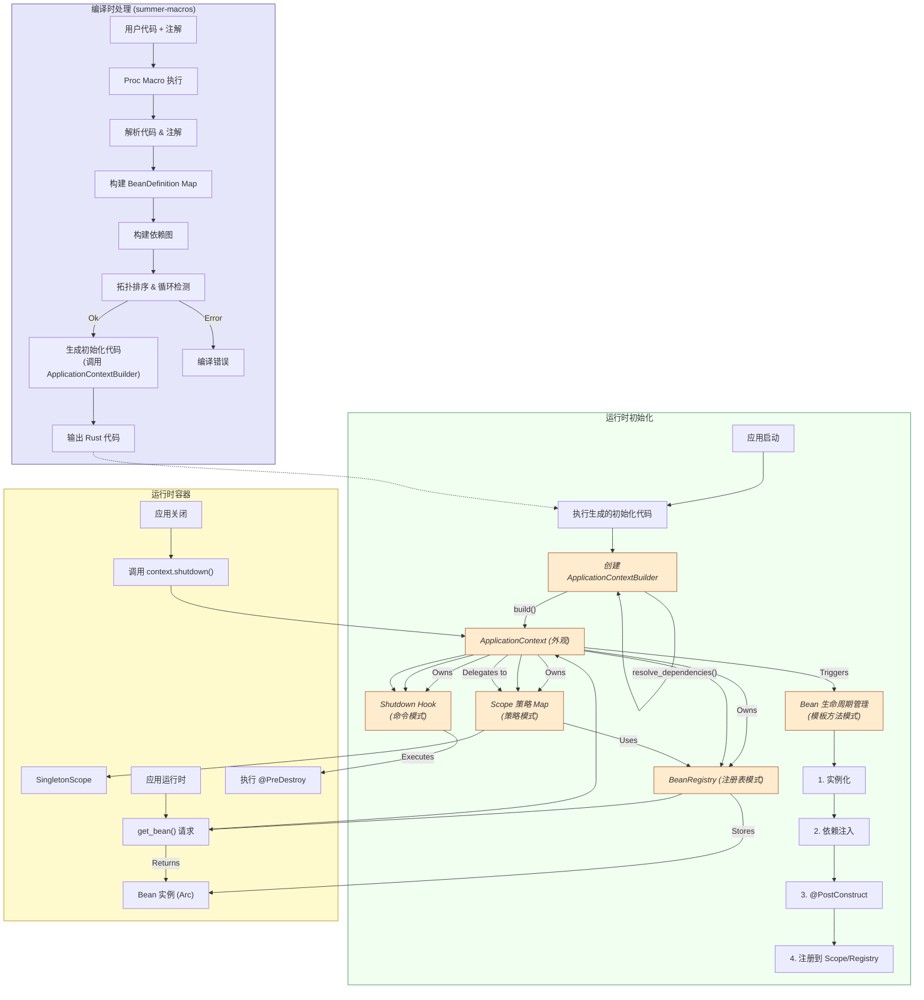

# **Summer Framework - IOC 容器模块 (F3) 详细设计说明书 (DDS)**

**版本历史**

| 版本 | 日期       | 作者      | 变更说明                                                                                                                         |
| :--- | :--------- | :-------- | :------------------------------------------------------------------------------------------------------------------------------- |
| 1.0  | 2025-05-03 | FaustoFan | 基于 ODD 和需求创建初稿                                                                                                          |
| 2.0  | 2025-05-06 | FaustoFan | **架构优化:** 应用策略(Scope)、构建器(Context)、外观(Context)、注册表(Registry)、模板方法(Lifecycle)、命令(Shutdown)等模式优化。 |
| 2.1  | YYYY-MM-DD | (待定)    | (根据后续详细设计评审和开发迭代更新)                                                                                             |

---

## 1. 引言

### 1.1 目的

本文档为 Summer Framework 的 Inversion of Control (IOC) 容器模块 (F3) 提供详细的设计方案。目标是设计一个高效、类型安全、易于使用、**结构清晰且扩展性良好**的依赖注入容器。其核心机制通过 Rust 的过程宏在编译时完成大部分工作，并通过应用**策略模式**、**构建器模式**、**外观模式**、**注册表模式**、**模板方法模式**和**命令模式**等设计模式优化内部结构，提供类似 Spring 的开发体验。

### 1.2 范围

本 DDS 覆盖 IOC 容器的组件发现、依赖解析、Bean 定义、**应用构建器模式的容器构建流程**、**基于模板方法的 Bean 生命周期管理**、**基于策略模式的作用域处理**（初期为 Singleton）、依赖注入机制、AOP 集成、**作为外观的 ApplicationContext** 运行时 Bean 访问接口、以及**基于命令模式的优雅关闭**的详细设计。

### 1.3 与 ODD 的关系

本文档是对 ODD 中 IOC 容器模块高层设计的具体化和细化，**核心变更为引入多种设计模式来重构和明确内部组件职责与交互**，提升了设计的模块化和可扩展性。

### 1.4 参考文献

- Summer Framework - 需求规格说明书 (SRS) v1.0
- Summer Framework - 概要设计说明书 (ODD) v1.0
- Rust 过程宏 (Proc-Macro) 文档, `syn`, `quote` crates
- `std::any::TypeId`, `std::any::Any`
- `std::sync::Arc`
- Design Patterns: Elements of Reusable Object-Oriented Software (GoF Book) (参考策略、构建器、外观、注册表、模板方法、命令模式)
- (如有参考) `shaku`, `inject` 等 Rust DI 库的设计

### 1.5 术语

遵循 ODD 术语，并强调新引入或明确的模式相关术语：

- **Bean Definition:** 描述 Bean 元数据（类型、依赖、生命周期、作用域等）的结构，主要在编译时构建和使用。
- **ApplicationContextBuilder (构建器模式):** 在编译时生成的代码所使用的构建器，用于逐步构建 `ApplicationContext`。
- **BeanLifecycleManager (模板方法模式):** 负责执行单个 Bean 标准生命周期（实例化、注入、PostConstruct）的逻辑（可能由生成代码直接体现）。
- **Scope (策略模式):** 处理 Bean 实例作用域的策略接口 (`Scope` trait) 和实现 (`SingletonScope`)。
- **ApplicationContext (外观模式):** 运行时 IOC 容器的核心接口，封装内部复杂性。
- **BeanRegistry (注册表模式):** 存储和检索 Bean 实例（特别是 Singleton）的核心数据结构。
- **ShutdownCommand (命令模式):** 封装 `@PreDestroy` 调用逻辑的对象或闭包。

---

## 2. 系统概述

Summer IOC 容器通过在**编译时**进行大量的静态分析和代码生成，实现了高性能、类型安全的依赖注入。其优化后的架构强调职责分离和模式应用：

- **编译时:**
  - 过程宏 (`summer-macros`) 扫描用户注解 (`@Component`, `@Autowired` 等)。
  - 构建内部的 `BeanDefinition` 元数据。
  - 进行依赖图分析、拓扑排序和循环依赖检测。
  - **生成初始化代码:** 这部分代码不再是单个大函数，而是调用 `ApplicationContextBuilder` (**构建器模式**) 的一系列方法，按顺序注册 Bean 定义、解析依赖、并指定实例化和生命周期逻辑。Bean 的创建过程遵循**模板方法模式**。
- **运行时:**
  - **`ApplicationContextBuilder`** 执行构建逻辑，创建并配置 `ApplicationContext`。
  - **`ApplicationContext` (外观模式):** 作为用户和框架其他部分与 IOC 容器交互的唯一入口。它内部持有：
    - **`BeanRegistry` (注册表模式):** 存储单例 Bean 实例 (`Arc<T>`)。
    - **`Scope` 策略处理器 (策略模式):** 根据 Bean Definition 的作用域（初期只有 Singleton）委托给相应的 `Scope` 实现来获取实例。
    - **生命周期管理器 (概念):** 负责协调 Bean 的创建和销毁。
    - **Shutdown Hook (命令模式):** 持有按逆序排列的 `@PreDestroy` 调用命令。
  - 运行时通过 `ApplicationContext` 的 API (`get_bean`) 获取 Bean 实例。
  - 应用关闭时，调用 `ApplicationContext::shutdown()` 执行预定义的关闭命令。

---

## 3. 详细设计

### 3.1 核心架构: 模式驱动的设计



### 3.2 编译时处理 (`summer-macros`)

**(基本同 v1.0，但生成的目标代码改变)**

- **组件发现 (`@Component`等):** 解析类型信息。
- **依赖识别 (`@Autowired`, 构造函数):** 解析字段和构造函数参数，记录依赖类型 (`TypeId`, `Option`, `dyn Trait` 等)。
- **生命周期回调识别 (`@PostConstruct`, `@PreDestroy`):** 记录方法名。
- **AOP 集成:** 标记需要代理的 Bean 或修改生成的实例化代码。
- **生成 Bean Definition:** (同 v1.0) 创建包含所有元数据的 `BeanDefinition` 结构，**增加 `scope: ScopeId` 字段** (初期默认为 `ScopeId::Singleton`)。
- **依赖图与排序:** (同 v1.0) 构建图，拓扑排序，检测循环依赖（失败则编译错误）。
- **生成初始化代码 (关键变更 - 使用 Builder):**
  - 不再生成一个巨大的 `__summer_init_context` 函数直接创建所有 Bean。
  - 生成的代码改为：
    1.  创建 `ApplicationContextBuilder` 实例。
    2.  对于每个 Bean (按拓扑序)，调用 `builder.register_bean(BeanDefinition { ... })` 注册其元数据。
    3.  调用 `builder.build()` 来触发实际的 Bean 实例化、注入和注册过程。
    4.  生成的代码可能包含一个简单的 `main` 函数包装器或启动函数，负责执行这个 Builder 流程。

### 3.3 `ApplicationContextBuilder` (构建器模式)

- **职责:** 负责协调 `ApplicationContext` 的构建过程，隐藏复杂性。
- **生命周期:** 在应用程序启动时被（生成的代码）创建和使用，完成构建后通常被丢弃。
- **内部状态:**
  - `bean_definitions: HashMap<TypeId, BeanDefinition>`
  - `dependency_graph: ...` (可能需要重新构建或传入)
  - `bean_registry: BeanRegistry` (用于存储已创建的 Singleton)
  - `scope_strategies: HashMap<ScopeId, Arc<dyn Scope>>`
  - `shutdown_commands: Vec<Box<dyn ShutdownCommand>>`
  - `currently_creating: HashSet<TypeId>` (用于检测运行时循环依赖，作为编译时检测的补充)
- **核心方法:**
  - `fn new() -> Self`
  - `fn register_bean(&mut self, bean_def: BeanDefinition) -> &mut Self`
  - `fn register_scope(&mut self, scope_id: ScopeId, scope: Arc<dyn Scope>) -> &mut Self` (注册 Scope 策略)
  - `fn build(mut self) -> Result<ApplicationContext, IocError>`:
    1.  执行最终的依赖检查和排序（如果需要）。
    2.  遍历 `bean_definitions`（按拓扑序）。
    3.  对每个 Bean，调用内部的 `create_and_initialize_bean(type_id)`。
    4.  收集所有 `ShutdownCommand`。
    5.  创建并返回 `ApplicationContext` 实例。
- **`create_and_initialize_bean(type_id: TypeId)` (内部，体现模板方法):**
  1.  检查是否正在创建 (防循环依赖运行时检查)。
  2.  获取 BeanDefinition。
  3.  **委托给 Scope 策略获取实例:** 调用 `scope_strategies.get(bean_def.scope).get_bean(type_id, || { /* Factory closure */ })`。
  4.  **工厂闭包 (Factory Closure):** 这个闭包封装了实际的创建、注入、PostConstruct 逻辑，只有在 Scope 需要创建新实例时才执行（例如 Singleton 首次创建）。
      - **[Template Step 1] 实例化:**
        - 解析构造函数依赖。递归调用 `create_and_initialize_bean` 获取依赖项 (`Arc<Dep>`)。
        - 调用 `Bean::new(...)` (或 AOP 代理的 `new`) 创建实例。处理 AOP。
      - **[Template Step 2] 依赖注入:**
        - 解析字段依赖 (`@Autowired`)。递归调用 `create_and_initialize_bean` 获取依赖项。
        - 设置实例字段。
      - **[Template Step 3] PostConstruct:**
        - 如果定义了 `@PostConstruct` 方法，调用 `instance.post_construct_method()`。
      - **[Template Step 4] (部分注册由 Scope 处理):** 返回创建好的实例 `Arc<dyn Any + Send + Sync>`。
  5.  将生成的 `ShutdownCommand` (如果有 `@PreDestroy`) 添加到列表中。
  6.  返回获取到的 Bean 实例 (`Arc<dyn Any>`)。

### 3.4 运行时容器 (`ApplicationContext` - 外观模式)

- **职责:** 提供简洁、统一的运行时访问接口，隐藏内部的 Registry, Scopes, Lifecycle 等。
- **结构:**

  ```rust
  use std::sync::Arc;
  use std::collections::{HashMap, HashSet};
  use tokio::sync::Mutex; // If shutdown needs async locking

  pub struct ApplicationContext {
      bean_registry: Arc<BeanRegistry>, // Shared registry
      scope_strategies: HashMap<ScopeId, Arc<dyn Scope>>,
      // Shutdown commands collected by the builder
      shutdown_commands: Mutex<Vec<Box<dyn ShutdownCommand>>>,
      // Flag to prevent double shutdown
      is_shutdown: Mutex<bool>,
  }

  impl ApplicationContext {
      // Internal constructor used by the Builder
      pub(crate) fn new(
          bean_registry: Arc<BeanRegistry>,
          scope_strategies: HashMap<ScopeId, Arc<dyn Scope>>,
          shutdown_commands: Vec<Box<dyn ShutdownCommand>>,
      ) -> Self {
          ApplicationContext {
              bean_registry,
              scope_strategies,
              shutdown_commands: Mutex::new(shutdown_commands),
              is_shutdown: Mutex::new(false),
          }
      }

      // Public API methods...
  }
  ```

- **Bean 访问 API (`get_bean`, `get_opt_bean`, `get_bean_dyn`):**
  - 这些方法现在需要**考虑 Scope**。
  - `get_bean<T>()`:
    1.  获取 `T` 的 `TypeId`。
    2.  (需要一种方法从 `TypeId` 查找 `BeanDefinition` 以获取其 `ScopeId`，这可能需要在 Context 中存储 `BeanDefinition` Map 或由 Builder 处理)。**假设可以查到 ScopeId。**
    3.  获取对应的 `Scope` 策略实现。
    4.  调用 `scope.get_bean(type_id, || { /* Factory - 但在此处不应执行 */ })`。对于 Singleton，Scope 会直接查询 Registry。对于其他 Scope (如 Prototype)，Scope 会负责创建。
    5.  处理查找结果 (Panic 或返回 `Option` / `Result`)。
  - `get_bean_dyn<T>()`: 实现仍然复杂，需要编译时支持或运行时遍历+检查。

### 3.5 Bean 注册表 (`BeanRegistry` - 注册表模式)

- **职责:** **仅负责存储和检索 Singleton 作用域的 Bean 实例。**
- **结构:** (同 v1.0)

  ```rust
  use std::any::{Any, TypeId};
  use std::collections::HashMap;
  use std::sync::Arc;
  use parking_lot::RwLock; // Use a faster RwLock like parking_lot's

  #[derive(Default)]
  pub(crate) struct BeanRegistry {
      // RwLock for concurrent reads, Arc for shared ownership
      instances: RwLock<HashMap<TypeId, Arc<dyn Any + Send + Sync>>>,
      // Optional: Compile-time generated map for trait resolution?
      // trait_to_concrete: HashMap<TypeId, TypeId>,
  }

  impl BeanRegistry {
      // Called by SingletonScope when creating a bean
      pub(crate) fn insert(&self, type_id: TypeId, instance: Arc<dyn Any + Send + Sync>) {
          let mut guard = self.instances.write();
          guard.insert(type_id, instance);
      }

      // Called by SingletonScope when retrieving a bean
      pub(crate) fn get(&self, type_id: &TypeId) -> Option<Arc<dyn Any + Send + Sync>> {
          let guard = self.instances.read();
          guard.get(type_id).cloned() // Clone the Arc
      }

      // Maybe needed for shutdown? Unlikely if commands hold Arcs.
      // pub(crate) fn get_all_instances(&self) -> Vec<Arc<dyn Any + Send + Sync>> {
      //     let guard = self.instances.read();
      //     guard.values().cloned().collect()
      // }
  }
  ```

### 3.6 作用域管理 (`Scope` - 策略模式)

- **`ScopeId` Enum:** 定义作用域标识符 (e.g., `Singleton`, `Prototype` - 未来, `Request` - 未来)。
- **`Scope` Trait (策略接口):**

  ```rust
  use std::any::TypeId;
  use std::sync::Arc;
  use std::any::Any;

  trait Scope: Send + Sync {
      /// Gets a bean instance from this scope.
      ///
      /// - `type_id`: The TypeId of the bean to retrieve.
      /// - `bean_factory`: A closure (FnOnce) that can be called to create a new instance
      ///   of the bean if it doesn't exist in the scope (or if the scope always creates new ones).
      ///   The factory closure itself handles dependencies and lifecycle internally.
      fn get_bean(
          &self,
          type_id: TypeId,
          bean_factory: &dyn Fn() -> Result<Arc<dyn Any + Send + Sync>, IocError> // Closure takes no args now
      ) -> Result<Arc<dyn Any + Send + Sync>, IocError>;

      /// Optional: Called when the scope is destroyed (e.g., application shutdown for Singleton, request end for Request).
      /// Allows the scope to clean up its managed beans (e.g., call @PreDestroy for non-Singletons).
      // fn destroy(&self);
  }
  ```

- **`SingletonScope` (具体策略):**

  ```rust
  struct SingletonScope {
      bean_registry: Arc<BeanRegistry>, // Holds the actual singleton instances
  }

  impl Scope for SingletonScope {
      fn get_bean(
          &self,
          type_id: TypeId,
          bean_factory: &dyn Fn() -> Result<Arc<dyn Any + Send + Sync>, IocError>
      ) -> Result<Arc<dyn Any + Send + Sync>, IocError> {
          // 1. Try to get from registry first
          if let Some(instance) = self.bean_registry.get(&type_id) {
              return Ok(instance);
          }

          // 2. If not found, invoke the factory closure ONCE to create it
          //    Need to ensure thread-safe creation (double-checked locking or Mutex)
          //    This part is tricky. The Builder might handle initial creation better.
          //    Let's assume the Builder populates the registry completely for singletons.
          //    So, if it's not in the registry here, it's an error during startup/lookup.
           self.bean_registry.get(&type_id)
               .ok_or_else(|| IocError::BeanNotFound(type_id))

          // Alternative if Scope handles creation:
          // let instance = bean_factory()?; // Create it
          // self.bean_registry.insert(type_id, instance.clone()); // Store it
          // Ok(instance)
      }
  }
  ```

  _修正思路:_ 单例 Bean 的创建最好由 `ApplicationContextBuilder` 在启动时**完全完成**并放入 `BeanRegistry`。`SingletonScope::get_bean` 之后只负责从 Registry 读取。这简化了并发控制。

- **`ApplicationContext` 持有 `HashMap<ScopeId, Arc<dyn Scope>>`**，并在 `get_bean` 时根据 BeanDefinition 查找对应的 Scope 策略执行。

### 3.7 关闭与 `@PreDestroy` (命令模式)

- **`ShutdownCommand` Trait (命令接口):**
  ```rust
  trait ShutdownCommand: Send + Sync {
      fn execute(&self); // Or async fn execute(&self)
  }
  ```
- **具体命令:**
  - 编译时为每个带有 `@PreDestroy` 的 Bean 生成一个实现了 `ShutdownCommand` 的结构体或闭包。
  - 这个命令对象持有对该 Bean 实例的 `Arc` 引用。
  - `execute` 方法调用 Bean 实例的 `@PreDestroy` 方法。
- **收集与执行:**
  - `ApplicationContextBuilder` 在创建每个 Bean 后，如果它有 `@PreDestroy`，就创建一个对应的 `ShutdownCommand` 并收集起来。
  - **重要:** 命令的收集顺序需要保证是 Bean 创建顺序的**逆序**（基于拓扑排序的反向）。
  - `ApplicationContext` 持有 `Vec<Box<dyn ShutdownCommand>>`。
  - `ApplicationContext::shutdown()` 方法迭代执行这个 Vec 中的所有 `command.execute()`。使用 `Mutex` 防止重复关闭。

---

## 4. 数据结构

### 4.1 Bean Definition (编译时/内部)

```rust
#[derive(Clone)] // Needed to store in builder
struct BeanDefinition {
    struct_type_id: TypeId,
    bean_name: String, // Generated name
    scope: ScopeId, // Now includes Scope
    constructor_dependencies: Vec<DependencyInfo>,
    field_dependencies: HashMap<String, DependencyInfo>, // field_name -> DepInfo
    provides_traits: Vec<TypeId>, // For dyn Trait resolution aid
    post_construct_method: Option<String>, // Method name
    pre_destroy_method: Option<String>, // Method name
    // source_location: Span, // For error reporting (using proc_macro2::Span)
    is_aop_proxy: bool, // Flag if AOP modifies instantiation
    // ... other metadata
}

#[derive(Clone, Debug, PartialEq, Eq, Hash)]
enum ScopeId {
    Singleton,
    // Prototype, // Future
    // Request,   // Future
}

#[derive(Clone)]
struct DependencyInfo {
    target_type_id: TypeId, // TypeId of the dependency (concrete type)
    // target_trait_id: Option<TypeId>, // If it's a dyn Trait dependency
    // qualifier: Option<String>,     // For named disambiguation
    is_optional: bool,
}
```

### 4.2 ApplicationContextBuilder (运行时启动)

(内部状态见 [3.3](#33-applicationcontextbuilder-构建器模式)))

### 4.3 BeanRegistry (运行时)

(见 [3.5](#35-bean-注册表-beanregistry---注册表模式)))

### 4.4 ApplicationContext (运行时)

(见 [3.4](#34-运行时容器-applicationcontext---外观模式)))

---

## 5. 接口设计

### 5.1 注解接口 (用户主要交互)

- `@Component`, `@Service`, `@Controller`, `@Repository`, `@Configuration`
- `@Autowired`
- `@PostConstruct`
- `@PreDestroy`
- `@Scope("singleton")` / `@Singleton` (或未来 `@Scope("prototype")`) - 需要宏支持解析作用域。

### 5.2 运行时 API (`ApplicationContext` - 外观)

- `fn get_bean<T: Any + Send + Sync>(&self) -> Arc<T>` (Panic on not found)
- `fn get_opt_bean<T: Any + Send + Sync>(&self) -> Option<Arc<T>>`
- `fn get_bean_dyn<T: ?Sized + Any + Send + Sync>(&self) -> Arc<T>` (实现依赖编译期支持)
- `fn shutdown(&self)` (执行 `@PreDestroy` 逻辑)

---

## 6. 错误处理

### 6.1 编译时错误

- (同 v1.0) 循环依赖、依赖未找到、宏使用错误、多重实现无限定符、生命周期方法签名错误。**错误信息应尽可能清晰，包含源码位置。**

### 6.2 运行时错误 (启动时 - Builder `build()` 阶段)

- **Bean 实例化失败:** 构造函数 panic 或返回 `Err`。
- **依赖注入失败:** 递归获取依赖时失败 (理论上编译时已检查，但运行时可能因 Scope 问题出现)。
- **`@PostConstruct` 方法 Panic:** 用户代码错误。
- **Scope 策略错误:** 获取 Bean 时 Scope 内部出错。
- **策略:** `ApplicationContextBuilder::build()` 应返回 `Result<ApplicationContext, IocError>`。任何在构建过程中发生的错误都应被捕获并作为 `IocError` 返回，导致应用启动失败。

### 6.3 运行时错误 (访问时 - `get_bean` 等)

- **Bean 未找到:** `get_bean` 默认 Panic，`get_opt_bean` 返回 `None`。
- **类型转换失败:** (不太可能发生，因为 `TypeId` 保证类型)。

### 6.4 运行时错误 (关闭时 - `shutdown()`)

- **`@PreDestroy` 方法 Panic:** 单个命令的 Panic 不应阻止其他命令的执行。`shutdown` 方法应捕获每个命令的 Panic (使用 `std::panic::catch_unwind`) 并记录错误，然后继续执行下一个命令。

---

## 7. 与配置管理集成

- **依赖关系:** IOC 模块**依赖**配置模块提供 `ConfigService` Bean。
- **实现:**
  1. `ConfigService` 被标记为框架内部的 `@Component` (或类似机制)。
  2. 确保 `ConfigService` 在依赖图中处于非常早期的位置，没有复杂的依赖。
  3. `@Value` 和 `@ConfigurationProperties` 的宏生成的代码会声明对 `Arc<ConfigService>` 的依赖，由 IOC 容器在初始化时注入。
  4. 对于 `@ConfigurationProperties` Bean，其创建过程（由 Builder 触发）会注入 `ConfigService` 并调用 `get` 来完成绑定。

---

## 8. 与 AOP 集成

- **编译时协作 (核心):**
  - AOP 宏 (`@Aspect` 等的处理逻辑) 需要在 IOC 宏**之后**运行，或者两者需要共享信息。
  - 当 AOP 宏确定一个 Bean (`struct Foo`) 需要被代理时，它会生成代理类 (`struct FooProxy`)。
  - AOP 宏需要修改传递给 `ApplicationContextBuilder::register_bean` 的 `BeanDefinition`，或者修改 Builder 内部用于实例化的工厂闭包，使其创建 `FooProxy` 而不是 `Foo`。这需要仔细设计宏之间的交互或 Builder 的扩展点。
- **运行时:** IOC 容器存储和返回的是代理对象 (`Arc<FooProxy>`)，但通常使用原始类型 (`TypeId::of::<Foo>()`) 进行注册和查找，对调用者透明。

---

## 9. 设计原理与权衡

- **编译时处理:** (同 v1.0) 优势在于性能和类型安全，代价是宏复杂度和编译时间。
- **设计模式应用:**
  - **优点:** 提高了模块化（策略、工厂）、清晰度（外观、构建器、模板）、可维护性（注册表、命令）和可扩展性（策略、注册表）。代码职责更分明（高内聚），组件间依赖更清晰（低耦合）。
  - **缺点:** 引入了更多抽象和间接层，可能增加初步理解源码的难度。
- **禁止运行时循环依赖:** (同 v1.0) 简化实现，强制良好设计。
- **Singleton 优先:** (同 v1.0) 简化初期实现，Scope 策略提供了清晰的扩展路径。
- **错误处理 (启动 Panic):** (同 v1.0) 快速失败原则。
- **`dyn Trait` 注入:** 仍然是实现的难点，依赖编译期信息或运行时检查。

---

**总结:**
本 DDS v2.0 通过引入多种核心设计模式，对 IOC 容器的内部架构进行了显著优化。在保持高性能编译时处理核心思想的同时，提高了代码的模块化、可扩展性和可维护性。策略模式用于作用域，构建器模式用于容器构建，外观模式简化了接口，注册表模式管理实例，模板方法规范生命周期，命令模式处理关闭。这为构建一个健壮且功能丰富的 IOC 容器奠定了坚实的基础。
