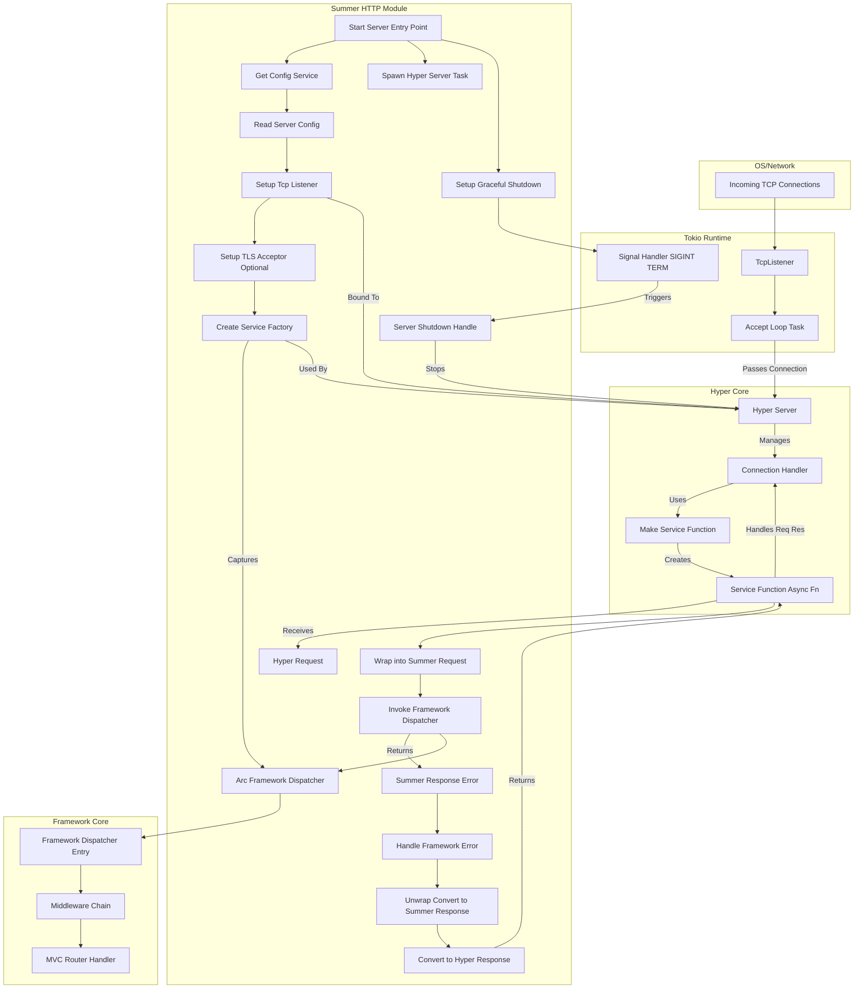

# **Summer Framework - HTTP Server 模块 (F1) 详细设计说明书 (DDS)**

**版本历史**

| 版本 | 日期       | 作者      | 变更说明                         |
| ---- | ---------- | --------- | -------------------------------- |
| 1.0  | 2025-05-03 | FaustoFan | 基于 ODD 和需求创建初稿          |
| 1.1  | YYYY-MM-DD | (待定)    | (根据详细设计评审和开发迭代更新) |

---

## 1. 引言

### 1.1 目的

本文档为 Summer Framework 的 HTTP Server 模块 (对应 SRS 中的 F1) 提供详细的设计方案。目标是设计一个基于 `hyper` 和 `tokio` 的高性能、异步 HTTP/1.1 服务器，能够处理网络连接、解析 HTTP 请求、将请求分发给框架核心处理，并将处理结果作为 HTTP 响应返回给客户端，同时支持优雅停机和可选的 TLS/HTTPS。

### 1.2 范围

本 DDS 覆盖 HTTP 服务器的启动、监听、连接处理、请求/响应对象的封装、与框架核心（中间件/MVC）的集成点、优雅停机机制、TLS 配置和实现，以及相关的错误处理。

### 1.3 与 ODD 的关系

本文档是对 ODD 中 HTTP Server 模块高层设计的具体化和细化，提供了更深入的实现流程、数据结构和 API 设计。

### 1.4 参考文献

- Summer Framework - 需求规格说明书 (SRS) v1.0
- Summer Framework - 概要设计说明书 (ODD) v1.0
- [`hyper` 文档](https://hyper.rs/) (特别是 `hyper::Server`, `hyper::service::Service`)
- [`tokio` 文档](https://tokio.rs/) (特别是 `tokio::net::TcpListener`, `tokio::signal`)
- [`rustls`, `tokio-rustls`](https://docs.rs/tokio-rustls/) (用于 Rustls 实现)
- [`native-tls`, `tokio-native-tls`](https://docs.rs/tokio-native-tls/) (用于系统 TLS 实现)
- Summer Framework - 配置管理模块 (F4) DDS
- Summer Framework - 插件/中间件模块 (F9) DDS (了解交互接口)

### 1.5 术语

遵循 ODD 术语，并强调：

- **Listener:** 监听网络端口以接受 TCP 连接的组件 (`tokio::net::TcpListener`)。
- **Acceptor:** (用于 TLS) 负责处理 TLS 握手并将加密流转换为明文流的组件。
- **Service:** `hyper` 中的核心概念，一个处理单个请求并返回响应的异步函数或结构。
- **Service Factory (`MakeService`):** `hyper` 中用于为每个新连接创建一个 `Service` 实例的工厂。
- **Framework Dispatcher:** 代表 Summer 框架核心处理逻辑的入口点（通常是中间件链的起点或 MVC 路由分发器）。
- **Request Wrapper:** `summer-http` 模块提供的对 `hyper::Request` 的封装，提供更友好的 API。
- **Response Wrapper:** `summer-http` 模块提供的用于构建响应的结构，最终会转换为 `hyper::Response`。

---

## 2. 系统概述

HTTP Server 模块是 Summer 框架面向网络的入口。它使用 `tokio` 进行异步 I/O 和任务管理，利用 `hyper` 处理 HTTP/1.1 协议细节。模块的核心职责是监听指定的网络地址和端口，接受传入的 TCP 连接（如果启用了 TLS，则执行 TLS 握手），然后将每个连接交给 `hyper` 处理。`hyper` 会为每个请求调用一个由 Summer 框架提供的 `Service` 实现。这个 `Service` 负责将 `hyper::Request` 封装成框架内部的 `Request` 对象，调用 **Framework Dispatcher**（中间件链或 MVC），接收框架返回的 `Response` 对象，将其转换回 `hyper::Response`，最后交由 `hyper` 发送回客户端。该模块还负责处理配置（监听地址、端口、TLS 设置）和实现优雅停机。

---

## 3. 详细设计

### 3.1 核心架构与流程



### 3.2 服务器生命周期管理

#### 3.2.1 启动流程

1.  **入口:** 由应用主入口（例如 `#[summer_boot::main]` 宏生成的代码或 `SummerApplication::run()`）调用 `summer-http` 模块的启动函数。
2.  **获取配置:** 从 IOC 容器获取 `ConfigService` 实例，读取 `server.*` 配置（地址、端口、TLS 设置等）。解析配置，处理无效配置错误。
3.  **创建 Listener:** 使用 `tokio::net::TcpListener::bind()` 绑定配置的地址和端口。处理绑定错误（如地址已被使用）。
4.  **创建 TLS Acceptor (可选):** 如果启用了 TLS ([见 3.5](#35-tlshttps-支持-可选))，根据配置加载证书和私钥，创建对应的 TLS Acceptor (e.g., `TlsAcceptor::from(Arc<ServerConfig>)` for `rustls`)。
5.  **创建 Framework Dispatcher 引用:** 获取框架核心处理逻辑的入口点。这可能是一个实现了特定 `trait` 的服务，或一个 `async fn`。需要确保它是 `Send + Sync + 'static` 且可以被 `Arc` 包裹，以便在多个连接和请求之间共享。
6.  **创建 Service Factory:**
    - 定义一个异步函数 `service_fn(hyper::Request<hyper::Body>) -> Result<hyper::Response<BodyType>, ErrorType>`。
    - `service_fn` 内部：
      - 捕获 (capture) `Arc<FrameworkDispatcher>`。
      - 接收 `hyper::Request`。
      - 调用 [3.3 请求处理流程](#33-请求处理流程) 和 [3.4 响应处理流程](#34-响应处理流程)。
      - 返回 `Result<hyper::Response<...>, ...>`。
    - 使用 `hyper::service::make_service_fn` 将 `service_fn` 包装成一个 Service Factory。这个工厂需要为每个连接克隆 `Arc<FrameworkDispatcher>`。
7.  **创建 `hyper::Server`:**
    - 使用 `hyper::Server::bind()` 或 `hyper::Server::builder()`。
    - 如果是 HTTPS，需要使用接收 `tokio-rustls::server::TlsStream` 或 `tokio-native-tls::TlsStream` 的 builder 方法（或先接受 TCP 连接，然后在 `accept` 循环中执行 TLS 握手）。
    - 将创建的 Service Factory 传递给 `server.serve()`。
8.  **设置优雅停机:**
    - 调用 `server.with_graceful_shutdown()` 并传递一个 `Future`。
    - 这个 `Future` 在接收到关闭信号时完成。通常使用 `tokio::signal` 监听 `SIGINT` (Ctrl+C) 和 `SIGTERM`。
9.  **启动服务器:** 将配置好的 `hyper::Server` (`Future`) `await` 或 `tokio::spawn` 到 Tokio 运行时。记录服务器启动信息（监听地址、端口、是否启用 HTTPS）。

#### 3.2.2 运行状态

- `tokio` 的 `TcpListener` 在 `accept` 循环中等待新的 TCP 连接。
- (HTTPS) `TlsAcceptor` 处理 TLS 握手。
- `hyper::Server` 接收已接受（且可能已完成 TLS 握手）的连接。
- 对于每个连接，`hyper` 处理 HTTP/1.1 协议，并在收到请求时调用 `ServiceFactory` 创建 `ServiceFn` 实例。
- `ServiceFn` 处理请求-响应周期。
- 服务器持续运行，直到接收到关闭信号。

#### 3.2.3 优雅停机 (Graceful Shutdown)

1.  **信号监听:** 在单独的 `tokio::task` 中（或主任务中）使用 `tokio::signal::ctrl_c()` 或结合 `signal(SignalKind::terminate())` 来监听关闭信号。
2.  **触发关闭:** 当监听到信号时，之前传递给 `with_graceful_shutdown()` 的 `Future` 会完成。
3.  **`hyper` 处理:** `hyper::Server` 停止接受新的连接。它会等待所有进行中的连接完成当前的请求-响应处理（或达到超时）。
4.  **任务完成:** 当所有连接处理完毕后，`server.await`（或 `tokio::spawn` 的任务）会完成。
5.  **应用退出:** 应用程序可以在服务器任务完成后执行清理逻辑（如调用 IOC 容器的 `shutdown()`）然后退出。

### 3.3 请求处理流程

1.  `ServiceFn` 被 `hyper` 调用，接收 `hyper::Request<hyper::Body>`。
2.  **创建 `summer_http::Request` 包装器:**
    - 将 `hyper::Request` 的头部、方法、URI、版本等信息提取出来。
    - 将 `hyper::Body` 存储起来，提供延迟读取、流式处理或一次性读取并反序列化的方法。
    - 提供便捷的 API 获取路径参数、查询参数（如果路由匹配信息在此阶段可用的话，否则在 MVC 层处理）、读取 Header 等。
3.  **调用 Framework Dispatcher:** 将创建的 `summer_http::Request` 传递给捕获的 `Arc<FrameworkDispatcher>` 的处理方法 (e.g., `dispatcher.dispatch(request).await`)。
4.  **等待结果:** `await` Dispatcher 的返回结果，应为 `Result<summer_http::Response, FrameworkError>` （其中 `FrameworkError` 是框架核心定义的错误类型）。

### 3.4 响应处理流程

1.  **接收结果:** 从 Framework Dispatcher 收到 `Result<summer_http::Response, FrameworkError>`。
2.  **错误处理:**
    - 如果是 `Err(framework_error)`，将其转换为一个合适的 `summer_http::Response`。这可能涉及：
      - 记录错误日志。
      - 根据错误类型映射到 HTTP 状态码 (e.g., 400 Bad Request, 404 Not Found, 500 Internal Server Error)。
      - （可选）根据配置决定是否在响应体中包含错误细节（生产环境通常隐藏）。
      - 创建一个表示错误的 `summer_http::Response`。
    - 如果是 `Ok(summer_response)`，则直接使用该 `summer_response`。
3.  **转换为 `hyper::Response`:**
    - 从 `summer_http::Response` 中获取状态码、头部信息。
    - 获取响应体 (`summer_http::Body`)。将 `summer_http::Body` 转换为 `hyper::Body`。这可能涉及：
      - 空 Body -> `hyper::Body::empty()`
      - Bytes -> `hyper::Body::from(bytes)`
      - String -> `hyper::Body::from(string)`
      - Stream -> 需要将 `summer_http` 的流适配为 `hyper::Body` 所需的 `Stream<Item = Result<Bytes, Error>>`。
      - JSON -> 先序列化为 `Bytes` 或 `String`。
    - 使用 `hyper::Response::builder()` 构建 `hyper::Response<hyper::Body>`。
4.  **返回给 Hyper:** 将构建好的 `hyper::Response` 返回给调用 `ServiceFn` 的 `hyper`。

### 3.5 TLS/HTTPS 支持 (可选)

- **启用:** 通过配置项 `server.ssl.enabled = true` 启用。
- **实现选择 (Feature Gates):**
  - **`feature = "tls-rustls"`:**
    - 需要 `rustls`, `tokio-rustls`, `rustls-pemfile` 依赖。
    - 配置需要指定证书链文件 (`server.ssl.certificate`) 和私钥文件 (`server.ssl.key-private-key`) 的路径。
    - 加载 PEM 格式的证书和 PKCS#8 或 RSA 私钥。
    - 创建 `rustls::ServerConfig`。
    - 创建 `tokio_rustls::TlsAcceptor`。
    - 在接受 TCP 连接后，使用 `acceptor.accept(stream).await` 进行 TLS 握手，得到 `TlsStream`。将 `TlsStream` 交给 `hyper` 处理。
  - **`feature = "tls-native-tls"`:**
    - 需要 `native-tls`, `tokio-native-tls` 依赖。
    - 配置需要指定密钥库 (e.g., PKCS#12) 文件路径 (`server.ssl.key-store`) 和密码 (`server.ssl.key-store-password`)。
    - 加载密钥库文件。
    - 创建 `native_tls::Identity`。
    - 创建 `tokio_native_tls::TlsAcceptor`。
    - 使用 `acceptor.accept(stream).await` 进行握手。
- **错误处理:** 处理证书加载失败、密码错误、TLS 握手失败等错误。

### 3.6 配置集成

- 依赖 `summer-config` 模块和 `ConfigService`。
- 在启动流程中获取 `ConfigService`。
- 读取以下（示例）配置键：
  - `server.address`: String (e.g., "0.0.0.0", "127.0.0.1")
  - `server.port`: u16
  - `server.ssl.enabled`: bool (default: false)
  - `server.ssl.certificate`: String (path, required if enabled and using rustls)
  - `server.ssl.key-private-key`: String (path, required if enabled and using rustls)
  - `server.ssl.key-store`: String (path, required if enabled and using native-tls)
  - `server.ssl.key-store-password`: String (required if enabled and using native-tls)
  - (可选) `server.timeout.read`: Duration
  - (可选) `server.timeout.write`: Duration
  - (可选) `server.max_connections`: usize
- 将读取到的配置用于绑定地址、端口，设置 TLS 等。

### 3.7 底层库封装 (`Request` / `Response` Wrappers)

- **目标:** 提供比 `hyper` 更符合人体工程学、更贴近 Web 框架用户习惯的 API，并隐藏 `hyper::Body` 的一些复杂性。
- **`summer_http::Request`:**
  - 持有 `hyper::Request` 的 parts (头部, URI, 方法等) 和 `hyper::Body` (可能包装在 `Option` 或 `OnceCell` 中以支持一次性读取)。
  - 提供方法: `method()`, `uri()`, `path()`, `query()`, `headers()`, `header(name)`, `async body_bytes()`, `async json<T>()`, `async form<T>()`, `body_stream() -> impl Stream<...>`。
  - 可能包含请求范围的扩展数据 (`Extensions`)。
- **`summer_http::Response`:**
  - 使用 Builder 模式创建。
  - `Response::status(StatusCode)`
  - `Response::header(name, value)`
  - `Response::body(impl Into<summer_http::Body>)`
  - `Response::json(impl Serialize)` (便捷方法)
  - `Response::text(impl Into<String>)` (便捷方法)
- **`summer_http::Body`:**
  - 定义一个枚举来表示不同的 Body 类型: `Empty`, `Bytes(Bytes)`, `Text(String)`, `Json(serde_json::Value)`, `Stream(Pin<Box<dyn Stream<Item=Result<Bytes, Error>> + Send + Sync>>)`。
  - 提供 `impl From<T>` for `Body` for common types (Bytes, String, Vec<u8>).
  - 提供将 `Body` 转换为 `hyper::Body` 的方法。

---

## 4. 数据结构

### 4.1 配置结构 (`ServerConfig`)

```rust
use serde::Deserialize;
use std::path::PathBuf;

// Assuming this maps to keys under "server.*"
#[derive(Deserialize, Debug, Clone)]
#[serde(deny_unknown_fields)]
pub struct ServerConfig {
    #[serde(default = "default_address")]
    pub address: String,
    #[serde(default = "default_port")]
    pub port: u16,
    #[serde(default)]
    pub ssl: SslConfig,
    // Add other fields like timeouts etc.
}

#[derive(Deserialize, Debug, Clone, Default)]
#[serde(deny_unknown_fields)]
pub struct SslConfig {
    #[serde(default)]
    pub enabled: bool,
    pub certificate: Option<PathBuf>,
    pub key_private_key: Option<PathBuf>,
    pub key_store: Option<PathBuf>,
    pub key_store_password: Option<String>,
    // maybe tls_provider: Option<TlsProvider> // Explicitly select rustls/native-tls
}

// Enforce TlsProvider if both features are enabled?
// pub enum TlsProvider { Rustls, NativeTls }

fn default_address() -> String { "127.0.0.1".to_string() }
fn default_port() -> u16 { 8080 }

// This struct might be loaded via @ConfigurationProperties("server")
```

### 4.2 请求封装 (`summer_http::Request`)

```rust
use hyper::{HeaderMap, Method, Request as HyperRequest, Body as HyperBody, Uri, Version};
use bytes::Bytes;
use serde::de::DeserializeOwned;
use std::error::Error as StdError;
use futures_core::Stream; // Re-export or use from 'futures'

// Conceptual Structure
pub struct Request {
    // Store parts directly or lazily access from original request? Store parts.
    method: Method,
    uri: Uri,
    version: Version,
    headers: HeaderMap,
    body: Option<HyperBody>, // Use Option to signify body can be consumed once
    // extensions: Arc<Extensions>, // For passing data between middleware/handlers
}

impl Request {
    pub(crate) fn from_hyper(req: HyperRequest<HyperBody>) -> Self {
        let (parts, body) = req.into_parts();
        Request {
            method: parts.method,
            uri: parts.uri,
            version: parts.version,
            headers: parts.headers,
            body: Some(body),
            // extensions: parts.extensions? Need to handle this
        }
    }

    pub fn method(&self) -> &Method { &self.method }
    pub fn uri(&self) -> &Uri { &self.uri }
    pub fn path(&self) -> &str { self.uri.path() }
    pub fn query(&self) -> Option<&str> { self.uri.query() }
    pub fn headers(&self) -> &HeaderMap { &self.headers }
    // ... other getters ...

    /// Consumes the body and returns it as Bytes. Fails if body already consumed.
    pub async fn body_bytes(&mut self) -> Result<Bytes, hyper::Error> {
        if let Some(body) = self.body.take() {
            hyper::body::to_bytes(body).await
        } else {
            // Consider a specific error type here
            panic!("Request body already consumed");
        }
    }

    /// Consumes the body and deserializes it as JSON.
    pub async fn json<T: DeserializeOwned>(&mut self) -> Result<T, RequestBodyError> {
        let bytes = self.body_bytes().await.map_err(RequestBodyError::Hyper)?;
        serde_json::from_slice(&bytes).map_err(RequestBodyError::Json)
    }

     /// Consumes the body and deserializes it as Form data.
    pub async fn form<T: DeserializeOwned>(&mut self) -> Result<T, RequestBodyError> {
        let bytes = self.body_bytes().await.map_err(RequestBodyError::Hyper)?;
        serde_urlencoded::from_bytes(&bytes).map_err(RequestBodyError::Form)
    }

    // pub fn body_stream(&mut self) -> Option<impl Stream<Item=Result<Bytes, hyper::Error>>> { ... }
}

// Define RequestBodyError enum
#[derive(Debug, thiserror::Error)]
pub enum RequestBodyError {
    #[error("Hyper error reading body: {0}")]
    Hyper(#[from] hyper::Error),
    #[error("JSON deserialization error: {0}")]
    Json(#[from] serde_json::Error),
    #[error("Form deserialization error: {0}")]
    Form(#[from] serde_urlencoded::de::Error),
     #[error("Body already consumed")]
    BodyConsumed, // Need to integrate this properly
}

```

### 4.3 响应封装 (`summer_http::Response`)

```rust
use hyper::{Response as HyperResponse, Body as HyperBody, StatusCode, HeaderMap, header::HeaderValue};
use serde::Serialize;
use bytes::Bytes;
use futures_core::Stream;
use std::pin::Pin;
use std::error::Error as StdError;

// Conceptual Structure
#[derive(Debug)]
pub struct Response {
    status: StatusCode,
    headers: HeaderMap,
    body: Body,
}

// Use a Body enum
#[derive(Debug)]
pub enum Body {
    Empty,
    Bytes(Bytes),
    Text(String),
    // Json(serde_json::Value), // Store as Value or directly serialize? Store Bytes.
    Stream(Pin<Box<dyn Stream<Item = Result<Bytes, Box<dyn StdError + Send + Sync>>> + Send + Sync>>),
}

impl Response {
    pub fn builder() -> ResponseBuilder {
        ResponseBuilder::new()
    }

    // Called by builder's build() method
    fn new(status: StatusCode, headers: HeaderMap, body: Body) -> Self {
        Response { status, headers, body }
    }

    // Convenience constructors
    pub fn ok() -> ResponseBuilder { Self::builder().status(StatusCode::OK) }
    pub fn created() -> ResponseBuilder { Self::builder().status(StatusCode::CREATED) }
    pub fn not_found() -> ResponseBuilder { Self::builder().status(StatusCode::NOT_FOUND) }
    pub fn internal_server_error() -> ResponseBuilder { Self::builder().status(StatusCode::INTERNAL_SERVER_ERROR) }

    pub fn json<T: Serialize>(data: &T) -> Result<Self, serde_json::Error> {
        // TODO: Handle serialization error properly, maybe return Result<ResponseBuilder,...>?
        let bytes = Bytes::from(serde_json::to_vec(data)?);
        Ok(Self::builder()
            .status(StatusCode::OK)
            .header(hyper::header::CONTENT_TYPE, "application/json")
            .body(Body::Bytes(bytes))
            .build() // Assuming build exists on builder
        )
    }

     pub fn text(data: impl Into<String>) -> Self {
         Self::builder()
            .status(StatusCode::OK)
            .header(hyper::header::CONTENT_TYPE, "text/plain; charset=utf-8")
            .body(Body::Text(data.into()))
            .build()
     }

    // Conversion TO hyper::Response
    pub(crate) fn into_hyper(self) -> HyperResponse<HyperBody> {
        let mut builder = HyperResponse::builder()
            .status(self.status)
            .version(hyper::Version::HTTP_11); // Assuming HTTP/1.1

        *builder.headers_mut().unwrap() = self.headers; // Copy headers

        let hyper_body = match self.body {
            Body::Empty => HyperBody::empty(),
            Body::Bytes(b) => HyperBody::from(b),
            Body::Text(s) => HyperBody::from(s),
            Body::Stream(s) => HyperBody::wrap_stream(s), // Requires Box<dyn Error...> compatibility
        };

        builder.body(hyper_body).unwrap() // Should not fail if built correctly
    }
}

// Builder pattern
#[derive(Debug)]
pub struct ResponseBuilder {
    status: StatusCode,
    headers: HeaderMap,
    body: Body,
}
impl ResponseBuilder {
    fn new() -> Self { /* defaults */ Self{ status: StatusCode::OK, headers: HeaderMap::new(), body: Body::Empty } }
    pub fn status(mut self, status: StatusCode) -> Self { self.status = status; self }
    pub fn header(mut self, name: hyper::header::HeaderName, value: impl Into<HeaderValue>) -> Self { self.headers.insert(name, value.into()); self }
    pub fn body(mut self, body: impl Into<Body>) -> Self { self.body = body.into(); self }
    pub fn build(self) -> Response { Response::new(self.status, self.headers, self.body) }
}

// Impl From<T> for Body for Bytes, String, Vec<u8>...
impl From<Bytes> for Body { fn from(b: Bytes) -> Self { Body::Bytes(b) } }
impl From<String> for Body { fn from(s: String) -> Self { Body::Text(s) } }
impl From<&str> for Body { fn from(s: &str) -> Self { Body::Text(s.to_string()) } }
impl From<Vec<u8>> for Body { fn from(v: Vec<u8>) -> Self { Body::Bytes(Bytes::from(v)) } }

```

### 4.4 HTTP Server 错误 (`ServerError`)

```rust
use std::io;
use std::net::SocketAddr;

#[derive(Debug, thiserror::Error)]
pub enum ServerError {
    #[error("IO error: {0}")]
    Io(#[from] io::Error),

    #[error("Failed to bind to address {addr}: {source}")]
    BindError { addr: SocketAddr, source: io::Error },

    #[error("Configuration error: {0}")]
    Config(#[from] config::ConfigError),

    #[error("TLS configuration error: {0}")]
    TlsConfig(String), // Wrap specific TLS errors (rustls::Error, native_tls::Error)

    #[error("TLS handshake error: {0}")]
    TlsHandshake(String), // Wrap specific TLS errors

    #[error("Hyper server error: {0}")]
    Hyper(#[from] hyper::Error),

    // Add other specific errors as needed
}
```

---

## 6. 错误处理

- **启动时错误:**
  - 配置读取失败 (`ConfigError`): 转换为 `ServerError::Config`, 阻止启动。
  - 地址解析/绑定失败 (`io::Error`): 转换为 `ServerError::BindError`, 阻止启动。
  - TLS 配置/证书加载失败: 转换为 `ServerError::TlsConfig`, 阻止启动。
  - 所有启动时错误都应记录详细信息并导致程序退出。
- **运行时错误:**
  - **TCP Accept 错误 (`io::Error`):** `hyper::Server` 通常会处理这些，可能会记录并继续尝试 accept。
  - **TLS Handshake 错误:** 应记录错误，关闭该连接。转换为 `ServerError::TlsHandshake`。
  - **Hyper 连接/协议错误 (`hyper::Error`):** 由 `hyper` 处理，可能会关闭连接。框架层面主要记录这些错误。
  - **Service Function (`service_fn`) 内部错误:**
    - 读取请求 Body 错误 (`hyper::Error`): 应转换为 HTTP 400 Bad Request 或 500 Internal Server Error，并记录日志。
    - 框架 Dispatcher 返回 `FrameworkError`: 应由 [3.4 响应处理流程](#34-响应处理流程) 中的错误处理逻辑转换为合适的 HTTP 错误响应。
    - 构建/转换响应错误 (e.g., Body stream error): 应该尝试返回 500 Internal Server Error，并记录详细日志。

---

## 7. 设计原理与权衡

- **基于 Hyper:** 选择了 `hyper` 作为底层库，以获得高性能和对 HTTP 协议的精细控制。代价是 `hyper` 的 API 相对底层和复杂，需要进行良好的封装。
- **Request/Response 封装:** 创建自定义的 `Request`/`Response` 类型提供了更友好的 API，隐藏了 `hyper` 的复杂性，但也引入了一层抽象和转换开销（通常很小）。
- **异步模型:** 完全基于 `tokio` 异步模型，以支持高并发。
- **TLS 实现选择:** 提供 `rustls` 和 `native-tls` 的选项（通过 feature gates）满足不同用户的需求（纯 Rust vs. 系统依赖/兼容性）。
- **错误处理:** 区分启动时致命错误和运行时可恢复/可报告的错误。尽量将框架内部错误映射为标准的 HTTP 错误码。
- **Service Factory 模式:** 遵循 `hyper` 的推荐模式，为每个连接（或根据配置）创建 Service 实例，通过 `Arc` 共享框架核心状态。

---
