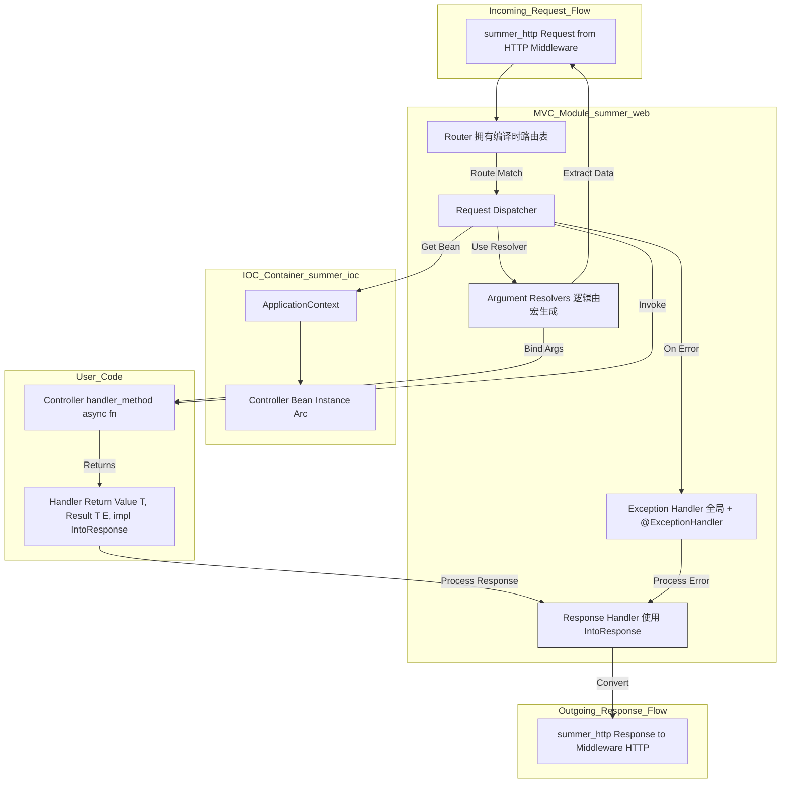

# **Summer Framework - MVC 模块 (F2) 详细设计说明书 (DDS)**

**版本历史**

| 版本 | 日期       | 作者      | 变更说明                         |
| ---- | ---------- | --------- | -------------------------------- |
| 1.0  | 2025-05-03 | FaustoFan | 基于 ODD 和需求创建初稿          |
| 1.1  | YYYY-MM-DD | (待定)    | (根据详细设计评审和开发迭代更新) |

---

## 1. 引言

### 1.1 目的

本文档旨在详细说明 Summer Framework 中 MVC (Model-View-Controller) 模块 (F2) 的设计。目标是设计一个基于注解、类型安全、异步的 Web 处理层，负责将 HTTP 请求路由到用户定义的 Controller 方法，处理请求参数，并根据方法返回值生成 HTTP 响应。

### 1.2 范围

本 DDS 覆盖 MVC 模块的核心组件设计，包括路由机制、请求分发、参数绑定、响应处理、异常处理，以及实现这些功能所需的关键注解 (`@Controller`, `@GetMapping`, `@PathVariable`, `@RequestBody` 等) 的过程宏处理逻辑。

### 1.3 与 ODD 的关系

本文档是对 ODD 中 MVC 模块高层设计的具体化，详细阐述了内部工作流程、数据结构、算法以及过程宏的实现策略。

### 1.4 参考文献

- Summer Framework - 需求规格说明书 (SRS) v1.0
- Summer Framework - 概要设计说明书 (ODD) v1.0
- Summer Framework - HTTP Server 模块 (F1) DDS
- Summer Framework - IOC 容器模块 (F3) DDS
- [`serde`, `serde_json`, `serde_urlencoded`](https://serde.rs/)
- 高性能路由库 (如 `matchit`, `path-tree`)
- Rust 过程宏 (Proc-Macro) 文档, `syn`, `quote` crates

### 1.5 术语

遵循 ODD 术语，并强调：

- **Controller:** 标记了 `@Controller` 或 `@RestController` 的结构体，包含处理请求的方法。由 IOC 管理。
- **Handler Method:** Controller 中标记了 `@GetMapping` 等路由注解的 `async fn`。
- **Route:** 将 HTTP 请求 (方法 + 路径模式) 映射到特定 Handler Method 的规则。
- **Router:** 负责存储路由规则并在运行时根据请求查找匹配 Route 的组件。
- **Dispatcher:** 接收匹配的 Route 和请求，负责获取 Controller 实例、绑定参数、调用 Handler Method 并处理响应。
- **Argument Resolver:** 负责解析特定类型的 Handler Method 参数（如从路径、查询、请求体中提取数据）。
- **Response Handler:** 负责将 Handler Method 的返回值转换为最终的 `summer_http::Response`。
- **`IntoResponse`:** 一个 Trait，使得不同类型可以方便地转换为标准响应。

---

## 2. 系统概述

MVC 模块是 Summer 框架处理 Web 请求的核心。它接收来自 HTTP Server 模块（或经过中间件链）的封装好的 `summer_http::Request` 对象。首先，**Router** 组件根据请求的方法和路径查找预先在编译时构建好的路由表，确定应该由哪个 **Controller** 的哪个 **Handler Method** 处理。接着，**Dispatcher** 组件从 IOC 容器获取对应的 Controller 实例，并通过 **Argument Resolvers** 解析请求数据，将其绑定到 Handler Method 的参数上。然后，Dispatcher **异步调用** Handler Method。最后，Dispatcher 将 Handler Method 的返回值（可能是一个普通类型、`Result` 或实现了 `IntoResponse` 的类型）传递给 **Response Handler**，后者将其转换为 `summer_http::Response` 对象，返回给调用者（中间件链或 HTTP Server）。整个过程通过大量使用**过程宏**来简化用户代码，实现注解驱动开发。

---

## 3. 详细设计

### 3.1 核心架构与请求处理流程



**流程描述:**

1.  请求 (`summer_http::Request`) 进入 MVC 模块。
2.  Router 根据请求方法和路径查找路由表。
    - **未找到:** 返回 404 Not Found 错误给调用者。
    - **找到:** 将匹配的路由信息 (`RouteEntry`) 和请求传递给 Dispatcher。
3.  Dispatcher:
    - 根据 `RouteEntry` 中的信息，向 IOC 容器请求对应的 Controller Bean 实例 (`Arc<Controller>`)。
    - 调用 Argument Resolver 逻辑，从请求中提取数据并准备 Handler Method 的参数列表。如果解析失败，转 6。
    - 异步调用 Controller 实例上的 Handler Method，传入参数。
    - `await` Handler Method 的结果。
4.  处理 Handler Result:
    - 如果结果是 `Ok(value)` 或普通值 `value`，将其传递给 Response Handler。
    - 如果结果是 `Err(error)`，将其传递给 Exception Handler。
5.  Response Handler:
    - 调用 `value.into_response()` (利用 `IntoResponse` trait) 将结果转换为 `summer_http::Response`。
    - 将 `Response` 返回给 Dispatcher。
6.  Exception Handler:
    - 查找能处理该 `error` 类型的 `@ExceptionHandler` 方法或使用全局默认处理器。
    - 调用错误处理方法，其返回值同样传递给 Response Handler 进行转换。
    - 将最终的错误 `Response` 返回给 Dispatcher。
7.  Dispatcher 将最终的 `summer_http::Response` 返回给调用者。

### 3.2 路由 (Routing)

#### 3.2.1 路由表构建 (编译时)

- **触发:** 通过 `summer-macros` 处理 `@Controller`, `@RequestMapping`, `@GetMapping` 等注解。
- **过程:**
  1.  扫描项目代码，找到所有标记了 Controller 相关注解的 `struct`。
  2.  扫描 Controller 结构体中的方法，找到标记了路由方法注解 (`@GetMapping` 等) 的 `async fn`。
  3.  为每个 Handler Method 提取路由信息：HTTP 方法、路径模式（合并 Controller 级别和方法级别的路径）。
  4.  提取 Handler Method 的标识信息（例如，一个指向该静态方法的函数指针，或者包含类型 ID 和方法名的结构）。
  5.  提取与该 Handler Method 相关的参数绑定信息（通过参数上的注解）。
  6.  将这些信息组合成一个 `RouteEntry` 结构。
  7.  **生成代码:** 生成一个静态初始化函数，该函数使用高性能路由库（如 `matchit` 或 `path-tree`）的 API，将所有 `RouteEntry` 编译成一个优化的、可在运行时快速查询的路由匹配器实例（Router Instance）。这个 Router Instance 通常是静态存储的，或者在应用启动时创建一次。

#### 3.2.2 路由匹配 (运行时)

- **输入:** 请求的方法 (`hyper::Method`) 和路径 (`&str`)。
- **过程:** 调用编译时生成的 Router Instance 的 `match` 方法。
- **输出:** `Result<Match<RouteEntry>, RoutingError>`
  - `Ok(Match)`: 包含匹配到的 `RouteEntry` 以及从路径中提取的路径参数 (`Params`)。
  - `Err(RoutingError::NotFound)`: 未找到匹配路由。
  - `Err(RoutingError::MethodNotAllowed)`: 路径匹配但方法不匹配。

### 3.3 请求分发 (`Dispatcher`)

- **职责:** 协调路由匹配后的请求处理。
- **实现:** 可能是一个核心函数或一个轻量级结构体。
- **关键步骤:**
  1.  接收 `Match<RouteEntry>` 和 `summer_http::Request`。
  2.  从 `RouteEntry` 获取 Controller 的 `TypeId`。
  3.  调用 `ApplicationContext::get_bean::<ControllerType>()` 获取 `Arc<ControllerBean>`。
  4.  调用参数绑定逻辑 ([见 3.4](#34-参数绑定-argument-resolvers))，传入 `Request`, `RouteEntry.params` (路径参数), 和 `RouteEntry.handler_info.argument_resolvers`。得到参数值列表 `Vec<ArgValue>` 或 `Result<Vec<ArgValue>, MvcError>`.
  5.  获取 `RouteEntry.handler_info.method_pointer` (或类似机制)。
  6.  异步调用 Handler Method: `controller_instance.handler_method(arg1, arg2, ...).await`。
  7.  处理返回值 (调用 Response Handler 或 Exception Handler)。

### 3.4 参数绑定 (`Argument Resolvers`)

逻辑上存在不同的 Argument Resolver，但实际实现通常是**由宏在编译时为每个 Handler Method 参数生成特定的提取和转换代码**。

#### 3.4.1 支持的参数类型

- `#[PathVariable] path_var: T`: 从 URL 路径段提取，`T` 需要实现 `FromStr` 或 `serde::Deserialize` (如果路径变量编码复杂)。
- `#[RequestParam] query_param: Option<T>` / `query_param: T`: 从 URL 查询参数提取，`T` 需要 `FromStr` 或 `serde::Deserialize`。支持可选参数。
- `#[RequestHeader] header_val: Option<T>` / `header_val: T`: 从 HTTP Header 提取，`T` 需要 `FromStr`。
- `#[RequestBody] body: T`: 读取请求体并使用 `serde_json::from_slice` (或 `serde_urlencoded`) 反序列化为 `T` (其中 `T: DeserializeOwned`)。
- `request: summer_http::Request`: 直接注入请求对象（可能需要特殊处理，避免 body 被重复消费）。
- `response: &mut summer_http::Response` (不太常见，除非需要直接操作响应头等)。

#### 3.4.2 实现机制 (通过宏生成代码)

- `#[GetMapping]` 等路由宏分析 Handler Method 的签名。
- 对于每个参数，检查其上的注解 (`#[PathVariable]` 等)。
- 根据注解和参数类型，**生成内联的 Rust 代码**来执行提取和转换。
  - **`@PathVariable`:** 生成代码访问 `Match.params.get("name")`，然后调用 `.parse::<T>()`。
  - **`@RequestParam`:** 生成代码解析 `request.uri().query()` (使用 `serde_urlencoded` 或手动解析)，然后调用 `.parse::<T>()`。处理 `Option<T>`。
  - **`@RequestHeader`:** 生成代码访问 `request.headers().get("name")?.to_str()?.parse::<T>()`。
  - **`@RequestBody`:** 生成代码调用 `request.json::<T>().await` 或 `request.form::<T>().await`。
- 生成的代码负责处理提取失败（如参数不存在）和类型转换失败，并返回 `MvcError::ParameterBindingFailed`。

#### 3.4.3 类型转换与验证 (基础)

- 主要依赖 `FromStr` trait 和 `serde::Deserialize`。
- **验证:**
  - **基础验证:** 类型转换本身提供了一些验证。
  - **高级验证 (可选/未来):** 可以集成 `validator` crate。`@RequestBody` 宏可以为带有 `#[derive(Validate)]` 的类型 `T` 生成 `body.validate()?` 调用。

### 3.5 响应处理 (`Response Handling`)

#### 3.5.1 `IntoResponse` Trait

- **定义:**

  ```rust
  use crate::response::Response; // Assuming Response is in crate::response
  use crate::error::MvcError;    // Assuming MvcError is defined

  /// Trait for types that can be converted into a Response.
  pub trait IntoResponse {
      /// Converts this type into a Response.
      fn into_response(self) -> Response;
  }

  /// Extension trait to handle Results from handlers.
  pub trait IntoHandlerResult {
       /// Converts the handler result into a Response, handling potential errors.
       fn into_handler_result(self) -> Result<Response, MvcError>; // Or directly return Response?
  }
  ```

- **实现:**
  - 为 `Response` 自身实现 `impl IntoResponse { fn into_response(self) -> Response { self } }`。
  - 为 `String`, `&str`, `Vec<u8>`, `Bytes` 实现，设置 `Content-Type: text/plain` 或 `application/octet-stream`。
  - 为 `serde_json::Value` 实现，设置 `Content-Type: application/json`。
  - 提供 `Json<T: Serialize>` 包装器，为其实现 `IntoResponse`，进行 JSON 序列化。
  - 为 `StatusCode` 实现，返回对应状态码和空 Body。
  - 为 `()` 实现，返回 `200 OK` 或 `204 No Content` 和空 Body。
  - **核心:** 为 `Result<T, E>` 实现 `IntoHandlerResult` (可能需要 `T: IntoResponse`, `E: Into<MvcError>` or handled by exception handler)。
- **用法:** Dispatcher 调用 `handler_result.into_handler_result()` 或 `handler_result.into_response()`。

#### 3.5.2 JSON 序列化

- 默认使用 `serde_json::to_vec()`。
- `Json<T>` 包装器或 `@RestController` 的默认行为会设置 `Content-Type: application/json`。
- 处理序列化错误，通常映射为 500 Internal Server Error。

#### 3.5.3 内容协商 (Content Negotiation - 基础)

- 初期简化：
  - `@RestController` 或返回 `Json<T>` 默认产生 JSON。
  - 返回 `String` 等产生 `text/plain`。
- 未来可扩展：根据请求的 `Accept` Header 选择不同的序列化器（JSON, XML 等），需要更复杂的 Response Handler 设计。

### 3.6 异常处理 (`Exception Handling`)

#### 3.6.1 全局异常处理器

- 框架提供一个默认的、可配置的全局异常处理器。
- 它捕获所有未被 `@ExceptionHandler` 处理的错误 (`MvcError` 或从 handler `Result::Err` 转换来的错误)。
- 根据错误类型映射到 HTTP Status Code 和标准的错误响应体（例如，JSON 格式的错误信息）。
- 生产环境下应避免泄露过多内部细节。

#### 3.6.2 `@ExceptionHandler` 注解

- **语法:** `#[exception_handler(ErrorType)] async fn handle_my_error(&self, error: ErrorType, request: &Request) -> impl IntoResponse`
- **宏处理:**
  1.  应用于 Controller 内的方法。
  2.  解析 `ErrorType`。
  3.  验证方法签名（必须接受错误类型作为参数，可选地接受 Request 等上下文）。
  4.  **生成代码:** 在编译时将 `(ControllerTypeId, ErrorTypeId)` 映射到该 Handler Method 的信息，存储在一个全局或 Controller 级别的错误处理器注册表中。
- **运行时:** 当 Dispatcher 捕获到特定类型的错误 `E` 时，查找注册表，看当前 Controller 或全局是否有处理 `E` 的 `@ExceptionHandler`。如果找到，则调用该方法处理错误；否则，交给全局默认处理器。

### 3.7 注解处理详解 (`summer-macros`)

- **核心职责:** 解析 MVC 相关注解，生成路由表、参数绑定代码、异常处理映射等。

#### 3.7.1 `@Controller` / `@RestController`

- 标记结构体为 IOC 组件 (与 IOC 宏协作)。
- `@Controller` 可能接收一个可选的基础路径 (`#[controller("/api")]`)。
- `@RestController` 是 `@Controller` 的组合，可能暗示默认使用 JSON 响应（需要 Response Handler 配合）。

#### 3.7.2 `@RequestMapping`, `@GetMapping`, `@PostMapping`, etc.

- 应用于 `async fn` 方法。
- 提取 HTTP Method 和 Path Pattern。
- 与 Controller 级别的路径组合。
- 将路由信息注册到编译时路由表构建器。
- 分析方法签名以供参数绑定宏使用。

#### 3.7.3 `@PathVariable`, `@RequestParam`, `@RequestHeader`

- 应用于 Handler Method 的参数。
- 提取参数名（注解值或参数变量名）。
- 标记该参数需要特定方式的解析。
- **生成参数解析代码**（见 [3.4.2](#342-实现机制-通过宏生成代码)）。

#### 3.7.4 `@RequestBody`

- 应用于 Handler Method 的一个参数。
- 标记该参数需要从请求体反序列化。
- **生成读取和反序列化 Body 的代码**。

#### 3.7.5 `@ExceptionHandler`

- 应用于 Controller 内的方法。
- 提取要处理的 `ErrorType`。
- **生成注册代码**，将 `(ControllerTypeId, ErrorTypeId)` 映射到此处理方法。

### 3.8 与框架其他模块的集成

#### 3.8.1 HTTP 模块

- 接收 `summer_http::Request`。
- 返回 `summer_http::Response`。
- 不直接与 `hyper` 交互。

#### 3.8.2 IOC 模块

- Controller 是 IOC Bean。
- Dispatcher 通过 `ApplicationContext::get_bean()` 获取 Controller 实例。
- Controller 可以注入 Service 等其他 Bean。

#### 3.8.3 AOP 模块

- AOP 可以应用于 Controller 的 Handler Method（如果它们被认为是需要拦截的连接点）。
- AOP 逻辑在 Dispatcher 调用 Handler Method **之前/之后/环绕** 执行。

#### 3.8.4 日志模块

- 在路由匹配、参数绑定、请求处理、错误处理等关键步骤记录日志 (使用 `tracing` API)。

---

## 4. 数据结构

### 4.1 路由条目 (`RouteEntry`) - 编译时/内部

```rust
use hyper::Method;
use std::any::TypeId;
// Plus other necessary imports

// Information stored for each route during compilation/initialization
#[derive(Clone)] // May need Clone if router stores copies
struct RouteEntry {
    http_method: Method,
    // path_pattern: String, // Handled by the router library itself
    controller_type_id: TypeId,
    handler_info: HandlerInfo, // Contains method identifier and argument info
}

#[derive(Clone)]
struct HandlerInfo {
   // How to call the method? Function pointer? Method name + reflection (less ideal)?
   // Using a generated wrapper function pointer is likely best.
   handler_fn_ptr: fn(Arc<dyn Any + Send + Sync>, Vec<ArgValue>) -> Pin<Box<dyn Future<Output = Result<Box<dyn Any + Send>, MvcError>> + Send>>, // Complex signature!
   argument_resolvers: Vec<ArgumentResolverInfo>, // Info needed by the wrapper fn
   return_type_info: ReturnTypeInfo, // Info about expected return type
}

// Represents the value extracted and converted for a handler argument
type ArgValue = Box<dyn Any + Send>; // Or a more specific enum/struct

// Example, details TBD
#[derive(Clone)]
struct ArgumentResolverInfo {
    param_index: usize,
    param_name: String,
    param_type_id: TypeId, // Target type
    source: ArgumentSource, // PathVar, QueryParam, Body etc.
    is_optional: bool,
}
enum ArgumentSource { PathVar, QueryParam, Header, Body, RequestObject }
struct ReturnTypeInfo { /* TBD: Info for IntoResponse */ }
```

_(注意: 上述结构是概念性的，实际实现可能因宏生成策略而异，例如很多信息可能直接编码到生成的函数中)_

### 4.2 处理器信息 (`HandlerInfo`) - 运行时

可能不需要独立的运行时 `HandlerInfo` 结构，因为路由匹配直接返回 `RouteEntry`，其包含的信息（或生成的函数指针）足以驱动 Dispatcher。

### 4.3 参数解析信息 (`ArgumentResolverInfo`) - 编译时/内部

同 `RouteEntry`，这些信息主要用于编译时生成参数绑定代码。

### 4.4 MVC 错误 (`MvcError`)

```rust
use hyper::StatusCode;
use thiserror::Error;
use crate::response::Response; // Assuming Response type
use crate::IntoResponse; // Assuming IntoResponse trait

#[derive(Debug, Error)]
pub enum MvcError {
    #[error("Routing failed: {0}")]
    Routing(#[from] RoutingError),

    #[error("Parameter binding failed for '{param_name}': {source}")]
    ParameterBindingFailed { param_name: String, source: Box<dyn std::error::Error + Send + Sync> }, // Or specific binding errors

    #[error("Request body deserialization failed: {0}")]
    RequestBodyDeserialization(String), // Wrap serde_json::Error etc.

    #[error("Response serialization failed: {0}")]
    ResponseSerialization(String), // Wrap serde_json::Error etc.

    #[error("Handler invocation failed: {0}")]
    HandlerInvocation(#[source] Box<dyn std::error::Error + Send + Sync>), // Box the original error from handler

    #[error("Unhandled internal error: {0}")]
    Internal(#[from] anyhow::Error), // Catch-all using anyhow? Or more specific types.

    // Add other specific MVC errors
}

// Implement IntoResponse for MvcError to map errors to HTTP responses
impl IntoResponse for MvcError {
    fn into_response(self) -> Response {
        let status = match &self {
            MvcError::Routing(RoutingError::NotFound) => StatusCode::NOT_FOUND,
            MvcError::Routing(RoutingError::MethodNotAllowed) => StatusCode::METHOD_NOT_ALLOWED,
            MvcError::ParameterBindingFailed { .. } => StatusCode::BAD_REQUEST,
            MvcError::RequestBodyDeserialization(_) => StatusCode::BAD_REQUEST,
            MvcError::ResponseSerialization(_) => StatusCode::INTERNAL_SERVER_ERROR,
            MvcError::HandlerInvocation(_) => StatusCode::INTERNAL_SERVER_ERROR, // Default, can be overridden by ExceptionHandler
            MvcError::Internal(_) => StatusCode::INTERNAL_SERVER_ERROR,
        };
        // Create a standard error JSON body (or text) based on the error
        // Avoid leaking details in production
        Response::builder()
            .status(status)
            .header(hyper::header::CONTENT_TYPE, "application/json") // Example
            .body(format!("{{\"error\":\"{}\"}}", self).into()) // Simplify body creation
            .build()
    }
}

#[derive(Debug, Error)]
pub enum RoutingError {
    #[error("No route matched the request path")]
    NotFound,
    #[error("Route matched, but method not allowed")]
    MethodNotAllowed,
}

```

---

## 5. 接口设计

### 5.1 注解接口 (用户主要交互)

- `#[controller]`, `#[rest_controller]`
- `#[request_mapping]`, `#[get_mapping]`, `#[post_mapping]`, `#[put_mapping]`, `#[delete_mapping]`, `#[patch_mapping]` (使用小写 snake_case 风格更符合 Rust 习惯)
- `#[path_variable]`, `#[request_param]`, `#[request_header]`, `#[request_body]`
- `#[exception_handler]`

### 5.2 `IntoResponse` Trait

如 [3.5.1](#351-intoresponse-trait) 所定义，是响应处理的核心扩展点。

---

## 6. 错误处理

- **路由错误:** 404 Not Found, 405 Method Not Allowed。由 Router 或 Dispatcher 直接处理并返回。
- **参数绑定错误:** 解析失败、类型转换失败、缺少必需参数。通常映射为 400 Bad Request。由参数绑定逻辑（生成的代码）捕获并返回 `MvcError::ParameterBindingFailed`。
- **请求体反序列化错误:** JSON/Form 格式错误。映射为 400 Bad Request。由 `@RequestBody` 生成的代码捕获并返回 `MvcError::RequestBodyDeserialization`。
- **Handler 方法内部错误 (`Result::Err`):** 错误 `E` 被 Dispatcher 捕获。传递给 Exception Handler 查找机制。如果未找到 `@ExceptionHandler`，则由全局处理器处理（可能包装为 `MvcError::HandlerInvocation`），通常映射为 500 Internal Server Error。
- **响应序列化错误:** （例如，返回的 `Json<T>` 无法序列化）。映射为 500 Internal Server Error。由 Response Handler 捕获并返回 `MvcError::ResponseSerialization` 或直接生成 500 响应。

---

## 7. 设计原理与权衡

- **编译时路由:** 提供了最佳的运行时路由性能，避免了启动时扫描和运行时查找的开销。代价是增加了宏的复杂性和编译时间。
- **注解驱动:** 极大地简化了用户代码，提供了类似 Spring Boot 的体验。但过度依赖宏可能使代码生成逻辑复杂且难以调试。
- **`IntoResponse` Trait:** 提供了一种灵活且类型安全的方式来处理 Handler 的返回值，易于扩展。
- **宏生成参数绑定代码:** 避免了运行时需要大量类型判断和反射的 Argument Resolver 列表，性能更好，类型更安全。但宏实现更复杂。
- **错误处理:** 通过结合 `Result`, `MvcError`, `@ExceptionHandler` 和全局处理器，提供了一个分层的、可定制的错误处理机制。将具体错误映射到 HTTP 状态码是关键。
- **异步:** 所有 Handler Method 和核心处理流程都是异步的，以支持高并发。

---
