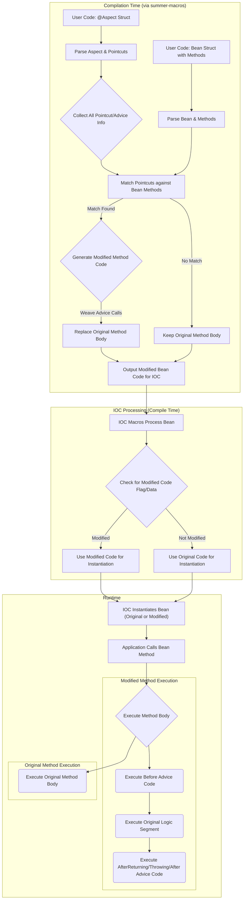

# **Summer Framework - AOP 模块 (F6) 详细设计说明书 (DDS)**

**版本历史**

| 版本 | 日期       | 作者      | 变更说明                         |
| ---- | ---------- | --------- | -------------------------------- |
| 1.0  | 2025-05-03 | FaustoFan | 基于 ODD 和需求创建初稿          |
| 1.1  | YYYY-MM-DD | (待定)    | (根据详细设计评审和开发迭代更新) |

---

## 1. 引言

### 1.1 目的

本文档为 Summer Framework 的 Aspect-Oriented Programming (AOP) 模块 (对应 SRS 中的 F6) 提供详细的设计方案。目标是设计一个允许开发者定义横切关注点（如日志、事务、权限）并将其应用于目标方法（连接点）的系统，主要通过**编译时代码织入**的方式实现，以保证性能和类型安全。

### 1.2 范围

本 DDS 覆盖 AOP 的核心概念实现：切面、通知、切点、连接点、织入过程，以及 `JoinPoint` 上下文对象的提供。重点在于如何使用 Rust 的过程宏解析 AOP 相关注解，并在编译时修改目标代码以插入通知逻辑。

### 1.3 与 ODD 的关系

本文档是对 ODD 中 AOP 模块高层设计的具体化和细化，深入探讨了编译时织入的机制、切点表达式的初步设计、代码生成策略以及与 IOC 的必要交互。

### 1.4 参考文献

- Summer Framework - 需求规格说明书 (SRS) v1.0
- Summer Framework - 概要设计说明书 (ODD) v1.0
- Summer Framework - IOC 容器模块 (F3) DDS (理解 Bean 管理和实例化)
- Spring AOP 文档 (概念参考)
- AspectJ 文档 (概念和 Pointcut 语法参考)
- Rust 过程宏 (Proc-Macro) 文档, `syn`, `quote` crates

### 1.5 术语

遵循 ODD 术语，并强调：

- **Aspect (切面):** 封装横切关注点的模块，通常是一个带有 `@Aspect` 注解的结构体，包含 Pointcut 和 Advice。
- **Advice (通知):** 切面在特定 Join Point 执行的操作。类型包括 `@Before`, `@AfterReturning`, `@AfterThrowing`, `@After`, `@Around`。
- **Pointcut (切点):** 定义应用通知的 Join Point 集合的表达式。
- **Join Point (连接点):** 程序执行过程中可以插入通知的点，在 Summer 中主要指**被 IOC 管理的 Bean 的方法调用**。
- **Weaving (织入):** 将切面的通知逻辑插入到目标连接点的过程。在 Summer 中主要指**编译时修改目标方法的代码**。
- **Target Object:** 被通知逻辑所应用的对象实例（即被 IOC 管理的 Bean 实例）。
- **Proxy (代理):** (备选方案，本项目主要不采用) 在运行时创建一个包装对象来拦截对 Target Object 的调用。Summer 优先采用编译时织入。

---

## 2. 系统概述

Summer AOP 模块旨在通过 Rust 的过程宏在**编译时**实现代码织入，从而提供 AOP 功能。开发者使用 `@Aspect` 标记切面结构体，使用 `@Pointcut` 定义切点表达式，使用 `@Before`, `@AfterReturning` 等注解标记通知方法。`summer-macros` 中的 AOP 相关宏负责解析这些定义。在编译期间，当处理被 IOC 管理的 Bean 时，IOC 宏（或与之协作的 AOP 宏）会检查是否有切点表达式匹配该 Bean 的方法。如果匹配，宏会**重写**目标方法的实现，将调用相应通知方法的逻辑**直接插入**到原始方法代码的前后或环绕它。运行时，当调用被织入的方法时，这些插入的通知逻辑会自然地执行。通知方法可以接收一个 `JoinPoint` 对象来获取关于当前连接点（被调用方法）的上下文信息。

---

## 3. 详细设计

### 3.1 核心架构: 编译时织入



### 3.2 切面 (Aspect) 与通知 (Advice) 定义

#### 3.2.1 `@Aspect` 注解

- **宏类型:** 属性宏 (`#[aspect]`)。
- **功能:**
  1. 应用于 `struct` 定义。
  2. **重要:** 标记该结构体为一个切面，并且**它也必须是一个 IOC Bean** (需要同时标记 `@Component` 或其派生注解，或由 `@Aspect` 宏隐式添加)。这是因为通知方法需要访问切面实例的状态（如果需要）并且需要被 IOC 管理其生命周期。
  3. 宏收集该结构体内部定义的 `@Pointcut` 和通知方法信息。

#### 3.2.2 通知注解 (`@Before`, `@AfterReturning`, etc.)

- **宏类型:** 属性宏。
- **功能:**
  1. 应用于 `@Aspect` 结构体内的**方法**。
  2. **`@Before(pointcut = "...")`**:
     - 解析 `pointcut` 属性（引用 `@Pointcut` 或直接写表达式）。
     - 验证方法签名：通常接收 `&self` 和可选的 `JoinPoint`。
  3. **`@AfterReturning(pointcut = "...", returning = "ret_val_name")`**:
     - 解析 `pointcut`。
     - 解析 `returning` 属性，指定一个参数名，用于接收目标方法的返回值。
     - 验证方法签名：通常接收 `&self`, 可选 `JoinPoint`, 以及与 `returning` 同名的参数 (类型需要能接收返回值，可能是 `&dyn Any` 或通过泛型约束)。
  4. **`@AfterThrowing(pointcut = "...", throwing = "err_val_name")`**:
     - 解析 `pointcut`。
     - 解析 `throwing` 属性，指定一个参数名，用于接收目标方法返回的错误 (`Result::Err`)。
     - 验证方法签名：通常接收 `&self`, 可选 `JoinPoint`, 以及与 `throwing` 同名的参数 (类型需要能接收错误，可能是 `&dyn Error` 或具体错误类型)。
  5. **`@After(pointcut = "...")`**:
     - 解析 `pointcut`。
     - 验证方法签名：通常接收 `&self` 和可选 `JoinPoint`。总会执行。
  6. **`@Around(pointcut = "...")`**:
     - 解析 `pointcut`。
     - **验证方法签名:** 必须特殊，通常接收 `&self` 和一个 `ProceedingJoinPoint` 对象。返回值类型必须与目标方法的返回值类型兼容（或是一个可以包含原始结果的类型，如 `Result<T, E>` 或 `anyhow::Result<T>`)。
  7. 记录通知类型、关联的切点、通知方法名以及参数绑定信息（`returning`, `throwing`）到内部的 `AdviceInfo`。

### 3.3 切点 (Pointcut) 定义与解析

#### 3.3.1 `@Pointcut` 注解

- **宏类型:** 属性宏。
- **功能:**
  1. 应用于 `@Aspect` 结构体内的**空方法**（或普通方法，但通常用空方法作为命名锚点）。
  2. 接收一个切点表达式字符串作为参数 (`#[pointcut("expression")]`)。
  3. 解析表达式字符串。
  4. 将解析后的切点信息与该方法名关联起来，存储在编译时的切面定义中，供通知注解引用。

#### 3.3.2 切点表达式语法 (初步)

借鉴 AspectJ，但**初期大幅简化**以降低实现难度。

- **`execution(modifiers? returnType package.Type.methodName(paramTypes))` (核心):**
  - `modifiers`: 可选，如 `pub`。
  - `returnType`: 返回类型匹配（可以使用 `*` 通配符）。
  - `package.Type`: 类型全路径名匹配（可以使用 `*`, `..` 通配符）。
  - `methodName`: 方法名匹配（可以使用 `*`）。
  - `paramTypes`: 参数类型列表匹配（可以使用 `..` 匹配零个或多个参数，`*` 匹配任意一个参数）。
  - **示例:** `execution(pub * my_app::service::UserService::find_user(u64))`
  - **示例:** `execution(* my_app::service::*.*(..))` (匹配 service 包下所有类型的任何方法)
- **`@annotation(package.AnnotationType)`:** 匹配带有指定注解的方法。
  - **示例:** `@annotation(summer_aop::annotation::Loggable)`
- **`within(package.TypePattern)`:** 匹配指定类型内部的所有方法。
  - **示例:** `within(my_app::controller::*)`
- **组合 (初期可选):** 使用 `&&` (AND), `||` (OR), `!` (NOT) 组合表达式。

#### 3.3.3 切点表达式解析 (编译时)

- 需要编写一个切点表达式的**解析器** (可以使用 parser combinator 库如 `nom`，或手写递归下降解析器)。
- 解析器将表达式字符串转换为内部的抽象语法树 (AST) 或匹配规则结构 (`PointcutInfo`)。
- 存储解析后的规则以供后续匹配使用。

### 3.4 连接点 (Join Point) 识别

- 在 Summer 中，主要的连接点是**被 IOC 容器管理的 Bean 的公共方法**。
- 在编译时处理 Bean 定义时，宏会检查该 Bean 的每个公共方法 (`pub fn` 或 `pub async fn`)。
- 这些方法是潜在的连接点，需要与解析后的切点规则进行匹配。

### 3.5 织入 (Weaving) 过程 (编译时)

#### 3.5.1 触发时机

织入发生在处理 Bean 定义的宏执行期间，在确定了 Bean 的原始方法实现之后，但在最终生成 IOC 初始化代码之前。

#### 3.5.2 目标定位

对于每个 Bean 的每个公共方法（连接点）：

1. 遍历所有已解析的切面 (`AspectDefinition`) 中的切点 (`PointcutInfo`)。
2. 将连接点（方法签名、类型、注解等信息）与切点规则进行匹配。
3. 收集所有匹配该连接点的通知 (`AdviceInfo`)。

#### 3.5.3 代码生成策略 (不同通知类型)

如果一个方法被一个或多个通知匹配，其原始代码块需要被**重写/包装**。

- **`@Before`:**

  ```rust
  // Original: pub async fn target_method(&self, arg1: T1) -> R { /* original body */ }
  // Modified:
  pub async fn target_method(&self, arg1: T1) -> R {
      { // Scope for advice call
          // 1. Get Aspect Bean instance from context
          let aspect_instance = context.get_bean::<AspectType>(); // Assuming context is accessible
          // 2. (Optional) Create JoinPoint context
          let join_point = JoinPoint::new(/*...*/);
          // 3. Call Before advice method
          aspect_instance.before_advice_method(join_point); // Or just aspect_instance.before_advice_method();
      }
      // 4. Execute original body
      /* original body */
  }
  ```
- **`@AfterReturning`:** (需要捕获返回值)

  ```rust
  pub async fn target_method(&self, arg1: T1) -> R {
      let result = { /* original body */ }; // Execute original body first
      { // Scope for advice call
          let aspect_instance = context.get_bean::<AspectType>();
          let join_point = JoinPoint::new(/*...*/);
          // Pass result to advice method, matching the 'returning' name
          let ret_val_ref = &result; // Or pass ownership if needed/possible
          aspect_instance.after_returning_advice(join_point, ret_val_ref);
      }
      result // Return original result
  }
  ```
- **`@AfterThrowing`:** (需要处理 `Result`)

  ```rust
  // Original: pub async fn target_method(&self, arg1: T1) -> Result<R, E> { /* original body */ }
  // Modified:
  pub async fn target_method(&self, arg1: T1) -> Result<R, E> {
      let result = { /* original body */ };
      match &result { // Check result without consuming
          Ok(_) => {} // Do nothing on Ok
          Err(err_val_ref) => { // If Err
              { // Scope for advice call
                 let aspect_instance = context.get_bean::<AspectType>();
                 let join_point = JoinPoint::new(/*...*/);
                  // Pass error ref to advice method, matching 'throwing' name
                 aspect_instance.after_throwing_advice(join_point, err_val_ref);
              }
          }
      }
      result // Return original result
  }
  ```
- **`@After`:** (需要 `finally` 块的效果，Rust 没有 `finally`，用 `Drop` guard 或显式 `match` 模拟)

  ```rust
  pub async fn target_method(&self, arg1: T1) -> Result<R, E> { // Example with Result
      // Use a guard or explicit match to ensure advice runs
      struct AfterGuard<'a> { aspect: Arc<AspectType>, join_point_data: ... , executed: bool }
      impl<'a> Drop for AfterGuard<'a> {
          fn drop(&mut self) {
              if !self.executed { /* Call advice if panic occurred */ }
          }
      }
      let guard = AfterGuard { /* ... */ executed: false };

      let result = { /* original body */ };

      // Call advice after normal execution
      {
         let aspect_instance = context.get_bean::<AspectType>();
         let join_point = JoinPoint::new(/*...*/);
         aspect_instance.after_advice(join_point);
         guard.executed = true; // Mark as normally executed
      }
      result
  }
  ```
- **`@Around`:** (最复杂)

  - 原始方法体需要被提取出来，可能包装成一个 `async` 闭包。
  - 生成的代码调用 `around_advice` 方法，并将该闭包（或一个能调用它的对象 `ProceedingJoinPoint`）传递给它。
  - `around_advice` 方法负责决定何时、是否以及如何调用原始逻辑（通过 `pjp.proceed().await`）。

  ```rust
  // Original: pub async fn target_method(&self, arg1: T1) -> Result<R, E> { /* original body */ }
  // Modified:
  pub async fn target_method(&self, arg1: T1) -> Result<R, E> { // Return type must match advice signature
      let aspect_instance = context.get_bean::<AspectType>(); // Get aspect bean

      // Create ProceedingJoinPoint (captures self, args, and original logic)
      let pjp = ProceedingJoinPoint::new(
          Arc::clone(&self), // Need Arc reference to self if self is needed
          (arg1,), // Tuple of arguments
          || -> Pin<Box<dyn Future<Output = Result<R, E>> + Send>> { // Closure representing original logic
              Box::pin(async move {
                  /* original body */
              })
          },
          // ... other JoinPoint context ...
      );

      // Call the Around advice method
      aspect_instance.around_advice(pjp).await // Advice controls execution
  }
  ```

  - `ProceedingJoinPoint` 需要提供 `proceed()` 方法来调用原始逻辑，以及访问 `JoinPoint` 的上下文信息。

#### 3.5.4 处理异步方法 (`async fn`)

- 所有生成的包装代码和通知调用**必须**是异步兼容的。
- 如果通知方法本身是 `async fn`，则在生成代码中需要 `await` 它。
- `@Around` 的原始逻辑闭包必须返回一个 `Pin<Box<dyn Future<...>>>`。

### 3.6 `JoinPoint` 上下文对象

- **目的:** 向通知方法提供关于被拦截方法的信息。
- **实现:**
  - 定义一个 `struct JoinPoint` (或 `ProceedingJoinPoint` for `@Around`)。
  - 在编译时生成代码，在调用通知方法前创建 `JoinPoint` 实例并填充数据。
  - **包含信息:**
    - `get_target(&self) -> Arc<dyn Any + Send + Sync>`: 获取目标 Bean 实例的引用。
    - `get_args(&self) -> &[ArgValue]` (或类似): 获取方法参数值的引用 (需要处理参数的序列化/表示)。
    - `get_signature(&self) -> MethodSignature`: 获取方法签名信息（方法名、参数类型、返回类型、类型路径）。
    - (For `ProceedingJoinPoint`) `async proceed(&mut self) -> Result<ReturnValue, Error>`: 调用原始方法逻辑。
    - (Optional) `get_static_part(&self)`: 返回一些编译时已知的信息。
- `MethodSignature` 需要在编译时提取并存储。

### 3.7 与 IOC 容器的集成

- **切面是 Bean:** `@Aspect` 结构体必须是 IOC Bean，以便在运行时可以从 `ApplicationContext` 获取其实例来调用通知方法。
- **织入目标是 Bean:** AOP 织入只应用于由 IOC 容器管理的 Bean 的方法。
- **实例化协作:** IOC 宏在生成 Bean 实例化代码时，需要检查是否有 AOP 宏已经修改了该 Bean 的方法，或者 AOP 宏直接负责修改 IOC 生成的代码。这需要两个模块的宏之间有明确的协作机制（可能是通过共享的编译时状态或约定的代码生成模式）。

### 3.8 注解处理详解 (`summer-macros`)

#### 3.8.1 `@Aspect` 宏

- 识别切面结构体。
- 触发对内部 `@Pointcut` 和通知注解的解析。
- 确保该结构体也被标记为 IOC Bean（或隐式添加）。

#### 3.8.2 `@Pointcut` 宏

- 解析切点表达式字符串为内部表示 (`PointcutInfo`)。
- 将解析结果与方法名关联存储。

#### 3.8.3 通知注解宏 (`@Before` 等)

- 解析 `pointcut` 属性（引用或内联表达式）。
- 解析 `returning`/`throwing` 属性。
- 验证方法签名。
- 创建 `AdviceInfo`，包含通知类型、关联的 Pointcut、方法名、参数绑定信息。
- **核心:** 参与到代码织入过程，为匹配的连接点生成相应的调用包装代码。

---

## 4. 数据结构

### 4.1 切面定义 (`AspectDefinition`) - 编译时/内部

```rust
struct AspectDefinition {
    aspect_type_id: TypeId,
    pointcuts: HashMap<String, PointcutInfo>, // Map from method name to PointcutInfo
    advices: Vec<AdviceInfo>,
}
```

### 4.2 切点信息 (`PointcutInfo`) - 编译时/内部

```rust
// Represents the parsed structure of a pointcut expression
enum PointcutInfo {
    Execution(ExecutionPattern),
    Annotation(AnnotationPattern),
    Within(WithinPattern),
    And(Box<PointcutInfo>, Box<PointcutInfo>),
    Or(Box<PointcutInfo>, Box<PointcutInfo>),
    Not(Box<PointcutInfo>),
    Reference(String), // Reference to a named pointcut
}
// Define ExecutionPattern, AnnotationPattern, WithinPattern structs...
```

### 4.3 通知信息 (`AdviceInfo`) - 编译时/内部

```rust
enum AdviceType { Before, AfterReturning, AfterThrowing, After, Around }

struct AdviceInfo {
    advice_type: AdviceType,
    pointcut: PointcutInfo, // The actual parsed pointcut, not just a reference
    advice_method_name: String,
    returning_arg_name: Option<String>,
    throwing_arg_name: Option<String>,
    // Parameter signature info for validation?
}
```

### 4.4 `JoinPoint` 结构体 - 运行时

```rust
use std::any::Any;
use std::sync::Arc;
use std::future::Future;
use std::pin::Pin;
use crate::error::AopError; // Assume AopError exists

// Simplified JoinPoint for Before, After*, etc.
pub struct JoinPoint {
    target: Arc<dyn Any + Send + Sync>,
    // Arguments need careful handling - maybe pass as tuple or Vec<Box<dyn Any>>?
    // args: Box<dyn Any + Send + Sync>, // Tuple of args?
    args_repr: String, // Or a more structured representation
    signature: MethodSignature, // Static signature info
}

// ProceedingJoinPoint for @Around
pub struct ProceedingJoinPoint<'a> {
    target: Arc<dyn Any + Send + Sync>,
    // args: Box<dyn Any + Send + Sync>,
    args_repr: String,
    signature: MethodSignature,
    // Closure or similar to invoke the original method logic
    original_logic: Box<dyn FnOnce() -> Pin<Box<dyn Future<Output = Result<Box<dyn Any + Send>, AopError>> + Send>> + Send + 'a>, // Complex! Needs careful typing
    proceeded: bool, // Track if proceed was called
}


#[derive(Debug, Clone)] // Should be created at compile time
pub struct MethodSignature {
    pub method_name: String,
    pub declaring_type: String, // Full type path
    // pub parameter_types: Vec<String>,
    // pub return_type: String,
    // Add more details as needed (visibility, asyncness)
}


impl JoinPoint {
    // Constructor and getter methods...
    pub fn new(/* ... */) -> Self { /* ... */ }
    pub fn get_target(&self) -> &Arc<dyn Any + Send + Sync> { &self.target }
    pub fn get_args_repr(&self) -> &str { &self.args_repr } // Temporary repr
    pub fn get_signature(&self) -> &MethodSignature { &self.signature }
}

impl<'a> ProceedingJoinPoint<'a> {
     pub fn new(/* ... */) -> Self { /* ... */ }
     pub fn get_target(&self) -> &Arc<dyn Any + Send + Sync> { &self.target }
     pub fn get_args_repr(&self) -> &str { &self.args_repr }
     pub fn get_signature(&self) -> &MethodSignature { &self.signature }

    /// Executes the original advised method logic.
    pub async fn proceed(mut self) -> Result<Box<dyn Any + Send>, AopError> {
        if self.proceeded {
            // Or return specific error?
            panic!("proceed() called more than once");
        }
        self.proceeded = true;
        (self.original_logic)().await
    }
}

```

_(Note: The signature and argument handling for `JoinPoint` and especially `ProceedingJoinPoint` is complex and requires careful implementation to be safe and ergonomic.)_

### 4.5 AOP 错误 (`AopError`)

```rust
use thiserror::Error;

#[derive(Debug, Error)]
pub enum AopError {
    // Compile-time errors are typically emitted directly by the macro

    // Runtime errors (less likely with compile-time weaving, but possible in advice logic)
    #[error("Error returned by advice execution: {0}")]
    AdviceExecution(#[source] Box<dyn std::error::Error + Send + Sync>),

    #[error("Error returned by target method execution (via Around): {0}")]
    TargetExecution(#[source] Box<dyn std::error::Error + Send + Sync>), // Error from original logic

    #[error("Type mismatch accessing JoinPoint arguments or return value")]
    TypeMismatch, // Or more specific errors

    // Add other potential runtime AOP errors
}
```

---

## 5. 接口设计

### 5.1 注解接口 (用户主要交互)

- `#[aspect]`
- `#[pointcut("expression")]`
- `#[before(pointcut = "...")]`
- `#[after_returning(pointcut = "...", returning = "name")]`
- `#[after_throwing(pointcut = "...", throwing = "name")]`
- `#[after(pointcut = "...")]`
- `#[around(pointcut = "...")]`

### 5.2 `JoinPoint` API

- `get_target()`
- `get_args()` / `get_args_repr()`
- `get_signature()`
- (For `ProceedingJoinPoint`) `proceed().await`

---

## 6. 错误处理

### 6.1 编译时错误

- **切点表达式语法错误:** 解析失败时由宏报告。
- **切点表达式语义错误:** 引用了不存在的类型或方法（需要与类型系统信息结合）。
- **通知方法签名错误:** 参数类型/数量不符合通知类型要求。
- **`returning`/`throwing` 名字或类型不匹配。**
- **切面未标记为 IOC Bean。**
- **织入失败:** 代码生成逻辑本身出错。
- **所有编译时错误都应通过 `syn::Error::new_spanned` 指向源代码中的问题位置。**

### 6.2 运行时错误

- **获取切面 Bean 失败:** 如果 IOC 容器未能提供切面实例（理论上不应发生）。
- **通知方法 Panic:** 用户编写的通知方法内部发生 panic。这会像普通 panic 一样传播。
- **`@Around` - `proceed()` 错误:** 如果原始方法逻辑返回 `Err`，`proceed().await` 会返回该错误。
- **类型转换错误:** 在 `JoinPoint` 中访问参数或返回值时发生类型不匹配（设计上应尽量避免）。

---

## 7. 设计原理与权衡

- **编译时织入:** 首选方案，提供最佳运行时性能和启动速度，避免了运行时代理的开销和动态分发的复杂性。主要代价是宏的极端复杂性、较长的编译时间和调试难度。
- **切点表达式简化:** 初期仅支持核心的 `execution` 和 `@annotation` 等，避免实现过于复杂的 AspectJ 语法。
- **显式 `JoinPoint` 参数:** 通知方法需要显式声明 `JoinPoint` 参数才能接收上下文，而不是像 Spring AOP 那样可以自动推断。这更符合 Rust 的显式风格。
- **异步处理:** 设计必须完全兼容 `async fn`，包括代码生成和 `JoinPoint` 的 `proceed`。
- **与 IOC 强耦合:** AOP 强依赖 IOC 来识别目标 Bean 和获取切面实例。织入过程与 Bean 的实例化过程紧密相关。
- **运行时代理 (未选):** 运行时代理（如使用 `dyn Trait` 和分发包装器）会引入运行时开销，且在 Rust 中处理泛型方法、具体类型等比 Java 更复杂，类型擦除问题也更突出。编译时织入更符合 Rust 理念。

---
